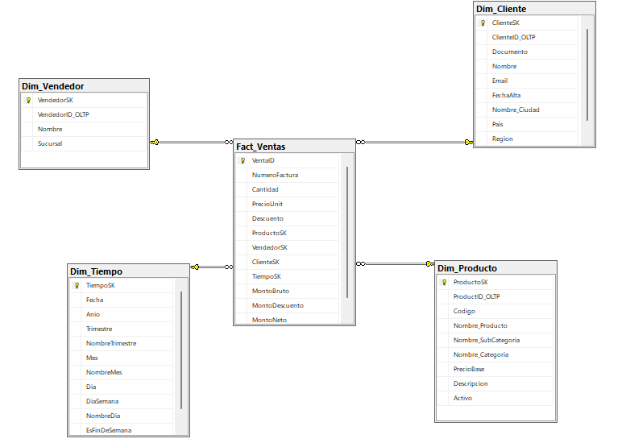

# Diseño, Construcción y Carga del Data Warehouse VentasDW
 
Proyecto: ETL_VentasDW
Empresa: VentasTech S.A.
Tecnologías: SQL Server, SSIS (Visual Studio)
 
---
 
 
## 2. Proceso de Negocio para el Data Warehouse
 
 
### 2.1 Selección del proceso de negocio: 
 
**Ventas.** VentasTech S.A. es una tienda de productos tecnológicos. El proceso modelado es el registro de las facturas emitidas, con el detalle de los productos vendidos, el cliente que compra, el vendedor que atiende y la fecha de la venta. Los datos se toman de las tablas `Ventas` y `DetalleVentas` de la base transaccional `VentasTech` y se cargan en `VentasDW`.
 
### 2.2 Justificación
 
- Es el proceso que genera los ingresos de la empresa y el que la gerencia consulta con más frecuencia.
- Los datos ya existen en el OLTP con integridad referencial entre ventas, detalle, clientes, vendedores y productos.
- Permite analizar la venta desde varias perspectivas: producto y categoría, cliente y ubicación, vendedor y sucursal, y tiempo.
- Separa las consultas analíticas del sistema transaccional.
- Deja un modelo estrella listo para Power BI, con métricas calculadas.
El DW debe permitir responder, como mínimo:
 
1. ¿Cuál es la venta neta por mes y categoría?
2. ¿Qué ciudades, países y regiones concentran más ventas?
3. ¿Qué vendedor y qué sucursal tienen mejor desempeño?
4. ¿Cuál es el descuento promedio otorgado y en qué productos se concentra?
5. ¿Cuál es el ticket promedio por factura?
6. ¿Qué productos son los más vendidos y cuáles están inactivos?
### 2.4 Flujo ETL del proceso
 
El ETL se desarrolla en SSIS (proyecto `ETL_VentasDW`), leyendo desde la base `VentasTech` (OLTP) y escribiendo en `VentasDW`. Primero se cargan las dimensiones y al final la tabla de hechos, para que las claves sustitutas (SK) ya existan al resolver las llaves foráneas.
 
**Orden de carga**
 
| Orden | Destino (DW) | Origen (OLTP) | Transformación |
|---|---|---|---|
| 1 | `Dim_Tiempo` | Rango `MIN` y `MAX` de `Ventas.Fecha` | Se genera un calendario día a día; `TiempoSK` en formato `yyyymmdd` |
| 2 | `Dim_Producto` | `Productos` ⨝ `SubCategorias` ⨝ `Categorias` | `JOIN` por `SubCategoriaID` y `CategoriaID`; se aplana la jerarquía |
| 3 | `Dim_Cliente` | `Clientes` ⨝ `Ciudades` | `JOIN` por `CiudadID`; `Region` nula se reemplaza por `'Sin región'` |
| 4 | `Dim_Vendedor` | `Vendedores` | Copia directa de columnas |
| 5 | `Fact_Ventas` | `DetalleVentas` ⨝ `Ventas` | `JOIN` por `VentaID`; filtro `Estado = 'Completada'`; *Lookups* para obtener las SK |
 
**Dim_Tiempo**
 
| Columna DW | Origen / Fórmula | Transformación |
|---|---|---|
| `TiempoSK` | `Fecha` | `CONVERT(INT, FORMAT(Fecha, 'yyyyMMdd'))` |
| `Fecha` | `Ventas.Fecha` (`DATETIME`) | `CAST(Fecha AS DATE)`; valores únicos entre el mínimo y el máximo |
| `Anio` | `Fecha` | `YEAR(Fecha)` |
| `Trimestre` | `Fecha` | `DATEPART(QUARTER, Fecha)` |
| `NombreTrimestre` | `Trimestre` | `'Trimestre ' + CAST(Trimestre AS VARCHAR)` |
| `Mes` | `Fecha` | `MONTH(Fecha)` |
| `NombreMes` | `Fecha` | `DATENAME(MONTH, Fecha)` con `SET LANGUAGE Spanish` |
| `Dia` | `Fecha` | `DAY(Fecha)` |
| `DiaSemana` | `Fecha` | `DATEPART(WEEKDAY, Fecha)` con `SET DATEFIRST 1` (1 = lunes) |
| `NombreDia` | `Fecha` | `DATENAME(WEEKDAY, Fecha)` con `SET LANGUAGE Spanish` |
| `EsFinDeSemana` | `DiaSemana` | `1` si `DiaSemana` es 6 o 7; `0` en otro caso |
 
**Dim_Producto**
 
| Columna DW | Origen OLTP | Transformación |
|---|---|---|
| `ProductoSK` | — | Autogenerada (`IDENTITY`) |
| `ProductID_OLTP` | `Productos.ProductoID` | Copia directa |
| `Codigo` | `Productos.Codigo` | Copia directa |
| `Nombre_Producto` | `Productos.Nombre` | Copia directa |
| `Nombre_SubCategoria` | `SubCategorias.Nombre` | `JOIN` por `Productos.SubCategoriaID` |
| `Nombre_Categoria` | `Categorias.Nombre` | `JOIN` por `SubCategorias.CategoriaID` |
| `PrecioBase` | `Productos.PrecioBase` | Copia directa (`DECIMAL(10,2)`) |
| `Descripcion` | `Categorias.Descripcion` | Copia directa; admite nulos |
| `Activo` | `Productos.Activo` | Copia directa (`BIT`) |
 
**Dim_Cliente**
 
| Columna DW | Origen OLTP | Transformación |
|---|---|---|
| `ClienteSK` | — | Autogenerada (`IDENTITY`) |
| `ClienteID_OLTP` | `Clientes.ClienteID` | Copia directa |
| `Documento` | `Clientes.Documento` | Copia directa |
| `Nombre` | `Clientes.Nombre` | Copia directa |
| `Email` | `Clientes.Email` | Copia directa; admite nulos |
| `FechaAlta` | `Clientes.FechaAlta` | Copia directa (`DATE`) |
| `Nombre_Ciudad` | `Ciudades.Nombre` | `JOIN` por `Clientes.CiudadID` |
| `Pais` | `Ciudades.Pais` | Copia directa |
| `Region` | `Ciudades.Region` | `ISNULL(Region, 'Sin región')`, porque en el DW es `NOT NULL` |
 
**Dim_Vendedor**
 
| Columna DW | Origen OLTP | Transformación |
|---|---|---|
| `VendedorSK` | — | Autogenerada (`IDENTITY`) |
| `VendedorID_OLTP` | `Vendedores.VendedorID` | Copia directa |
| `Nombre` | `Vendedores.Nombre` | Copia directa |
| `Sucursal` | `Vendedores.Sucursal` | Copia directa |
 
**Fact_Ventas**
 
| Columna DW | Origen OLTP | Transformación |
|---|---|---|
| `VentaID` | — | Autogenerada (`IDENTITY`) |
| `NumeroFactura` | `Ventas.NumeroFactura` | Copia directa |
| `Cantidad` | `DetalleVentas.Cantidad` | Copia directa |
| `PrecioUnit` | `DetalleVentas.PrecioUnit` | Copia directa |
| `Descuento` | `DetalleVentas.Descuento` | Copia directa (porcentaje, `DECIMAL(5,2)`) |
| `ProductoSK` | `DetalleVentas.ProductoID` | *Lookup* en `Dim_Producto` por `ProductID_OLTP` |
| `VendedorSK` | `Ventas.VendedorID` | *Lookup* en `Dim_Vendedor` por `VendedorID_OLTP` |
| `ClienteSK` | `Ventas.ClienteID` | *Lookup* en `Dim_Cliente` por `ClienteID_OLTP` |
| `TiempoSK` | `Ventas.Fecha` | `CONVERT(INT, FORMAT(Fecha, 'yyyyMMdd'))`, validado con *Lookup* en `Dim_Tiempo` |
| `MontoBruto` | — | Columna calculada persistida en SQL Server; no se carga |
| `MontoDescuento` | — | Columna calculada persistida en SQL Server; no se carga |
| `MontoNeto` | — | Columna calculada persistida en SQL Server; no se carga |
 
Reglas generales del flujo:
 
- Solo se cargan las ventas con `Ventas.Estado = 'Completada'`.
- Las filas que no encuentran coincidencia en un *Lookup* se envían a una salida de error para su revisión.
- Las dimensiones cargan solo los registros nuevos, comparando por el ID del OLTP.
---
 
## 3. Declaración de Granularidad de la Tabla de Hechos
 
 
### 3.1 Definición
 
Cada fila de `Fact_Ventas` representa **una línea de detalle de una factura**: un producto vendido, en una factura, a un cliente, atendido por un vendedor, en una fecha determinada. Corresponde al nivel más atómico del OLTP (`DetalleVentas`).
 
### 3.2 Medidas (hechos)
 
| Medida | Tipo | Descripción | Aditividad |
|---|---|---|---|
| `Cantidad` | Base | Unidades vendidas en la línea | Aditiva |
| `PrecioUnit` | Base | Precio unitario aplicado en la venta | No aditiva |
| `Descuento` | Base | Porcentaje de descuento aplicado | No aditiva |
| `MontoBruto` | Calculada | `Cantidad * PrecioUnit` | Aditiva |
| `MontoDescuento` | Calculada | `Cantidad * PrecioUnit * (Descuento / 100)` | Aditiva |
| `MontoNeto` | Calculada | `MontoBruto - MontoDescuento` | Aditiva |
 
Atributo degenerado: `NumeroFactura`.
 
 
--- 
 
## 4. Definición del Modelo Estrella del Data Warehouse
 
 
### 4.1 Visión general
 
El modelo estrella de VentasDW estará compuesto por:
 
- **tabla de hechos central:** `Fact_Ventas`
- **tablas de dimensiones:** `Dim_Producto`, `Dim_Cliente`, `Dim_Vendedor` y `Dim_Tiempo`
| Dimensión | Clave sustituta | Clave de negocio | Atributos principales |
|---|---|---|---|
| `Dim_Producto` | `ProductoSK` | `ProductID_OLTP` | Código, nombre, subcategoría, categoría, precio base, descripción, activo |
| `Dim_Cliente` | `ClienteSK` | `ClienteID_OLTP` | Documento, nombre, email, fecha de alta, ciudad, país, región |
| `Dim_Vendedor` | `VendedorSK` | `VendedorID_OLTP` | Nombre, sucursal |
| `Dim_Tiempo` | `TiempoSK` | `Fecha` | Año, trimestre, mes, día, día de la semana, nombres, es fin de semana |
 
Las jerarquías (Categoría → SubCategoría → Producto y Región → País → Ciudad) se desnormalizan dentro de cada dimensión, lo que da un esquema estrella puro.
 
### 4.2 Diagrama del modelo estrella
 
