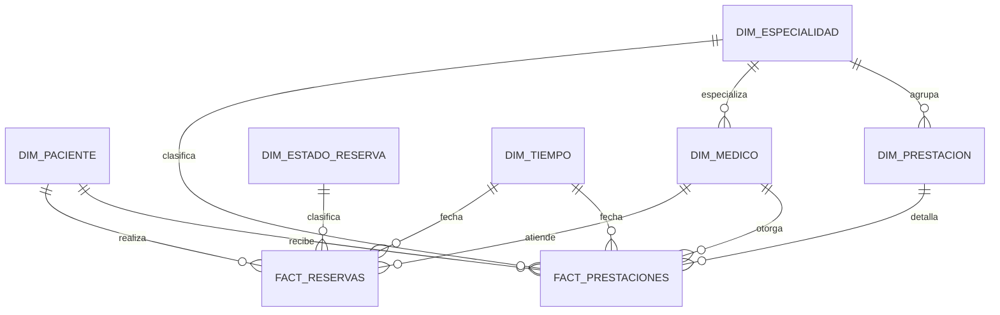

# SaludVital
- Inteligencia de negocio 
- Octavio Valencia - Lukas Garrido
- Paralelo 701
- *Entrega 1 - 2 - 3 - 4 - 5*
- GitHub : https://github.com/LukasGarrido/computer_engineering_content/blob/master/Inteligencia%20de%20negocio/PROYECTO_SaludVital/PROYECTO%20SALUDVITAL%20-%20An%C3%A1lisis%20del%20negocio.md
---
## Índice

- [1. Análisis del negocio](#1-anlisis-del-negocio)
  - [1.1. Historia](#11-historia)
- [2. Situación actual](#2-situacin-actual)
  - [2.1. Actores](#21-actores)
  - [2.2. Procesos](#22-procesos)
  - [2.3. Problemas](#23-problemas)
  - [2.4. Objetivos](#24-objetivos)
- [3. Reglas de negocio](#3-reglas-de-negocio)
  - [3.1. Catalogo de reglas](#31-catalogo-de-reglas)
    - [3.1.1. Reglas sobre Limpieza y Estructura de Datos (ETL)](#311-reglas-sobre-limpieza-y-estructura-de-datos-etl)
    - [3.1.2. Reglas Operativas y de Atención](#312-reglas-operativas-y-de-atencin)
    - [3.1.3. Reglas Financieras y de Modelo Dimensional](#313-reglas-financieras-y-de-modelo-dimensional)
- [4. Requerimientos BI](#4-requerimientos-bi)
  - [4.1. Matriz de requerimientos](#41-matriz-de-requerimientos)
- [5. Perfilamiento de datos](#5-perfilamiento-de-datos)
  - [5.1. Alcance y fuente](#51-alcance-y-fuente)
  - [5.2. Perfilamiento por tabla](#52-perfilamiento-por-tabla)
  - [5.3. Resumen de hallazgos de calidad](#53-resumen-de-hallazgos-de-calidad)
  - [5.4. Integridad referencial](#54-integridad-referencial)
- [6. Modelo dimensional](#6-modelo-dimensional)
  - [6.1. Proceso de negocio y granularidad](#61-proceso-de-negocio-y-granularidad)
  - [6.2. Tablas de hechos](#62-tablas-de-hechos)
  - [6.3. Dimensiones](#63-dimensiones)
  - [6.4. Esquema y relaciones](#64-esquema-y-relaciones)
  - [6.5. Medidas](#65-medidas)

---

# 1. Análisis del negocio
## 1.1. Historia

SaludVital es un centro medico privado que provee servicios de atención **ambulatoria** a pacientes de la Región del Bio Bio. Inicio como un pequeño centro de atención medica, el cual actualmente lleva 8 años operando. En sus inicios contaba solamente con cierto servicios, como: Medicina general, Pediatría, Ginecología, Traumatología.

Debido a la alta demanda, cuenta con **10 especialidades medicas** y mas de 20 profesionales. Actualmente, el centro SaludVital atiende aproximadamente 2000 consultas mensuales. La reserva de horas se realiza de manera presencial en recepción, por teléfono, vía sitio web o a través de su aplicación móvil.

A pesar de este crecimiento, la arquitectura de los sistemas de información actuales no fue diseñada para un análisis multidimensional de los datos, lo que limita la explotación estratégica de su volumen de información. 

--- 
# 2. Situación actual

Actualmente, SaludVital cuenta con un sistema que no satisface el análisis multidimensional de los datos. Esta limitación genera diversos problemas, como: información distribuida, Pacientes duplicados, Especialidades inconsistentes, etc. 

---
## 2.1. Actores

Internos:

1. Paciente – solicita y recibe atención médica, reserva/cancela horas.
2. Médico / Profesional de salud – otorga la atención y registra el detalle de la consulta.
3. Personal de recepción – gestiona reservas presenciales/telefónicas y confirma asistencia.
4. Dirección / Administración – toma decisiones estratégicas y evalúa desempeño.
5. Área de Sistemas / TI – administra los sistemas de información del centro.
6. Área de Facturación/Finanzas – gestiona cobros e ingresos por atenciones.

Externos:

1. Sitio web de reservas – canal digital para agendar horas.
2. Aplicación móvil – canal alternativo de reserva y gestión de horas.
3. Call center / Central telefónica – canal telefónico de reserva.
---
## 2.2. Procesos

- Reserva de hora médica (presencial, telefónica, web, app).
- Registro y actualización de datos del paciente.
- Confirmación de hora.
- Atención médica (consulta, diagnóstico, indicaciones).
- Cancelación / reprogramación de hora.
- Registro de asistencia (Atendida, Cancelada, No asistió, Pendiente).
- Facturación de la atención.
- Generación de reportes mensuales (manual).
- Gestión de especialidades y profesionales.

---
## 2.3. Problemas

1. Información distribuida: La información de pacientes, médicos y atenciones se encuentra en diferentes fuentes.
2. Pacientes duplicados: Existen pacientes registrados más de una vez debido a diferencias en sus datos. Ejemplo: 
	- Juan Pérez 
	- Juan A. Pérez 
	- JUAN PEREZ 
	- Juan Pérez
3. Especialidades inconsistentes: Algunas especialidades aparecen con diferentes nombres: 
	- Traumatología 
	- Traumatologia 
	- TRAUMATOLOGIA 
	- Trauma
4. Horas no concretadas: No todas las reservas terminan en una atención efectiva. Existen estados como: 
	- Atendida 
	- Cancelada 
	- No asistió 
	- Pendiente.
5. Reportes manuales: La dirección actualmente recibe informes mensuales preparados manualmente.
6. Dificultad para evaluar desempeño: No existe una visión consolidada de:
	- Demanda por especialidad
	- Utilización de horas
	- Atenciones por médico
	- Cancelaciones
	- Inasistencias
	- Ingresos
---
## 2.4. Objetivos

**Objetivo General:** El objetivo del proyecto es diseñar e implementar una solución de inteligencia de negocios. La cual debe permitir analizar las atenciones medicas de SaludVital, optimizando la toma de decisiones.

**Objetivos específicos:** 
1. Analizar el negocio: Estudiar la trayectoria y modelo de atención de SaludVital.
2. Identificar actores y procesos: Mapear quiénes interactúan con el centro, y las operaciones.
3. Identificar entidades: Reconocer los objetivos.
4. Definir reglas de negocio: Establecer los limites y políticas que rigen el flujo de datos. 
5. Analizar la calidad de los datos: Diagnosticar la información actual para identificar problemas de consistencia, registros duplicados, campos nulos y datos dispersos.
6. Identificar indicadores relevantes: Seleccionar las métricas clave de desempeño.
7. Definir requerimientos BI: Identificar y levantar las necesidades de información que tienen los directivos para tomar decisiones basadas en los datos.
8. Determinar la granularidad del hecho: 
9. Diseñar un modelo dimensional: Estructurar la base de datos analítica mediante esquemas.
10. Implementar procesos ETL: Diseñar los flujos de Extracción, Transformación y Limpieza de datos desde los sistemas origen hacia el destino.
11. Construir un Data Mart: Crear base de datos optimizada para el área de salud.
12. Crear medidas DAX: Programar los cálculos y fórmulas dinámicas necesarios a la hora de analizar métricas agregadas en la herramienta de reporte.
13. Diseñar un dashboard: Desarrollar un panel de control interactivo y visual para monitorear los indicadores principales de forma intuitiva.
14. Analizar los resultados: Interpretar los hallazgos y patrones descubiertos en los dashboards para entender el desempeño real del centro médico.
15. Proponer recomendaciones: Formular acciones estratégicas y de mejora continua basadas en la evidencia obtenida del análisis de datos.

---

# 3. Reglas de negocio

## 3.1. Catalogo de reglas

*Un catalogo de reglas de negocio es una lista ordenada y documentada que recopila las condiciones, restricciones, políticas y normas bajo las cuales opera una organización*

*Al analizar `SALUDVITAL_2BaseDatos.xlsx`, se detectó que la tabla `03_ESPECIALIDADES`esta errónea (es una copia exacta de `02_MEDICOS` ), por lo que RN01 para deducir las 10 especialidades a partir de las prestaciones, garantizando la integridad del modelo dimensional.*

### 3.1.1. Reglas sobre Limpieza y Estructura de Datos (ETL)

| **ID**   | **Regla**                                                                                                                                                                                                                                                                                               | **Impacto**                          |
| -------- | ------------------------------------------------------------------------------------------------------------------------------------------------------------------------------------------------------------------------------------------------------------------------------------------------------- | ------------------------------------ |
| **RN01** | **Reconstrucción de Especialidades:** Dado que la tabla `03_ESPECIALIDADES` contiene datos erróneos (duplica `02_MEDICOS` ), los registros de `03_ESPECIALIDADES` deben ser deducidos y construidos durante el ETL extrayendo los códigos únicos (`EspecialidadID`) desde la tabla "`04_PRESTACIONES`". | Proceso ETL / Dimensión Especialidad |
| **RN02** | **Normalización de Nombres:** Cualquier variación tipográfica o error de escritura en especialidades detectada en fuentes anexas (ej. _Trauma, TRAUMATOLOGIA_) debe estandarizarse a su nombre **maestro** deducido (ej. "Traumatología").                                                              | Proceso ETL / Limpieza de Datos      |
| **RN03** | **Unificación de Pacientes:** Los registros duplicados de pacientes con diferencias de capitalización, puntuación o abreviaturas (ej. _Juan Pérez vs JUAN PEREZ_) deben consolidarse bajo un único `PacienteID`.                                                                                        | Proceso ETL / Dimensión Paciente     |

### 3.1.2. Reglas Operativas y de Atención

| **ID**   | **Regla**                                                                                                                                                              | **Impacto**                                           |
| -------- | ---------------------------------------------------------------------------------------------------------------------------------------------------------------------- | ----------------------------------------------------- |
| **RN04** | **Atenciones Efectivas:** Una reserva solo se considera como "atención efectiva" (y genera prestaciones realizadas) si su `EstadoReserva` es estrictamente "Atendida". | KPI (Atenciones realizadas, Tasa de atención)         |
| **RN05** | **Inasistencias y Cancelaciones:** Las reservas en estado "Cancelada", "Pendiente" o "No asistió" no generan ingresos ni prestaciones.                                 | KPI (Ingresos, Tasa de inasistencia)                  |
| **RN06** | **Horas Perdidas:** Exclusivamente el estado "No asistió" se contabilizará negativamente para evaluar el desempeño de la utilización de horas del profesional médico.  | KPI (Utilización de horas / Dashboard Gestión Médica) |

### 3.1.3. Reglas Financieras y de Modelo Dimensional

| **ID**   | **Regla**                                                                                                                                                                                                                                  | **Impacto**                          |
| -------- | ------------------------------------------------------------------------------------------------------------------------------------------------------------------------------------------------------------------------------------------ | ------------------------------------ |
| **RN07** | **Cálculo de Ingresos:** Los ingresos se calculan sumando el valor monetario (`Valor` en la tabla PRESTACIONES) únicamente de las atenciones con estado "Atendida".                                                                        | Medidas DAX / KPI Ingresos           |
| **RN08** | **Granularidad del Hecho Principal:** El nivel más detallado de la tabla de hechos corresponde a la **prestación individual realizada** dentro de una atención, vinculando al paciente, el médico, la especialidad, la reserva y la fecha. | Modelo Dimensional (Tabla de Hechos) |

---

# 4. Requerimientos BI

## 4.1. Matriz de requerimientos

| ID                           | Pregunta                                                                        | Indicador                       | Dimensión              | Prioridad |
| ---------------------------- | ------------------------------------------------------------------------------- | ------------------------------- | ---------------------- | --------- |
| **Demanda**                  |                                                                                 |                                 |                        |           |
| RQ01                         | ¿Cuántas reservas se realizan mensualmente?                                     | Total de Reservas               | Tiempo                 | Alta      |
| RQ02                         | ¿Cuál es la especialidad más solicitada?                                        | Total de Reservas               | Especialidad           | Alta      |
| RQ03                         | ¿Qué días de la semana presentan mayor demanda?                                 | Total de Reservas               | Tiempo (Día de semana) | Media     |
| RQ04                         | ¿Cómo evoluciona la demanda de horas durante el año?                            | Total de Reservas               | Tiempo (Mes)           | Alta      |
| **Atención**                 |                                                                                 |                                 |                        |           |
| RQ05                         | ¿Qué porcentaje de reservas termina en una atención efectiva?                   | Tasa de Atención                | Tiempo, Especialidad   | Alta      |
| RQ06                         | ¿Cuál es la tasa de inasistencia por especialidad?                              | Tasa de Inasistencia            | Especialidad           | Alta      |
| RQ07                         | ¿Cuál es la tasa de cancelación de horas?                                       | Tasa de Cancelación             | Tiempo                 | Media     |
| RQ08                         | ¿Cuántas horas se pierden mensualmente por inasistencia?                        | Horas Perdidas                  | Tiempo, Médico         | Alta      |
| **Médicos / Gestión médica** |                                                                                 |                                 |                        |           |
| RQ09                         | ¿Qué médicos atienden más pacientes?                                            | Atenciones Realizadas           | Médico                 | Alta      |
| RQ10                         | ¿Cuál es el ranking de profesionales por atenciones realizadas?                 | Atenciones Realizadas           | Médico                 | Media     |
| RQ11                         | ¿Cuál es el nivel de utilización de horas por médico?                           | Utilización de Horas            | Médico, Tiempo         | Alta      |
| RQ12                         | ¿Qué especialidad concentra más profesionales y mayor carga de atención?        | Atenciones Realizadas           | Especialidad, Médico   | Media     |
| **Pacientes**                |                                                                                 |                                 |                        |           |
| RQ13                         | ¿Qué comunas concentran más pacientes atendidos?                                | Atenciones Realizadas           | Paciente (Comuna)      | Media     |
| RQ14                         | ¿Qué pacientes utilizan con mayor frecuencia los servicios?                     | Frecuencia de Atención          | Paciente               | Media     |
| RQ15                         | ¿Cómo se distribuye la cartera de pacientes por previsión (Fonasa/Isapre)?      | Total de Pacientes              | Paciente (Previsión)   | Baja      |
| RQ16                         | ¿Cómo evoluciona la base de pacientes atendidos en el tiempo?                   | Pacientes Atendidos             | Tiempo                 | Media     |
| **Ingresos**                 |                                                                                 |                                 |                        |           |
| RQ17                         | ¿Cuáles son los ingresos totales por período?                                   | Ingresos                        | Tiempo                 | Alta      |
| RQ18                         | ¿Qué especialidades generan mayores ingresos?                                   | Ingresos                        | Especialidad           | Alta      |
| RQ19                         | ¿Cuál es el ingreso promedio por atención?                                      | Ingreso Promedio por Atención   | Especialidad, Médico   | Media     |
| RQ20                         | ¿Qué prestaciones son las más solicitadas y más rentables?                      | Ingresos, Total de Prestaciones | Prestación             | Media     |
| **Especialidades**           |                                                                                 |                                 |                        |           |
| RQ21                         | ¿Cuántas especialidades activas tiene el centro y cuál es su carga de atención? | Total de Atenciones             | Especialidad           | Media     |
| RQ22                         | ¿Qué especialidad presenta mayor crecimiento de demanda interanual?             | Total de Reservas               | Especialidad, Tiempo   | Baja      |
| RQ23                         | ¿Cómo se compara la tasa de atención entre especialidades?                      | Tasa de Atención                | Especialidad           | Media     |
| RQ24                         | ¿Qué especialidades requieren más profesionales para cubrir su demanda?         | Utilización de Horas            | Especialidad, Médico   | Baja      |

---

# 5. Perfilamiento de datos

## 5.1. Alcance y fuente

El perfilamiento se realizó sobre el archivo `SALUDVITAL_2BaseDatos.xlsx`, que contiene 7 tablas: 
- `01_PACIENTES`
- `02_MEDICOS`
- `03_ESPECIALIDADES`
- `04_PRESTACIONES`
- `05_RESERVAS`
- `06_ATENCIONES` 
- `07_DETALLE_ATENCION`.
Se analizaron nulos, duplicados, consistencia de categorías e integridad referencial entre tablas.

## 5.2. Perfilamiento por tabla

| Tabla                 | Filas | Columnas | Hallazgos                                                                                                                                                                                                                                                                                                                                                                                                                                                                                                            |
| --------------------- | ----- | -------- | -------------------------------------------------------------------------------------------------------------------------------------------------------------------------------------------------------------------------------------------------------------------------------------------------------------------------------------------------------------------------------------------------------------------------------------------------------------------------------------------------------------------- |
| `01_PACIENTES`        | 33    | 7        | 30/33 completos (90,9%); **P031–P033** vacíos salvo el ID. Columna `Unnamed: 1` (columna B) 100% nula, descartar en ETL. Sin duplicados exactos de nombre completo, pero varios nombres/apellidos se repiten entre personas distintas ("Pérez" x5, "Soto"/"Rojas"/"González"/"Silva" x4) → deduplicar siempre por nombre completo, no por partes. Distribución pareja: FONASA/Isapre 15-15, F/M 15-15, edad 28-57 años (prom. 41,6).                                                                                 |
| `02_MEDICOS`          | 10    | 3        | Sin nulos ni `MedicoID` duplicados. 10 médicos, uno por especialidad (`E01`–`E10`), consistente con el negocio.                                                                                                                                                                                                                                                                                                                                                                                                      |
| `03_ESPECIALIDADES`   | 10    | 3        | La tabla es una copia exacta (byte a byte) de `02_MEDICOS`, mismas columnas (`MedicoID`, `Medico`, `EspecialidadID`) y mismos valores. No contiene un catálogo real de especialidades. Esta es la base de **RN01**: la dimensión de especialidad debe reconstruirse desde `04_PRESTACIONES`.                                                                                                                                                                                                                         |
| `04_PRESTACIONES`     | 15    | 4        | Sin nulos ni duplicados. Contiene **10 `EspecialidadID` únicos** (`E01`–`E10`), lo que valida que sí es posible deducir el catálogo completo de las 10 especialidades desde esta tabla, tal como indicamos en RN01. Nombres de especialidad ya vienen estandarizados en esta fuente (no se observan variantes tipo "Trauma"/"TRAUMATOLOGIA" en `04_PRESTACIONES`, esas variantes descritas en el análisis del negocio, corresponden a fuentes anexas/históricas fuera de este extracto y siguen cubiertas por RN02). |
| `05_RESERVAS`         | 30    | 6        | Sin nulos ni `ReservaID` duplicados. `EstadoReserva` solo presenta 3 valores en este extracto: **Atendida (22), No asistió (4), Cancelada (4)**, el estado "Pendiente" mencionado en el proceso de negocio no aparece en la muestra actual, por lo que el modelo y el ETL deben contemplarlo igualmente como estado válido futuro. No se detectaron reservas duplicadas (mismo paciente, médico, fecha y hora).                                                                                                      |
| `06_ATENCIONES`       | 22    | 5        | Sin nulos ni duplicados. Cada `ReservaID` referenciado aparece una sola vez (relación 1 a 1 con Reserva). Las 22 atenciones corresponden exactamente a las 22 reservas en estado "Atendida" — consistente con RN04.                                                                                                                                                                                                                                                                                                  |
| `07_DETALLE_ATENCION` | 22    | 5        | Sin nulos ni duplicados. Cada atención tiene exactamente un detalle asociado (`Cantidad = 1` en todos los casos) y el `ValorUnitario` coincide en el 100% de los casos con el `Valor` maestro de `04_PRESTACIONES` (no se detectaron precios inconsistentes).                                                                                                                                                                                                                                                        |

## 5.3. Resumen de hallazgos de calidad

| Problema detectado                                                                                                                 | Tabla / Campo                                | Evidencia                                                 | Regla de negocio asociada | Acción de limpieza (ETL)                                                                                                                         |
| ---------------------------------------------------------------------------------------------------------------------------------- | -------------------------------------------- | --------------------------------------------------------- | ------------------------- | ------------------------------------------------------------------------------------------------------------------------------------------------ |
| Tabla de especialidades corrupta (copia de Médicos)                                                                                | `03_ESPECIALIDADES`                          | Igual fila a fila a `02_MEDICOS`                          | RN01                      | Descartar `03_ESPECIALIDADES`; construir `DIM_ESPECIALIDAD` desde `EspecialidadID` único de `04_PRESTACIONES`                                    |
| Columna vacía sin uso                                                                                                              | `01_PACIENTES.Unnamed: 1`                    | 33/33 nulos                                               | —                         | Excluir la columna en la extracción                                                                                                              |
| Registros de paciente incompletos/huérfanos                                                                                        | `01_PACIENTES` (P031, P032, P033)            | Todos los campos nulos salvo el ID                        | —                         | Poner en cuarentena / excluir de `DIM_PACIENTE` hasta validar con el sistema origen; registrar como incidencia de calidad                        |
| Estado "Pendiente" no representado en la muestra                                                                                   | `05_RESERVAS.EstadoReserva`                  | Solo 3 de los 4 estados del proceso aparecen en los datos | RN05, RN06                | Modelar igualmente los 4 estados posibles en `DIM_ESTADO_RESERVA`, para no perder cobertura cuando aparezcan en producción                       |
| Riesgo de pacientes/especialidades duplicados por variantes de escritura (descrito en el negocio, no reproducido en este extracto) | Fuentes anexas de Pacientes / Especialidades | Ejemplos narrados en el análisis del negocio              | RN02, RN03                | Mantener normalización (mayúsculas/tildes/espacios) y matching difuso como control preventivo del ETL, aun si el extracto actual no lo evidencia |

No se detectaron: valores nulos en las tablas transaccionales (`RESERVAS`, `ATENCIONES`, `DETALLE_ATENCION`), llaves primarias duplicadas, ni precios inconsistentes entre `DETALLE_ATENCION` y `PRESTACIONES`.

## 5.4. Integridad referencial

| Relación verificada                                           | Resultado                                           |
| ------------------------------------------------------------- | --------------------------------------------------- |
| `RESERVAS.PacienteID` → `PACIENTES.PacienteID`                | Sin huérfanos                                       |
| `RESERVAS.MedicoID` → `MEDICOS.MedicoID`                      | Sin huérfanos                                       |
| `ATENCIONES.ReservaID` → `RESERVAS.ReservaID`                 | Sin huérfanos, relación 1 a 1                       |
| Reservas "Atendida" ↔ existencia de Atención                  | Coincidencia exacta (22 = 22), consistente con RN04 |
| `DETALLE_ATENCION.AtencionID` → `ATENCIONES.AtencionID`       | Sin huérfanos, toda atención tiene detalle          |
| `DETALLE_ATENCION.PrestacionID` → `PRESTACIONES.PrestacionID` | Sin huérfanos                                       |
| `MEDICOS.EspecialidadID` / `PRESTACIONES.EspecialidadID`      | Consistentes entre sí (E01–E10 en ambas)            |

**Conclusión del perfilamiento:** las tablas transaccionales (Reservas, Atenciones, Detalle) están limpias, los problemas de calidad detectados en la fuente disponible (excel) se concentran en las tablas maestras (`03_ESPECIALIDADES` corrupta, columna residual y registros incompletos en `PACIENTES`). Los problemas narrados en el análisis del negocio (pacientes duplicados, especialidades con variantes de escritura) deben tratarse como riesgos del proceso operativo real vigentes para el diseño de RN02/RN03 aunque no se manifiesten en este extracto acotado.

---

# 6. Modelo dimensional

## 6.1. Proceso de negocio y granularidad

**Proceso de negocio analizado:** el ciclo de atención médica ambulatoria, desde la reserva de hora hasta la prestación efectivamente realizada y facturada.

**Hecho principal:** la prestación realizada dentro de una atención médica (RN08).

**Granularidad del hecho principal:** una fila representa **una prestación individual realizada dentro de una atención**, asociada a un paciente, un médico, una especialidad, una reserva y una fecha.

Para responder también a las preguntas de demanda y efectividad (RQ01–RQ08), que necesitan contar **todas** las reservas, incluidas las que no generan prestación (Cancelada, No asistió, Pendiente), se define una **constelación de hechos** con dos tablas de hechos que comparten dimensiones conformadas (Paciente, Médico, Especialidad, Tiempo):

1. `FACT_RESERVAS` — grano: una fila por reserva (soporta demanda, tasa de atención/inasistencia/cancelación, utilización de horas).
2. `FACT_PRESTACIONES` — grano: una fila por prestación realizada (soporta ingresos y granularidad clínica de detalle), y solo contiene reservas en estado "Atendida" (RN04, RN07).

## 6.2. Tablas de hechos

**`FACT_RESERVAS`**

| Campo                     | Tipo         | Descripción                                          |
| ------------------------- | ------------ | ---------------------------------------------------- |
| ReservaID (PK degenerada) | Texto        | Identificador de la reserva                          |
| PacienteKey (FK)          | Entero       | → `DIM_PACIENTE`                                     |
| MedicoKey (FK)            | Entero       | → `DIM_MEDICO`                                       |
| EstadoKey (FK)            | Entero       | → `DIM_ESTADO_RESERVA`                               |
| FechaKey (FK)             | Entero       | → `DIM_TIEMPO` (fecha de la reserva)                 |
| HoraReserva               | Hora         | Hora agendada                                        |
| EsAtendida                | Booleano/0-1 | Bandera derivada (1 si EstadoReserva = "Atendida")   |
| EsInasistencia            | Booleano/0-1 | Bandera derivada (1 si EstadoReserva = "No asistió") |

**`FACT_PRESTACIONES`**

| Campo | Tipo | Descripción |
|---|---|---|
| DetalleID (PK degenerada) | Texto | Identificador del detalle de atención |
| AtencionID / ReservaID (degenerada) | Texto | Trazabilidad a la atención/reserva origen |
| PacienteKey (FK) | Entero | → `DIM_PACIENTE` |
| MedicoKey (FK) | Entero | → `DIM_MEDICO` |
| EspecialidadKey (FK) | Entero | → `DIM_ESPECIALIDAD` |
| PrestacionKey (FK) | Entero | → `DIM_PRESTACION` |
| FechaKey (FK) | Entero | → `DIM_TIEMPO` (fecha de la atención) |
| Cantidad | Entero | Unidades de la prestación |
| ValorUnitario | Numérico | Valor cobrado por unidad |
| IngresoLinea | Numérico | Cantidad × ValorUnitario |

## 6.3. Dimensiones

| Dimensión | Llave | Atributos principales | Origen |
|---|---|---|---|
| `DIM_PACIENTE` | PacienteKey | PacienteID, Nombre, Comuna, FechaNacimiento, Edad, Previsión, Sexo | `01_PACIENTES` (excluyendo columna vacía y registros incompletos) |
| `DIM_MEDICO` | MedicoKey | MedicoID, Nombre, EspecialidadID (atributo de referencia) | `02_MEDICOS` |
| `DIM_ESPECIALIDAD` | EspecialidadKey | EspecialidadID, NombreEspecialidad (estandarizado) | Deducida de `04_PRESTACIONES` (RN01) + normalización (RN02) |
| `DIM_PRESTACION` | PrestacionKey | PrestacionID, NombrePrestación, EspecialidadID, ValorListado | `04_PRESTACIONES` |
| `DIM_ESTADO_RESERVA` | EstadoKey | Atendida / Cancelada / No asistió / Pendiente | `05_RESERVAS` (catálogo fijo de 4 estados) |
| `DIM_TIEMPO` | FechaKey | Fecha, Día, Mes, Nombre Mes, Trimestre, Año, Día de semana, Es fin de semana | Calendario generado |

## 6.4. Esquema y relaciones

## 6.5. Medidas

| KPI                                  | Fórmula (lógica DAX)                                                                     | Tabla de hechos                   |
| ------------------------------------ | ---------------------------------------------------------------------------------------- | --------------------------------- |
| KPI1 — Total de reservas             | `COUNTROWS(FACT_RESERVAS)`                                                               | FACT_RESERVAS                     |
| KPI2 — Atenciones realizadas         | `CALCULATE(COUNTROWS(FACT_RESERVAS), EstadoReserva = "Atendida")`                        | FACT_RESERVAS                     |
| KPI3 — Tasa de atención              | `Atenciones realizadas / Total de reservas`                                              | FACT_RESERVAS                     |
| KPI4 — Tasa de inasistencia          | `CALCULATE(COUNTROWS(FACT_RESERVAS), EstadoReserva="No asistió") / Total de reservas`    | FACT_RESERVAS                     |
| KPI5 — Ingresos                      | `SUM(FACT_PRESTACIONES[IngresoLinea])` (solo reservas Atendida, por RN07)                | FACT_PRESTACIONES                 |
| KPI6 — Ingreso promedio por atención | `Ingresos / Atenciones realizadas`                                                       | FACT_PRESTACIONES / FACT_RESERVAS |
| KPI7 — Utilización de horas          | `1 - (Horas "No asistió" / Total de horas agendadas)` (RN06: solo "No asistió" penaliza) | FACT_RESERVAS                     |
| Tasa de cancelación (complementario) | `CALCULATE(COUNTROWS(FACT_RESERVAS), EstadoReserva="Cancelada") / Total de reservas`     | FACT_RESERVAS                     |
