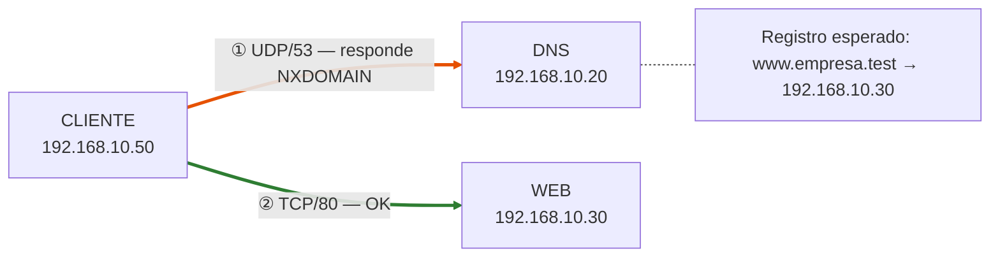
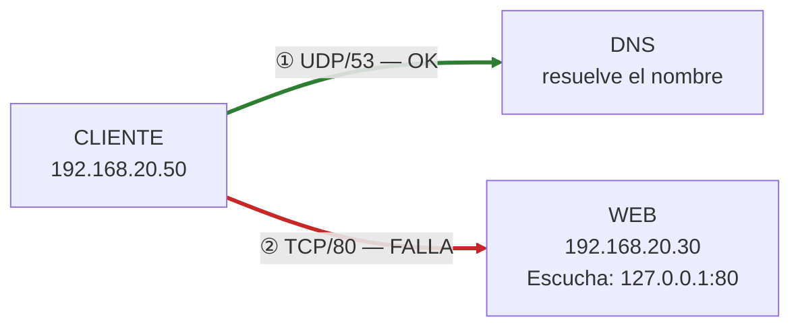
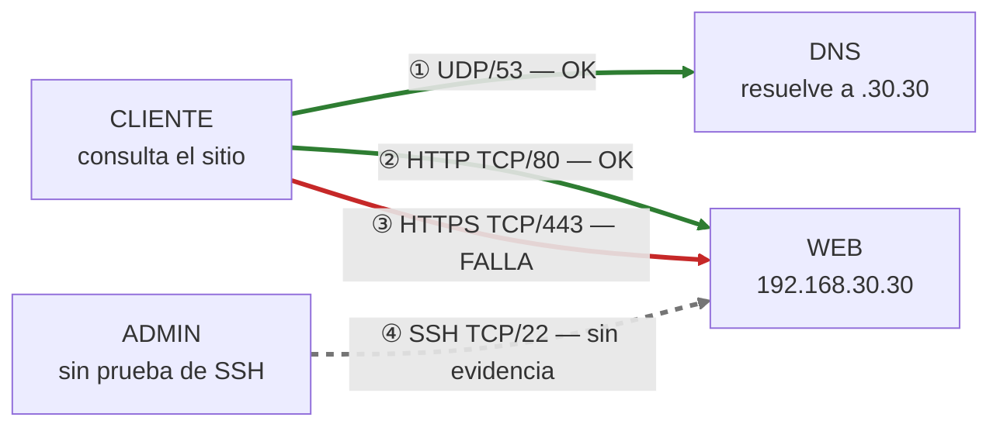
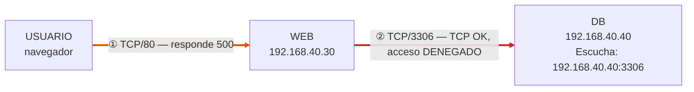
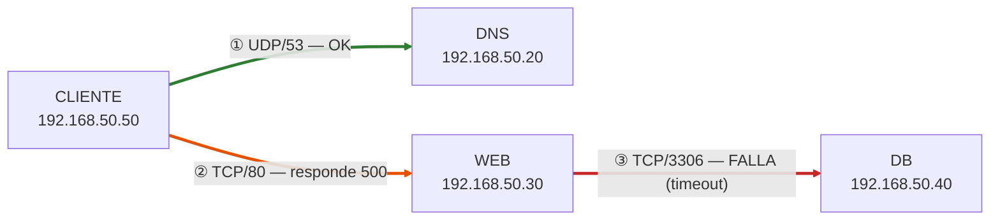
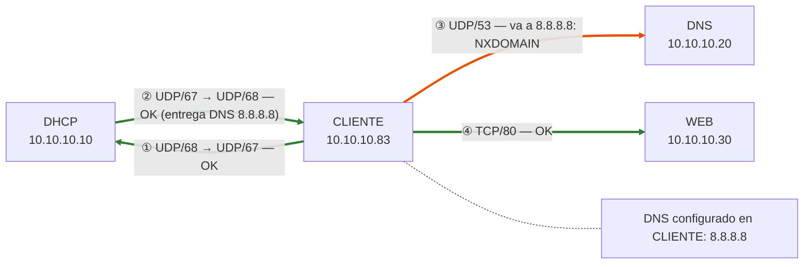
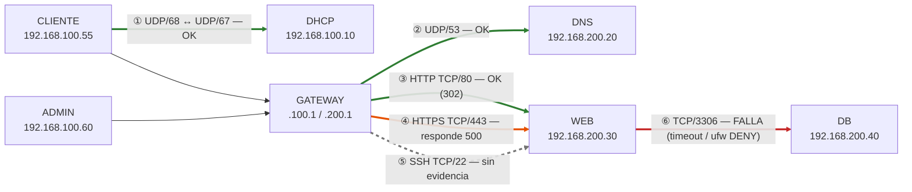
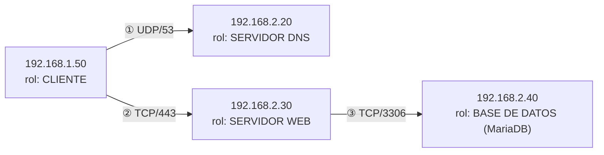

# CERTAMEN 1: diagramas de servicios y diagnóstico — PAUTA CORREGIDA

**Taller de Administración de Sistemas · EIN-090B · USM · 2026**

*Versión de trabajo para evaluación individual y práctica de laboratorio*

> **Nota sobre este documento.** Contiene el certamen completo (enunciados, evidencias, logs, tablas y mapas de red) junto con las **respuestas correctas**. El certamen original no trae pauta oficial: las respuestas están elaboradas a partir de las evidencias de cada caso. Los comandos indicados son ejemplos válidos; cualquier equivalente que pruebe lo mismo es aceptable.
>
> **Leyenda de los mapas de red:** flecha verde = funciona · naranja = responde con error de aplicación · roja = falla · gris = sin evidencia.

---

## Indicaciones al estudiante

Use solo los antecedentes de cada caso. Complete los flujos indicando origen, destino, protocolo de transporte y puerto de destino. Una respuesta «servicio activo» no demuestra accesibilidad desde otro equipo. Proponga primero pruebas y luego una corrección limitada, validación y reversión.

| Actividad | Puntaje | Foco |
| --- | --- | --- |
| 1. Términos pareados | 8 | evidencia |
| 2. DNS | 10 | resolución |
| 3. Web local | 10 | escucha |
| 4. HTTP y HTTPS | 12 | TLS/puertos |
| 5. Web y base de datos | 15 | bind |
| 6. Cadena de tres servicios | 15 | capas |
| 7. DHCP, DNS y web | 15 | configuración cliente |
| 8. Integrador | 25 | segmentación y seguridad |
| 9. Topología inversa | 8 | reconstrucción |

Banco completo: 118 puntos. Se selecciona y marca con una X la pregunta a corregir. Debe responder al menos 7 preguntas para llegar a los 100 puntos.

> **Observación:** el Ejercicio 3 figura con 10 puntos en la tabla resumen y con 12 puntos en su encabezado. El total del banco (118) es consistente con 10.

### Regla general para leer los errores (útil en todos los ejercicios)

| Síntoma observado | Qué demuestra | Qué NO demuestra |
| --- | --- | --- |
| `Connection refused` (inmediato) | Llegó al host; nadie escucha en ese IP:puerto (o rechazo activo) | Que el servicio esté caído en otra interfaz |
| `Connection timed out` | Los paquetes no obtienen respuesta: filtrado, ruta o retorno defectuoso | Cuál de esas tres causas es |
| `NXDOMAIN` | El servidor DNS **respondió**; el nombre no existe en lo que ese servidor conoce | Que el DNS esté caído |
| HTTP 500 | La petición **llegó** al servidor web/aplicación y este falló internamente | Que el problema esté en la red |
| MariaDB `ERROR 1045` | El TCP llegó a la DB; la **autenticación/autorización** fue rechazada | Que haya un problema de red |
| `ping` responde | Hay alcance ICMP a esa IP | Que un servicio (HTTP, DNS, MariaDB) funcione |
| `active` en `systemctl` | El proceso/unidad está en ejecución | Que sea accesible desde otros equipos |
| `curl -k` | Que hay respuesta HTTP sobre TLS | Que el certificado sea válido |

---

## Ejercicio 1. Términos pareados: servicio y evidencia · 8 puntos

Asocie cada evidencia numerada con la conclusión más acotada que permite. Cada conclusión se utiliza una vez. Evite inferir más de lo observado.

| N.º | Evidencia | Letra | Por qué |
| --- | --- | --- | --- |
| 1 | `dig portal.empresa.test +short` → 192.168.20.30 | **C** | Solo muestra que el nombre resolvió a esa IPv4 en esa prueba. |
| 2 | `ss -lnt` → 127.0.0.1:80 | **D** | Escucha en loopback: solo la propia máquina puede conectarse a ese puerto. |
| 3 | `curl -I https://portal.empresa.test` → HTTP/1.1 500 | **B** | Hubo respuesta HTTP: el servidor/aplicación contestó y falló internamente. |
| 4 | `ping 192.168.20.40` → respuesta ICMP | **E** | ICMP responde; no prueba que MariaDB funcione. |
| 5 | `ss -lnt` → 0.0.0.0:3306 | **F** | Hay un socket local en el puerto de MariaDB; no prueba acceso remoto (firewall, permisos). |
| 6 | `curl https://portal.empresa.test` → certificate verify failed | **G** | Falló la verificación de confianza/identidad del certificado. |
| 7 | `ip route` → default via 192.168.10.1 | **A** | Existe ruta por defecto configurada; no prueba que el gateway funcione. |
| 8 | `journalctl -u nginx` → bind() to 0.0.0.0:443 failed | **H** | Nginx no pudo ocupar el socket; revisar configuración o conflicto de puerto. |

| Letra | Conclusión |
| --- | --- |
| A | Existe una ruta por defecto configurada. |
| B | La aplicación o servidor HTTP respondió; hay error de servidor. |
| C | El nombre consultado se resolvió a esa IPv4 en esa prueba. |
| D | El servicio escucha únicamente en la interfaz local para ese puerto. |
| E | Hubo respuesta ICMP, sin demostrar que funcione MariaDB. |
| F | Existe un socket local escuchando en el puerto de MariaDB, sin probar acceso remoto. |
| G | Falló la verificación de confianza/identidad del certificado. |
| H | Nginx no logró ocupar ese socket; investigar configuración o conflicto de puerto. |

**Clave: 1-C · 2-D · 3-B · 4-E · 5-F · 6-G · 7-A · 8-H**

---

## Ejercicio 2. DNS: el nombre no resuelve · 10 puntos

**Escenario.** Cliente 192.168.10.50/24, DNS configurado 192.168.10.20 y web 192.168.10.30. El nombre esperado es `www.empresa.test`.

### Evidencias

```text
cliente$ ping -c 1 192.168.10.30  → 1 received
cliente$ curl http://192.168.10.30 → <h1>Portal Empresa</h1>
cliente$ dig @192.168.10.20 www.empresa.test A → status: NXDOMAIN
```

### Mapa de red (con respuestas)



### Complete el mapa de comunicaciones

| Flecha | Comunicación | Protocolo / puerto | Estado y evidencia |
| --- | --- | --- | --- |
| 1 | Cliente → DNS / consulta por www.empresa.test | **UDP/53** (TCP/53 solo como respaldo para respuestas grandes) | **Llega y responde**, pero sin el dato: `dig @192.168.10.20` devuelve NXDOMAIN. El servidor DNS está vivo; no tiene un registro A para ese nombre. |
| 2 | Cliente → web por IPv4 / HTTP | **TCP/80** | **Funciona**: `ping` 1 received y `curl` devuelve `<h1>Portal Empresa</h1>`. La web es accesible por IP. |

### Diagnóstico y validación

**1. Complete el registro A esperado: `www.empresa.test` → __________. ¿Qué componente investigaría primero y qué prueba lo justifica?**

- Registro esperado: `www.empresa.test. IN A 192.168.10.30`
- Componente a investigar primero: **el servidor DNS (192.168.10.20) y su zona `empresa.test`**: registro A faltante o mal escrito, zona no cargada o sin recargar.
- Prueba que lo justifica: `dig @192.168.10.20 www.empresa.test A` → NXDOMAIN, mientras que el acceso por IP a la web funciona (red y web quedan descartadas). Un DNS caído no daría NXDOMAIN, sino timeout (`no servers could be reached`).

**2. ¿Qué no permite concluir el ping?**

El ping solo prueba alcance ICMP a 192.168.10.30. **No** demuestra que el nombre resuelva, que el registro exista en el DNS, ni que el servicio HTTP funcione. Tampoco dice nada sobre el estado del servidor DNS.

**3. Indique una prueba posterior a la corrección y el resultado esperado.**

- `dig @192.168.10.20 www.empresa.test +short` → `192.168.10.30`
- `curl -I http://www.empresa.test` → `HTTP/1.1 200 OK` (o `curl http://www.empresa.test` → `<h1>Portal Empresa</h1>`), ahora **por nombre**.
- (Corrección segura de referencia: respaldar el archivo de zona, agregar el registro, validar la zona —p. ej. `named-checkzone`— e incrementar el serial antes de recargar. Reversión: restaurar el archivo respaldado y recargar.)

---

## Ejercicio 3. Servidor web activo, pero inaccesible · 12 puntos *(10 según la tabla resumen)*

**Escenario.** Cliente 192.168.20.50; servidor web 192.168.20.30; DNS devuelve 192.168.20.30 para `www.empresa.test`.

### Evidencias

```text
cliente$ curl http://www.empresa.test → curl: (7) Failed to connect to port 80
web$ systemctl is-active apache2 → active
web$ ss -lntp → LISTEN 127.0.0.1:80 (apache2)
```

### Mapa de red (con respuestas)



### Complete el mapa de comunicaciones

| Flecha | Comunicación | Protocolo / puerto | Estado y evidencia |
| --- | --- | --- | --- |
| 1 | Cliente → DNS / consulta A | **UDP/53** | **Funciona**: el nombre se resuelve a 192.168.20.30 y `curl` intenta conectar a esa IP (el error es de conexión, no «could not resolve host»). |
| 2 | Cliente → web / HTTP | **TCP/80** | **Falla**: `curl (7)` desde el cliente. Apache está `active`, pero solo escucha en 127.0.0.1:80 (loopback) y no acepta conexiones por 192.168.20.30. |

### Diagnóstico y validación

**1. Explique la diferencia entre proceso activo y socket accesible desde la LAN.**

- *Proceso activo*: la unidad de systemd está corriendo. No dice en qué dirección escucha.
- *Socket accesible desde la LAN*: el proceso tiene un socket TCP en LISTEN sobre una dirección alcanzable por otros equipos (`0.0.0.0:80` o `192.168.20.30:80`) y ningún firewall lo bloquea.
- `127.0.0.1` es **loopback**: solo la propia máquina web puede conectarse. No es «la red local». Por eso «active» no demuestra accesibilidad remota.

**2. Proponga la prueba en servidor y la prueba desde cliente que confirmarían el problema.**

- En el servidor: `ss -lntp | grep :80` → solo `127.0.0.1:80`; y `curl -I http://127.0.0.1` → responde (el servicio funciona localmente).
- Desde el cliente: `curl -I http://192.168.20.30` o `nc -vz 192.168.20.30 80` → *connection refused* (rechazo inmediato: nadie escucha en esa IP:puerto). Como `dig` ya resolvió bien, el DNS queda descartado.

**3. Indique qué validaría tras cambiar la dirección de escucha y cómo revertiría el cambio.**

- Cambio: en `/etc/apache2/ports.conf`, `Listen 127.0.0.1:80` → `Listen 80` (o `Listen 192.168.20.30:80`), revisando el VirtualHost. Antes: `cp ports.conf ports.conf.bak` y `apache2ctl configtest` → *Syntax OK*; luego `systemctl reload apache2`.
- Validación: `ss -lntp` → `0.0.0.0:80` (o `192.168.20.30:80`) con apache2; desde el cliente `curl -I http://www.empresa.test` → `HTTP/1.1 200 OK`; y `nc -vz 192.168.20.30 80` → *succeeded*.
- Reversión: restaurar `ports.conf.bak`, `apache2ctl configtest`, `systemctl reload apache2` y comprobar con `ss` que vuelve a `127.0.0.1:80`.

---

## Ejercicio 4. HTTP funciona y HTTPS falla · 12 puntos

**Escenario.** `www.empresa.test` resuelve a 192.168.30.30. El servidor utiliza Nginx.

### Evidencias

```text
cliente$ curl -I http://www.empresa.test → HTTP/1.1 200 OK
cliente$ curl -I https://www.empresa.test → curl: (7) Failed to connect to port 443
web$ systemctl is-active nginx → active
web$ ss -lntp → LISTEN 0.0.0.0:80 (nginx); ninguna escucha en :443
```

### Mapa de red (con respuestas)



### Complete el mapa de comunicaciones

| Flecha | Comunicación | Protocolo / puerto | Estado y evidencia |
| --- | --- | --- | --- |
| 1 | Cliente → DNS / nombre | **UDP/53** | **Funciona**: el nombre resuelve a 192.168.30.30 (dato del escenario; `curl` por nombre por HTTP responde 200). |
| 2 | Cliente → web / HTTP | **TCP/80** | **Funciona**: `200 OK`; nginx escucha en `0.0.0.0:80`. Sin cifrado. |
| 3 | Cliente → web / HTTPS | **TCP/443** (TLS va encima de TCP) | **Falla en la conexión TCP**: `Failed to connect to port 443`; no hay socket en :443. Ni siquiera se inicia el handshake TLS. |
| 4 | Administrador → web / SSH (sin evidencia) | **TCP/22** (SSH cifra por sí mismo; no usa TLS) | **Sin evidencia**: no hay prueba de escucha ni de conexión; no se puede afirmar su estado. |

### Diagnóstico y validación

**1. Seleccione la afirmación respaldada: A) falla DNS; B) Nginx está detenido; C) no hay socket local en TCP/443; D) el certificado expiró. Justifique.**

**Respuesta: C.**

- `ss -lntp` solo muestra `0.0.0.0:80`; no hay nada escuchando en :443. `Failed to connect` (curl 7) es un error de conexión TCP, anterior a cualquier negociación TLS.
- A) descartada: el nombre resuelve (HTTP por nombre funciona).
- B) descartada: nginx está `active` y sirve el puerto 80.
- D) no respaldada: un certificado vencido produce un error de verificación (curl 60) **después** de conectar; aquí no se logra ni conectar. No hay evidencia de certificado.

**2. Enumere dos verificaciones antes de editar la configuración TLS y una validación posterior, incluyendo certificado.**

Antes de editar:
1. Revisar la configuración de nginx: `nginx -T` (buscar `listen 443 ssl` y las rutas `ssl_certificate` / `ssl_certificate_key`) y `nginx -t`. Confirmar si existe el bloque `server` de 443 y respaldar el archivo (`cp` a `.bak`).
2. Verificar que el certificado y la llave existen, son legibles y corresponden entre sí y al nombre: `openssl x509 -in <cert> -noout -subject -dates -ext subjectAltName` (debe cubrir `www.empresa.test` y estar vigente); comprobar además que :443 no lo ocupa otro proceso (`ss -lntp`) ni lo bloquea el firewall.

Validación posterior:
- `nginx -t` → *syntax is ok*; `systemctl reload nginx`; `ss -lntp` → `0.0.0.0:443 (nginx)`.
- `curl -I https://www.empresa.test` → `HTTP/1.1 200 OK` **verificando el certificado** (sin `-k`), y `openssl s_client -connect www.empresa.test:443 -servername www.empresa.test` → `Verify return code: 0 (ok)`; revisar CN/SAN, vigencia y cadena.
- Reversión: restaurar el respaldo y recargar nginx.

---

## Ejercicio 5. MariaDB rechaza al usuario del servidor web · 15 puntos

**Escenario.** El CMS se ejecuta en WEB 192.168.40.30 y utiliza MariaDB en DB 192.168.40.40. El usuario de aplicación es `cms_app`. La página del CMS presenta «Error establishing a database connection». No se entregan contraseñas.

### Evidencias

```text
cliente$ curl -I http://192.168.40.30 → HTTP/1.1 500 Internal Server Error

db$ ss -lntp → LISTEN 192.168.40.40:3306 (mariadbd)

web$ mariadb -h 192.168.40.40 -u cms_app -p cms_db
ERROR 1045 (28000): Access denied for user 'cms_app'@'192.168.40.30' (using password: YES)

db> SELECT User,Host FROM mysql.user WHERE User='cms_app';
cms_app | localhost
```

### Mapa de red (con respuestas)



### Complete el mapa de comunicaciones

| Flecha | Comunicación | Protocolo / puerto | Estado y evidencia |
| --- | --- | --- | --- |
| 1 | Cliente → WEB / HTTP | **TCP/80** | **Llega a la web**, que responde `500`: el CMS atiende pero falla internamente al no poder usar la base de datos («Error establishing a database connection»). |
| 2 | WEB → DB / TCP y autenticación MariaDB | **TCP/3306** (TLS es opcional y no hay evidencia de él) | **TCP: OK** — MariaDB respondió con el ERROR 1045, que solo se emite tras establecerse la conexión y recibir credenciales. **Acceso: DENEGADO** — `cms_app@192.168.40.30` no está autorizado; la única cuenta existente es `cms_app@localhost`. |

### Diagnóstico y validación

**1. ¿Qué demuestra el error 1045 sobre la llegada de WEB a DB? Distinga transporte TCP y autenticación.**

- **Transporte TCP:** el error viene del propio servidor MariaDB, así que la conexión a 192.168.40.40:3306 **sí se estableció** (ruta, firewall y dirección de escucha están bien; escucha en 192.168.40.40, no solo en loopback).
- **Autenticación/autorización:** MariaDB rechazó al cliente `cms_app` visto desde el host `192.168.40.30`. El problema no es de red, sino de cuentas y permisos.

**2. Con las evidencias disponibles, ¿cuál es la causa más probable y qué comprobación haría antes de crear o modificar el usuario?**

- **Causa más probable:** la cuenta `cms_app` está definida solo para el host `'localhost'`. MariaDB identifica al usuario como `usuario@host-de-origen`; la conexión llega como `cms_app@192.168.40.30`, para la cual no existe ninguna cuenta. (La contraseña no se puede evaluar sin credenciales, pero la falta de coincidencia de host ya explica el rechazo.)
- **Comprobaciones previas:** `SELECT User,Host FROM mysql.user;` y `SHOW GRANTS FOR 'cms_app'@'localhost';` para ver qué privilegios tiene hoy; confirmar que existe la base `cms_db` (`SHOW DATABASES;`); verificar que el archivo de configuración del CMS usa el host, usuario y base correctos; y respaldar (`mysqldump`/lista de usuarios) antes de tocar nada.

**3. Proponga un acceso limitado al origen WEB y a la base del CMS. Indique cómo validaría y revertiría el cambio.**

Acceso limitado (en la DB):

```sql
CREATE USER 'cms_app'@'192.168.40.30' IDENTIFIED BY '<contraseña_segura>';
GRANT SELECT, INSERT, UPDATE, DELETE ON cms_db.* TO 'cms_app'@'192.168.40.30';
-- (añadir CREATE/ALTER/INDEX solo si el CMS lo requiere para instalar o actualizar)
```

Sin `'%'`, sin `ON *.*` y sin `GRANT ALL`: solo el origen WEB y solo la base `cms_db`.

- **Validación:** desde WEB, `mariadb -h 192.168.40.40 -u cms_app -p cms_db -e "SELECT 1;"` → OK; en DB, `SHOW GRANTS FOR 'cms_app'@'192.168.40.30';`; y recargar el CMS → deja de dar 500 (`curl -I http://192.168.40.30` → 200).
- **Reversión:** `DROP USER 'cms_app'@'192.168.40.30';` (o `REVOKE` de los privilegios), verificando que la cuenta original `cms_app@localhost` no fue alterada.

---

## Ejercicio 6. DNS y web responden; la aplicación falla · 15 puntos

**Escenario.** Cliente 192.168.50.50; DNS 192.168.50.20; web 192.168.50.30; DB 192.168.50.40. El nombre `tienda.empresa.test` corresponde a la web.

### Evidencias

```text
cliente$ dig @192.168.50.20 tienda.empresa.test +short → 192.168.50.30
cliente$ curl -I http://tienda.empresa.test → HTTP/1.1 500 Internal Server Error
web$ ss -lnt → LISTEN 0.0.0.0:80
app.log → DB host=192.168.50.40 port=3306: Connection timed out
db$ ss -lnt → LISTEN 0.0.0.0:3306
```

### Mapa de red (con respuestas)



### Complete el mapa de comunicaciones

| Flecha | Comunicación | Protocolo / puerto | Estado y evidencia |
| --- | --- | --- | --- |
| 1 | Cliente → DNS / A | **UDP/53** | **Funciona**: `dig` devuelve 192.168.50.30. |
| 2 | Cliente → web / HTTP | **TCP/80** | **Llega a la web**; esta responde 500: la petición fue recibida y la aplicación falló internamente. DNS y transporte hasta la web están bien. |
| 3 | Web → DB / MariaDB | **TCP/3306** | **Falla**: `app.log` registra *Connection timed out* hacia 192.168.50.40:3306. La DB sí escucha en `0.0.0.0:3306`, así que el servicio existe; el timeout (sin rechazo inmediato) sugiere paquetes descartados o sin retorno (filtrado o ruta). La causa exacta aún no está demostrada. |

### Diagnóstico y validación

**1. ¿Hasta qué componente llegó la petición de acuerdo con el 500?**

Hasta el **servidor web y su aplicación** (192.168.50.30, TCP/80): un 500 lo genera el propio servidor. Por lo tanto DNS, red hasta la web y servicio HTTP funcionan. La falla aparece en la etapa siguiente, web → DB.

**2. Formule una hipótesis principal sin afirmar una causa raíz no demostrada.**

«El enlace Web (192.168.50.30) → DB (192.168.50.40) por TCP/3306 no se completa —posiblemente por filtrado, ruta o retorno defectuoso—, y por eso la aplicación agota el tiempo de conexión y devuelve 500.»
No es un problema de DNS (resuelve) ni de dirección de escucha de la DB (`0.0.0.0:3306`); tampoco se afirma que sea el firewall sin probarlo.

**3. Proponga dos pruebas para diferenciar filtrado, ruta y respuesta del puerto 3306.**

1. **Desde WEB:** `nc -vz -w 3 192.168.50.40 3306`
   - *Timeout* → filtrado o ruta.
   - *Connection refused* inmediato → llegan, pero nadie escucha o hay rechazo activo.
   - *succeeded* → el TCP funciona; investigar autenticación.
2. **Ruta y captura:** en WEB, `ip route get 192.168.50.40` (¿interfaz/gateway correctos?; «No route to host» → ruta); en DB, `tcpdump -ni any tcp port 3306 and host 192.168.50.30` mientras se repite la prueba, y revisar el firewall (`ufw status`, `nft list ruleset`/`iptables -S`).

| Resultado | Interpretación |
| --- | --- |
| No llegan SYN a la DB | Filtrado o ruta antes de la DB |
| Llegan SYN y no hay SYN-ACK | Firewall/regla en la propia DB |
| `ip route get` no muestra ruta válida | Problema de ruta |
| `nc` refused | Puerto sin escucha o rechazo activo |

---

## Ejercicio 7. DHCP entrega un DNS inadecuado · 15 puntos

**Escenario.** Notebook nuevo 10.10.10.83/24, gateway 10.10.10.1, DNS recibido 8.8.8.8. La LAN dispone de DHCP 10.10.10.10, DNS interno 10.10.10.20 y web 10.10.10.30. `intranet.empresa.test` apunta a 10.10.10.30.

### Evidencias

```text
cliente$ curl http://10.10.10.30 → Portal interno
cliente$ dig intranet.empresa.test → status: NXDOMAIN
cliente$ dig @10.10.10.20 intranet.empresa.test +short → 10.10.10.30
```

### Mapa de red (con respuestas)



> Nota sobre la flecha ③: el mapa la dibuja hacia el DNS interno (10.10.10.20), que es el destino **correcto** para la LAN. Con la configuración recibida, el cliente en realidad envía la consulta al **DNS configurado, 8.8.8.8**, que no conoce la zona interna.

### Complete el mapa de comunicaciones

| Flecha | Comunicación | Protocolo / puerto | Estado y evidencia |
| --- | --- | --- | --- |
| 1 | Cliente → DHCP / solicitud a servidor | **UDP/68 → UDP/67** (puerto origen del cliente 68; destino, servidor DHCP 67) | **Funciona**: el cliente obtuvo 10.10.10.83/24, gateway 10.10.10.1 y DNS 8.8.8.8. |
| 2 | DHCP → cliente / respuesta | **UDP/67 → UDP/68** | **Funciona**: el cliente recibió la oferta/confirmación, pero la opción de DNS entregada es **8.8.8.8** (inadecuada para nombres internos). |
| 3 | Cliente → DNS configurado | **UDP/53** (hacia 8.8.8.8) | **Responde, pero con el DNS equivocado**: `dig` sin `@` da NXDOMAIN porque un DNS público no conoce `intranet.empresa.test`. |
| 4 | Cliente → web / HTTP | **TCP/80** | **Funciona por IP**: `curl http://10.10.10.30` → *Portal interno*. Red y web están bien. |

### Diagnóstico y validación

**1. Identifique el dato de configuración que explica mejor la falla de nombre.**

El **servidor DNS entregado por DHCP: 8.8.8.8** (opción DHCP «domain-name-servers») en lugar de 10.10.10.20. Se confirma porque `dig intranet.empresa.test` (usa el DNS configurado) da NXDOMAIN, mientras que `dig @10.10.10.20 ...` devuelve 10.10.10.30.

**2. Explique por qué no corresponde concluir que el DNS interno está averiado.**

Porque al consultarle directamente (`dig @10.10.10.20`) responde correctamente 10.10.10.30. El cliente nunca le preguntó: consultó a 8.8.8.8, que no tiene esa zona. El defecto está en la **configuración entregada por DHCP**, no en el servicio DNS.

**3. Proponga cambio, renovación de configuración, validación y reversión.**

- **Cambio (servidor DHCP 10.10.10.10):** respaldar el archivo de configuración y cambiar la opción DNS a `10.10.10.20` (ISC DHCP: `option domain-name-servers 10.10.10.20;`; dnsmasq: `dhcp-option=6,10.10.10.20`). Validar la sintaxis (`dhcpd -t`) y reiniciar el servicio.
- **Renovación en el cliente:** liberar y renovar el lease (`sudo dhclient -r && sudo dhclient`, o reconectar la interfaz con `nmcli`).
- **Validación:** `resolvectl status` o `cat /etc/resolv.conf` → DNS 10.10.10.20; `dig intranet.empresa.test +short` → `10.10.10.30`; `curl http://intranet.empresa.test` → *Portal interno*.
- **Reversión:** restaurar el respaldo de configuración, reiniciar DHCP y renovar el lease del cliente.

---

## Ejercicio 8. Incidente integrador y segmentación · 25 puntos

**Topología.** Usuarios 192.168.100.0/24; servidores 192.168.200.0/24. Gateway/firewall: 192.168.100.1 y 192.168.200.1. Cliente 192.168.100.55/24 con gateway 192.168.100.1 y DNS 192.168.200.20. DHCP 192.168.100.10; web 192.168.200.30; DB 192.168.200.40. `portal.empresa.test` apunta a la web. Administrador 192.168.100.60. El DHCP responde dentro de la LAN de usuarios; no presuponga relay.

### Tabla de zonas y nodos (completada)

| Zona / nodo | Dirección asignada | Rol o dato que debe completar |
| --- | --- | --- |
| Cliente | 192.168.100.55/24 | DNS: **192.168.200.20** · Gateway: **192.168.100.1** |
| Gateway/firewall | **192.168.100.1 / 192.168.200.1** | Ruta entre las dos subredes: **enruta 192.168.100.0/24 ↔ 192.168.200.0/24** (con reenvío de paquetes y las reglas de firewall que correspondan) |
| DHCP | **192.168.100.10** | Puertos de servidor y cliente: **UDP/67 / UDP/68** |
| DNS | **192.168.200.20** | Puerto de consulta: **UDP/53** (TCP/53 como respaldo) |
| Web | **192.168.200.30** | HTTP: **TCP/80** · HTTPS: **TCP/443** · SSH: **TCP/22** |
| DB | **192.168.200.40** | Puerto MariaDB: **TCP/3306** |

### Evidencias del incidente

```text
cliente$ dig portal.empresa.test +short → 192.168.200.30
cliente$ curl -I http://portal.empresa.test → 302 Location: https://portal.empresa.test/
cliente$ curl -k -I https://portal.empresa.test → HTTP/1.1 500
web$ ss -lnt → LISTEN 0.0.0.0:80; 0.0.0.0:443; 0.0.0.0:22
app.log → DB host=192.168.200.40 port=3306: Connection timed out
db$ systemctl is-active mariadb → active
db$ ss -lnt → LISTEN 0.0.0.0:3306
db$ ufw status numbered → [1] 22/tcp ALLOW IN Anywhere; [2] 3306/tcp DENY IN Anywhere
```

**Supuesto del caso:** la regla [2] coincide con el tráfico entrante desde la web y no existe una regla previa que lo permita. Interprete `curl -k` solo como prueba de la respuesta HTTP sobre TLS, no como validación del certificado.

### Mapa de red (con respuestas)



Red usuarios: 192.168.100.0/24 · Red servidores: 192.168.200.0/24 · 3 HTTP · 4 HTTPS · 5 SSH de administrador.

### Complete el mapa de comunicaciones

| Flecha | Comunicación | Protocolo / puerto | Estado y evidencia |
| --- | --- | --- | --- |
| 1 | Cliente ↔ DHCP (LAN usuarios) | **UDP/68 / UDP/67** (cliente / servidor) | **OK**; configuración recibida (IP 192.168.100.55/24, gateway .100.1, DNS .200.20). Funciona dentro de la LAN, sin relay. |
| 2 | Cliente → DNS (vía gateway) | **UDP/53** | **OK**; `dig portal.empresa.test +short` → 192.168.200.30. |
| 3 | Cliente → web HTTP (vía gateway) | **TCP/80** | **OK**; responde `302` con redirección a `https://portal.empresa.test/`. |
| 4 | Cliente → web HTTPS (vía gateway) | **TCP/443** | **Llega y responde con error de aplicación**: `HTTP/1.1 500`. Hay TLS y HTTP funcionando (`curl -k` no valida certificado). La falla es interna del servidor/aplicación. |
| 5 | Administrador → web SSH | **TCP/22** | **Sin evidencia**: la web escucha en `0.0.0.0:22`, pero no hay prueba de conexión desde el administrador a través del gateway. |
| 6 | Web → DB | **TCP/3306** | **FALLA**: *Connection timed out* en `app.log`. La DB está activa y escucha en `0.0.0.0:3306`; la regla `ufw [2] 3306/tcp DENY IN Anywhere` (y ninguna regla previa que lo permita) es consistente con un descarte silencioso, es decir, con un timeout. |

### Diagnóstico y validación

**1. ¿Dónde se observa por primera vez una falla y qué evidencia ubica el problema allí?**

- **Falla visible para el usuario:** HTTP 500 en la flecha 4 (HTTPS).
- **Punto donde se origina (primer eslabón que falla): la flecha 6, Web → DB (TCP/3306).** Evidencia: `app.log` registra *Connection timed out* hacia 192.168.200.40:3306; DNS (2), HTTP (3) y HTTPS (4) responden, así que el cliente, el gateway y la web funcionan; en la DB, MariaDB está `active` y escucha en `0.0.0.0:3306` (servicio y dirección de escucha correctos); y `ufw` tiene `3306/tcp DENY IN Anywhere`, que ubica el bloqueo en el firewall del host DB.

**2. Proponga una prueba desde web al TCP/3306 y una comprobación de las reglas efectivas en DB.**

- **Desde WEB:** `nc -vz -w 3 192.168.200.40 3306` → timeout (confirma filtrado). Alternativa: `timeout 3 bash -c '</dev/tcp/192.168.200.40/3306' && echo OK`.
- **En DB:** `sudo ufw status numbered` (o `ufw status verbose`) para ver el orden de las reglas (la primera que coincide manda) y `sudo iptables -S` / `sudo nft list ruleset` para las reglas efectivas en el kernel. Opcional: `sudo tcpdump -ni any tcp port 3306 and host 192.168.200.30` → SYN entrantes sin respuesta.

**3. Describa la regla mínima de ingreso: origen, destino, transporte y puerto. Evite abrir DB a toda la red.**

| Campo | Valor |
| --- | --- |
| Origen | **192.168.200.30** (solo la web) |
| Destino | **192.168.200.40** (DB) |
| Transporte | **TCP** |
| Puerto | **3306** |
| Acción | ALLOW, ubicada **antes** del `DENY` [2] (el orden importa) |

```bash
sudo ufw insert 1 allow proto tcp from 192.168.200.30 to 192.168.200.40 port 3306 comment 'web->mariadb'
```

No abrir 3306 a `Anywhere`, ni a 192.168.100.0/24 ni a toda 192.168.200.0/24.

**4. Indique validación funcional, prueba de certificado sin `-k`, resguardo previo y reversión de la regla.**

- **Resguardo previo:** `sudo ufw status numbered > /root/ufw-antes.txt` y `sudo cp -a /etc/ufw /root/ufw-backup` (opcional: `sudo iptables-save > /root/iptables-antes.txt`).
- **Validación funcional:**
  - `sudo ufw status numbered` → la regla ALLOW queda sobre el DENY.
  - Desde WEB: `nc -vz 192.168.200.40 3306` → *succeeded*.
  - Desde el cliente: `curl -I https://portal.empresa.test` → `200` (en lugar de 500) y `app.log` sin nuevos timeouts.
  - Prueba negativa: desde el cliente (192.168.100.55) `nc -vz 192.168.200.40 3306` debe seguir fallando (la DB no quedó abierta a la red de usuarios).
- **Certificado sin `-k`:** `curl -vI https://portal.empresa.test` → sin *certificate verify failed* (aparece *SSL certificate verify ok*); y `openssl s_client -connect portal.empresa.test:443 -servername portal.empresa.test -verify_return_error` → `Verify return code: 0 (ok)`, comprobando CN/SAN = `portal.empresa.test`, vigencia y cadena (con una CA propia de laboratorio, usar `--cacert ca.pem`).
- **Reversión:** `sudo ufw status numbered` → identificar el número de la regla añadida → `sudo ufw delete <n>` (o `sudo ufw delete allow proto tcp from 192.168.200.30 to 192.168.200.40 port 3306`); comparar con `/root/ufw-antes.txt`; si hace falta, restaurar `/etc/ufw` y `sudo ufw reload`.

---

## Ejercicio 9. Reconstrucción de topología por puertos · 8 puntos

Red de usuarios 192.168.1.0/24 y red de servidores 192.168.2.0/24; el gateway intermedio está operativo. El siguiente inventario muestra solicitudes y puertos de destino. Complete el rol probable de los nodos y el servicio de cada enlace. Los puertos son indicios, no prueba de que el servicio esté sano.

### Mapa de red (con respuestas)



### Inventario (completado)

| Origen | Destino | Destino TCP/UDP | Rol / servicio inferido |
| --- | --- | --- | --- |
| 192.168.1.50 | 192.168.2.20 | UDP/53 | **Cliente → servidor DNS** (consulta de nombres) |
| 192.168.1.50 | 192.168.2.30 | TCP/443 | **Cliente → servidor web** (HTTPS) |
| 192.168.2.30 | 192.168.2.40 | TCP/3306 | **Web → base de datos** (MariaDB/MySQL) |

**1. Escriba el rol probable de .1.50, .2.20, .2.30 y .2.40.**

- **.1.50:** cliente (origina las consultas)
- **.2.20:** servidor DNS (recibe UDP/53)
- **.2.30:** servidor web/aplicación (recibe HTTPS y a su vez consulta a la DB)
- **.2.40:** servidor de base de datos MariaDB (recibe TCP/3306)

**2. Si HTTPS devuelve 500 y el log web registra timeout a .2.40, ¿qué enlace debe probar y por qué?**

El **enlace 3: Web (192.168.2.30) → DB (192.168.2.40), TCP/3306**. El 500 muestra que la petición del cliente llegó a la web (enlaces 1 y 2 funcionan), y el timeout registrado por la web ocurre precisamente en su conexión a la DB. Pruebas: desde .2.30, `nc -vz -w 3 192.168.2.40 3306` e `ip route get 192.168.2.40`; en .2.40, `ss -lnt` (¿escucha?), `tcpdump -ni any tcp port 3306` (¿llegan los SYN?) y las reglas de firewall. Como los puertos son solo indicios, ver el 3306 en el inventario no prueba que MariaDB esté sano ni que la conexión funcione. La «saturación» de la DB no se puede afirmar con estas evidencias.

---

## Resumen de puertos y protocolos del certamen

| Servicio | Transporte / puerto | Notas |
| --- | --- | --- |
| DNS | **UDP/53** (TCP/53 respaldo) | NXDOMAIN = el DNS respondió, sin ese registro |
| DHCP | **UDP/67 (servidor) y UDP/68 (cliente)** | Cliente 68 → servidor 67; servidor 67 → cliente 68 |
| HTTP | **TCP/80** | Sin cifrado |
| HTTPS | **TCP/443** | TLS sobre TCP; `curl -k` no valida el certificado |
| SSH | **TCP/22** | Cifrado propio, no es TLS |
| MariaDB | **TCP/3306** | 1045 = TCP llegó, falló la autenticación |
| Ping | ICMP | No es TCP/UDP; no prueba servicios |

**EIN-090B · Taller de Administración de Sistemas**
