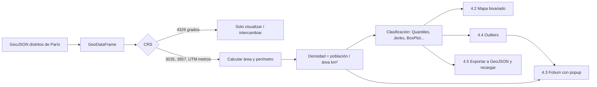
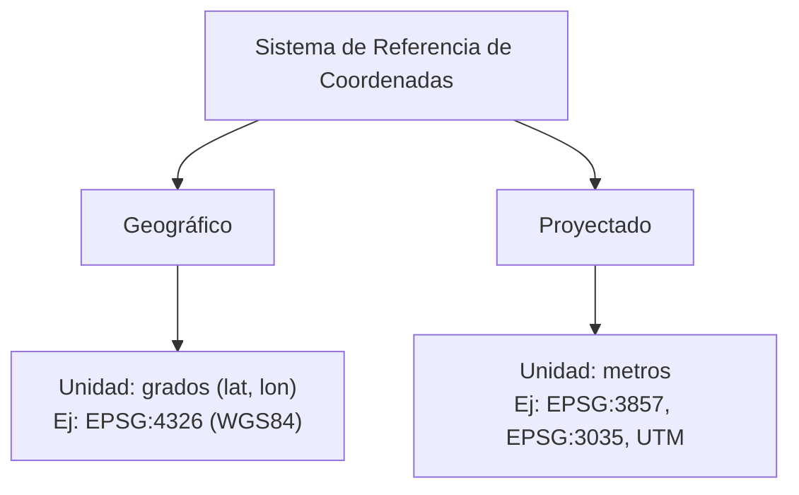
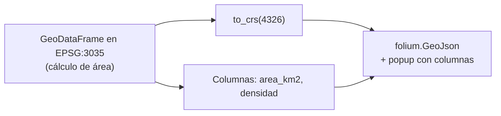

# EIN092B – Laboratorio Mapas: guía de conceptos teóricos y prácticos

> Guía de estudio basada en el enunciado (`Lab_S2 - Mapas.pdf`) y en el notebook base (`W2_library_maps.ipynb`).
> Objetivo: que puedas **explicar con tus palabras** lo que hace cada actividad, porque el staff te interrogará sobre los conceptos.

---

## Índice

1. [Mapa mental del laboratorio](#1-mapa-mental-del-laboratorio)
2. [Teoría 1: Datos geoespaciales y GeoDataFrame](#2-teoría-1-datos-geoespaciales-y-geodataframe)
3. [Teoría 2: CRS y proyecciones](#3-teoría-2-sistemas-de-referencia-espacial-crs-y-proyecciones)
4. [Teoría 3: Mapas coropléticos y clasificación](#4-teoría-3-mapas-coropléticos-y-clasificación-de-datos)
5. [Teoría 4: Mapas interactivos](#5-teoría-4-mapas-interactivos-y-visualización-web)
6. [Práctica: actividades 4.1 a 4.5 (con código)](#6-práctica-actividades-41-a-45)
7. [Preguntas teóricas 4.6 a 4.8 (ideas para responder)](#7-preguntas-teóricas-46-a-48)
8. [Errores comunes y checklist de entrega](#8-errores-comunes-y-checklist)

---

## 1. Mapa mental del laboratorio



**Flujo lógico de todo el lab:** cargar datos → elegir un CRS adecuado → calcular área → calcular densidad → clasificar → visualizar (estático e interactivo) → exportar.

| Actividad | Concepto central | Librería clave |
|---|---|---|
| 4.1 Comparación de proyecciones | CRS y distorsión del área | `GeoPandas` (`to_crs`, `.area`) |
| 4.2 Clasificación múltiple | Mapa coroplético bivariado | `mapclassify`, `matplotlib` |
| 4.3 Mapa interactivo | Popups y tooltips | `folium` |
| 4.4 Outliers espaciales | Regla del IQR / BoxPlot | `mapclassify` |
| 4.5 Exportación | Formato GeoJSON, persistencia | `to_file`, `read_file` |
| 4.6–4.8 | Teoría: CRS, clasificación, impacto en políticas públicas | — |

---

## 2. Teoría 1: Datos geoespaciales y GeoDataFrame

### 2.1 Modelo vectorial vs. raster

| | **Vectorial** | **Raster** |
|---|---|---|
| Representa | Entidades discretas (puntos, líneas, polígonos) | Grilla de celdas (píxeles) |
| Atributos | Una fila de tabla por entidad | Un valor por celda |
| Ejemplos | Comunas, calles, estaciones | Imágenes satelitales, elevación |
| En este lab | **Sí** (polígonos de distritos) | No |

### 2.2 Tipos de geometría

```
Point           Puntos          •                 (ciudades)
LineString      Líneas          ──────────        (ríos, calles)
Polygon         Polígonos       ┌────────┐        (distritos, países)
                                │        │
                                └────────┘
Multi*          Varias partes   Multi Polygon = país con islas (ej. Chile, Indonesia)
```

En el notebook se usan tres datasets que ilustran cada tipo: países (polígonos), ciudades (puntos) y ríos (líneas).

### 2.3 ¿Qué es un GeoDataFrame?

Un **GeoDataFrame = DataFrame de pandas + columna `geometry` + un CRS**.

```
┌────┬────────────┬───────────┬─────────────────────────┐
│    │ l_qu       │ perimetre │ geometry  ← GeoSeries   │
├────┼────────────┼───────────┼─────────────────────────┤
│ 0  │ Gaillon    │ 1234.5    │ POLYGON ((x y, x y,...))│
│ 1  │ Halles     │ 2100.7    │ POLYGON ((x y, x y,...))│
└────┴────────────┴───────────┴─────────────────────────┘
        atributos (como pandas)        geometría (espacial)
```

Como sigue siendo un DataFrame, funciona todo lo de pandas: `mean()`, filtrado booleano, `sort_values`, etc. Además aporta métodos espaciales: `.area`, `.length`, `.centroid`, `.buffer()`, `.to_crs()`, `.plot()`, `.explore()`.

### 2.4 Código base del notebook

```python
import geopandas as gpd
import matplotlib.pyplot as plt

districts = gpd.read_file("quartier_paris.geojson")   # lee cualquier formato SIG
districts.shape      # (n_distritos, n_columnas)
districts.crs        # ¿en qué sistema de coordenadas está?
districts.plot()     # vista rápida (matplotlib, estática)
districts.explore()  # vista rápida interactiva (folium/Leaflet)
```

> **Aviso importante:** el dataset `quartier_paris` del notebook trae solo `l_qu` (nombre), `perimetre` y `st_area_shape`. **No trae población.** Para las actividades 4.2, 4.3 y 4.4 necesitas agregar una columna de población (por ejemplo desde datos abiertos de París/INSEE, unida por nombre o código de distrito con `merge`) o, si el staff lo permite, generar datos simulados y dejarlo explícito.

---

## 3. Teoría 2: Sistemas de referencia espacial (CRS) y proyecciones

### 3.1 Idea central

Un **CRS** le dice al computador cómo convertir un par de números `(x, y)` en un lugar real de la Tierra. Sin CRS, las coordenadas no significan nada.



### 3.2 Geográfico vs. proyectado

| Característica | **Geográfico** (EPSG:4326) | **Proyectado** (EPSG:3857, 3035…) |
|---|---|---|
| Superficie | Elipsoide (curva) | Plano (aplastado) |
| Unidades | Grados | Metros (o pies) |
| Bueno para | Almacenar e intercambiar datos globales, GPS | Medir áreas, distancias, perímetros; dibujar mapas |
| Problema | `.area` devuelve **grados²**, sin sentido físico | Toda proyección **distorsiona** algo |
| Ejemplo típico | GeoJSON estándar, GPS | Google Maps / OSM (3857) |

### 3.3 Por qué toda proyección distorsiona

Es imposible aplastar una esfera sin deformar **forma, área, distancia o dirección**. Es el problema de la cáscara de naranja: si intentas aplanarla, se rompe o se estira.

| Tipo de proyección | Preserva | Sacrifica | Ejemplos |
|---|---|---|---|
| **Conforme** | Ángulos y formas locales | Áreas (mucho cerca de los polos) | Mercator (EPSG:3857), UTM |
| **Equivalente / área igual** | Proporción de áreas | Formas | Albers, Mollweide, **LAEA (EPSG:3035)** |
| **Equidistante** | Distancias desde un punto de referencia | Áreas y formas | Azimutal equidistante |

### 3.4 Las proyecciones del laboratorio

| EPSG | Nombre | Tipo | Unidad | ¿Sirve para área? |
|---|---|---|---|---|
| **4326** | WGS84 | Geográfico | grados | No (grados²) |
| **3857** | Web Mercator | Conforme (cilíndrica) | metros | **No**: infla áreas lejos del ecuador |
| **3035** | ETRS89 / LAEA Europe | Equivalente | metros | **Sí** (diseñada para Europa) |
| **32631** | UTM zona 31N *(opcional)* | Conforme, baja distorsión local | metros | Sí para zonas chicas como París |

### 3.5 Cuánto distorsiona Mercator (cifras reales)

Mercator multiplica las **distancias lineales** por `1/cos(latitud)`. Como el área es largo × ancho, se multiplica por `1/cos²(latitud)`.

Para París (latitud ≈ 48,85°):

```
factor de área ≈ 1 / cos²(48,85°) ≈ 1 / 0,433 ≈ 2,31
```

Verificación con un polígono pequeño en París (mismo polígono, cuatro CRS):

| CRS | Área devuelta | Interpretación |
|---|---|---|
| EPSG:4326 | 0,000314 | grados² → inútil |
| EPSG:3857 | 5 906 729 m² | **≈ 2,3 veces** el valor real |
| EPSG:3035 | 2 559 929 m² | valor correcto (área igual) |
| EPSG:32631 (UTM 31N) | 2 558 024 m² | casi idéntico al correcto |

`5 906 729 / 2 559 929 ≈ 2,31` coincide con la fórmula. **Esto es lo que debes explicar en 4.1:** la diferencia no es un error de cálculo, es la distorsión geométrica de cada proyección.

```
Efecto visual de Mercator (más cerca del polo → más inflado)

 Ecuador      ▢            factor 1,0×
 París 49°    ▢▢           factor ~2,3×
 Groenlandia  ▢▢▢▢▢▢       factor >>5× (parece tan grande como África, y es ~14 veces menor)
```

---

## 4. Teoría 3: Mapas coropléticos y clasificación de datos

### 4.1 ¿Qué es un mapa coroplético?

Colorea **unidades geográficas** (distritos, comunas, países) según el valor de una **variable numérica**. Buena práctica: mapear **tasas o densidades**, no conteos absolutos, porque los conteos dependen del tamaño del territorio.

```
Población (conteo)  →  engañoso: las zonas grandes siempre "ganan"
Densidad = población / área km²  →  comparable entre distritos
```

### 4.2 Métodos de clasificación

**Ejemplo mínimo** (10 valores con un valor extremo: `[1, 2, 2, 3, 3, 4, 5, 8, 20, 100]`, k = 3). Resultados reales de `mapclassify`:

| Método | Cortes (bins) | Clase de cada valor | Lectura |
|---|---|---|---|
| **EqualInterval** | 34, 67, 100 | `0 0 0 0 0 0 0 0 0 2` | 9 de 10 valores caen en una sola clase, el mapa casi no tiene contraste |
| **Quantiles** | 3, 5, 100 | `0 0 0 0 0 1 1 2 2 2` | Clases balanceadas, pero el 8 y el 100 quedan juntos |
| **NaturalBreaks (Jenks)** | 8, 20, 100 | `0 0 0 0 0 0 0 0 1 2` | Separa "muchos bajos / uno medio / uno extremo" |
| **BoxPlot** | −5,25 · 2,25 · 3,5 · 7,25 · 14,75 · 100 | `1 1 1 2 2 3 3 4 5 5` | Los valores 20 y 100 (clase 5) son **outliers superiores** |

### 4.3 Comparación conceptual

| Método | Idea | Ventajas | Desventajas / sesgos |
|---|---|---|---|
| **Intervalos iguales** | Rango dividido en tramos del mismo ancho | Simple, leyenda fácil de entender | Con datos sesgados deja clases vacías o casi todo en una |
| **Cuantiles** | Misma cantidad de unidades por clase | Siempre usa todos los colores, resalta orden relativo | Puede agrupar valores muy distintos y separar valores casi idénticos |
| **Jenks (rupturas naturales)** | Minimiza varianza dentro de clases y la maximiza entre clases | Respeta "saltos" reales de los datos | Cortes dependen de los datos, no comparables entre mapas o años |
| **Desviación estándar** | Clases según distancia a la media | Destaca atípicos, bueno para datos ~normales | Malo si la distribución es muy asimétrica |
| **BoxPlot (IQR)** | Usa cuartiles y `Q1 − 1,5·IQR`, `Q3 + 1,5·IQR` | Identifica outliers de forma objetiva | Clases poco intuitivas para público general |

### 4.4 Mapa bivariado

Muestra **dos variables a la vez** combinando dos paletas en una matriz 3×3.

```
                        ÁREA (x) →
                   pequeña   media    grande
   POBLACIÓN  alta   🟪        🟪🟦      🟦      ← esquina "alta pob + baja área" = ALTA DENSIDAD
     (y) ↑    media  🟪🟫      🟦🟪      🟦
              baja   ⬜        🟦        🟦      ← esquina "baja pob + gran área" = BAJA DENSIDAD
```

Paleta 3×3 clásica (Stevens), con el índice `clase = 3·y + x`:

| | x = 0 (área baja) | x = 1 | x = 2 (área alta) |
|---|---|---|---|
| **y = 2** (pob. alta) | `#be64ac` | `#8c62aa` | `#3b4994` |
| **y = 1** | `#dfb0d6` | `#a5add3` | `#5698b9` |
| **y = 0** (pob. baja) | `#e8e8e8` | `#ace4e4` | `#5ac8c8` |

Así se identifican de un vistazo: **alta densidad** (magenta: mucha población en poco espacio), **baja densidad** (turquesa: poca población en mucho espacio), y **valores intermedios** (tonos grises/lilas).

---

## 5. Teoría 4: Mapas interactivos y visualización web

| | Mapa estático (`.plot()`) | Mapa interactivo (`.explore()` / `folium`) |
|---|---|---|
| Salida | Imagen fija (matplotlib) | HTML con Leaflet.js |
| Zoom / pan | No | Sí |
| Información al interactuar | No | Tooltip (hover) y popup (clic) |
| Capa base | No | Tile layer (OpenStreetMap, CartoDB…) |
| Ideal para | Informes, PDFs | Exploración, dashboards |

**Conceptos clave:**

- **Tile layer:** mosaico de imágenes del mapa base descargadas según el zoom.
- **GeoJSON layer:** tus polígonos superpuestos sobre la capa base.
- **Tooltip:** aparece al pasar el cursor. **Popup:** aparece al hacer clic.
- **Folium/Leaflet trabajan en EPSG:4326 (lat/lon).** Si calculaste área en 3035, debes volver a `to_crs(4326)` **solo para dibujar**, manteniendo las columnas ya calculadas.



---

## 6. Práctica: actividades 4.1 a 4.5

### Preparación común

```python
import geopandas as gpd
import pandas as pd
import numpy as np
import matplotlib.pyplot as plt
import mapclassify as mc
import folium

districts = gpd.read_file("quartier_paris.geojson")
districts = districts[["l_qu", "perimetre", "st_area_shape", "geometry"]]

# Agregar población (ejemplo: tabla externa con columnas l_qu, poblacion)
# pop = pd.read_csv("poblacion_distritos.csv")
# districts = districts.merge(pop, on="l_qu", how="left")
# districts["poblacion"].isna().sum()   # verificar que no falten uniones
```

---

### 4.1 Comparación de proyecciones

**Qué pide:** mapear los mismos datos en ≥ 3 CRS, calcular el área de un mismo distrito en cada uno y explicar las diferencias.

**Idea clave:** el mismo polígono, bajo distintos CRS, da áreas distintas por distorsión de la proyección (Mercator infla ~2,3× en París).

```python
crs_list = {
    "EPSG:4326 (grados)": 4326,
    "EPSG:3857 (Web Mercator)": 3857,
    "EPSG:3035 (LAEA Europa)": 3035,
    "EPSG:32631 (UTM 31N)": 32631,
}

# 1) Mapas lado a lado
fig, axes = plt.subplots(1, 4, figsize=(20, 5))
for ax, (nombre, epsg) in zip(axes, crs_list.items()):
    districts.to_crs(epsg=epsg).plot(ax=ax, edgecolor="k", linewidth=0.3)
    ax.set_title(nombre, fontsize=10)
    ax.set_axis_off()
plt.tight_layout()
plt.show()

# 2) Área de un mismo distrito en cada CRS
distrito = districts.iloc[[0]]          # o filtrar por nombre: districts[districts.l_qu == "..."]
filas = []
for nombre, epsg in crs_list.items():
    a = distrito.to_crs(epsg=epsg).area.iloc[0]
    filas.append({"CRS": nombre, "area_en_unidades_CRS": a})
tabla = pd.DataFrame(filas)

ref = tabla.loc[tabla["CRS"].str.contains("3035"), "area_en_unidades_CRS"].iloc[0]
tabla["razon_vs_3035"] = tabla["area_en_unidades_CRS"] / ref
print(tabla)
```

**Qué deberías observar:**

- 4326 → valores diminutos (grados²), y GeoPandas lanza un *UserWarning*.
- 3857 → ≈ 2,3× el área de 3035.
- 3035 y 32631 → prácticamente iguales (los dos son buenos para París).

**Pregunta probable del staff:** *¿Por qué no usar 3857 para medir áreas?* → Porque Mercator es conforme: preserva ángulos y formas pero no áreas; el factor de inflación crece con la latitud.

---

### 4.2 Clasificación múltiple: mapa coroplético bivariado

**Qué pide:** clasificar por población y área a la vez, y mostrar alta / baja / media densidad.

**Pasos:** (1) área en CRS métrico → (2) clasificar cada variable en 3 clases → (3) combinar en una clase 0–8 → (4) asignar color de la matriz 3×3 → (5) dibujar mapa y leyenda.

```python
d = districts.to_crs(epsg=3035).copy()
d["area_km2"] = d.geometry.area / 1e6
d["densidad"] = d["poblacion"] / d["area_km2"]

# Clases 0,1,2 por cuantiles (se puede cambiar por Jenks: mc.NaturalBreaks)
d["cls_pob"]  = mc.Quantiles(d["poblacion"], k=3).yb    # eje y
d["cls_area"] = mc.Quantiles(d["area_km2"],  k=3).yb    # eje x

# Matriz 3x3: índice = 3*y + x
paleta = [
    "#e8e8e8", "#ace4e4", "#5ac8c8",   # y=0 (población baja)
    "#dfb0d6", "#a5add3", "#5698b9",   # y=1
    "#be64ac", "#8c62aa", "#3b4994",   # y=2 (población alta)
]
d["cls_bi"] = 3 * d["cls_pob"] + d["cls_area"]
d["color_bi"] = d["cls_bi"].map(lambda i: paleta[i])

fig, ax = plt.subplots(figsize=(10, 8))
d.plot(color=d["color_bi"], edgecolor="white", linewidth=0.4, ax=ax)
ax.set_title("Mapa bivariado: población × área", fontsize=14, fontweight="bold")
ax.set_axis_off()

# Leyenda 3x3 como inset
leg = fig.add_axes([0.08, 0.12, 0.16, 0.16])
for y in range(3):
    for x in range(3):
        leg.add_patch(plt.Rectangle((x, y), 1, 1, color=paleta[3 * y + x]))
leg.set_xlim(0, 3); leg.set_ylim(0, 3)
leg.set_xticks([]); leg.set_yticks([])
leg.set_xlabel("Área →", fontsize=8); leg.set_ylabel("Población →", fontsize=8)
plt.show()
```

**Cómo leer el resultado:**

| Color | Combinación | Interpretación |
|---|---|---|
| Magenta `#be64ac` | Población alta, área baja | **Alta densidad** |
| Azul oscuro `#3b4994` | Población alta, área alta | Distrito grande y poblado |
| Turquesa `#5ac8c8` | Población baja, área alta | **Baja densidad** |
| Gris `#e8e8e8` | Población baja, área baja | Distrito pequeño y poco poblado |
| Tonos intermedios | Clases medias | **Densidad intermedia** |

**Sobre "normalizar" (la ayuda del enunciado):** los cuantiles ya son independientes de la escala, pero si usas intervalos iguales conviene reescalar (min-max: `(x - min) / (max - min)`) para que ambas variables sean comparables.

**Pregunta probable:** *¿Por qué bivariado y no dos mapas separados?* → Porque el cerebro no cruza bien dos mapas; el bivariado muestra la relación conjunta (aquí, implícitamente, la densidad).

---

### 4.3 Mapa interactivo con popup (Folium)

**Qué pide:** al hacer clic en un distrito, mostrar nombre, área en km², población total y densidad.

**Puntos delicados:** las columnas del popup deben **existir ya** en el GeoDataFrame; y hay que pasar a **EPSG:4326** para dibujar.

```python
d_web = d.to_crs(epsg=4326).copy()
d_web["area_km2"]  = d_web["area_km2"].round(3)
d_web["densidad"]  = d_web["densidad"].round(1)

centro = [d_web.geometry.centroid.y.mean(), d_web.geometry.centroid.x.mean()]
m = folium.Map(location=centro, zoom_start=12, tiles="CartoDB positron")

folium.GeoJson(
    d_web,
    name="Distritos de París",
    style_function=lambda f: {
        "fillColor": "#3b4994", "color": "white", "weight": 1, "fillOpacity": 0.45,
    },
    highlight_function=lambda f: {"weight": 3, "color": "black", "fillOpacity": 0.7},
    tooltip=folium.GeoJsonTooltip(fields=["l_qu"], aliases=["Distrito:"]),
    popup=folium.GeoJsonPopup(
        fields=["l_qu", "area_km2", "poblacion", "densidad"],
        aliases=["Distrito", "Área (km²)", "Población", "Densidad (hab/km²)"],
    ),
).add_to(m)

folium.LayerControl().add_to(m)
m.save("mapa_4_3.html")
m   # en Jupyter se muestra inline
```

**Conceptos para defender:**

- `tooltip` = hover; `popup` = clic.
- El orden de `fields` y `aliases` debe coincidir.
- `style_function` define el estilo base; `highlight_function`, el estilo al pasar el cursor.

**Alternativa rápida:** `d_web.explore(column="densidad", scheme="quantiles", k=5, popup=True)`.

---

### 4.4 Identificación de outliers espaciales

**Qué pide:** detectar distritos con densidad atípica (con `mapclassify`) y marcarlos con otro color en un mapa interactivo.

**Regla del IQR (Tukey):**

```
IQR = Q3 − Q1
límite inferior = Q1 − 1,5 · IQR
límite superior = Q3 + 1,5 · IQR
outlier = valor fuera de [límite inferior, límite superior]
```

```
            Q1      Mediana   Q3
   ●         ├────────┬────────┤                        ●   ●
 outlier   |--bigote--[  caja  ]--bigote--|           outliers
            Q1−1,5·IQR                  Q3+1,5·IQR
```

**Con `mapclassify.BoxPlot`** (hinge = 1,5 por defecto). Genera 6 clases: la **0** son outliers inferiores y la **5** outliers superiores.

```python
bp = mc.BoxPlot(d["densidad"], hinge=1.5)
print(bp)            # muestra los cortes y el conteo por clase
d["cls_box"] = bp.yb

d["outlier"] = d["cls_box"].isin([0, 5])     # 0 = inferior, 5 = superior

# Comprobación manual equivalente (útil para explicar)
q1, q3 = d["densidad"].quantile([0.25, 0.75])
iqr = q3 - q1
lim_inf, lim_sup = q1 - 1.5 * iqr, q3 + 1.5 * iqr
d["outlier_manual"] = (d["densidad"] < lim_inf) | (d["densidad"] > lim_sup)
print("Coinciden:", (d["outlier"] == d["outlier_manual"]).all())
```

```python
d_web = d.to_crs(epsg=4326).copy()
d_web["densidad"] = d_web["densidad"].round(1)

m = folium.Map(location=centro, zoom_start=12, tiles="CartoDB positron")
folium.GeoJson(
    d_web,
    style_function=lambda f: {
        "fillColor": "#d7191c" if f["properties"]["outlier"] else "#9ecae1",
        "color": "white", "weight": 1, "fillOpacity": 0.7,
    },
    tooltip=folium.GeoJsonTooltip(
        fields=["l_qu", "densidad", "outlier"],
        aliases=["Distrito", "Densidad", "¿Outlier?"],
    ),
).add_to(m)
m.save("mapa_4_4.html")
m
```

**Nota práctica:** con pocos distritos puede que los dos métodos no detecten nada. Si no hay outliers con `hinge=1.5`, prueba `hinge=1.0` y **explícalo**. Un outlier **no es un error**: puede ser un distrito real pero excepcional (ej. un distrito muy denso del centro).

**Pregunta probable:** *¿Por qué es un outlier "espacial"?* → Porque además del valor atípico, importa **dónde** está; los outliers pueden agruparse (clusters) o ser un caso aislado.

---

### 4.5 Exportación y reutilización

**Qué pide:** guardar las columnas nuevas (área, densidad, clasificaciones) en GeoJSON, recargar y verificar que todo se conserve.

**Puntos delicados:**

- GeoJSON (RFC 7946) espera coordenadas en **WGS84 (EPSG:4326)** → reproyectar antes de exportar.
- Las columnas booleanas y numéricas se conservan; los objetos complejos no. Guarda las clases como `int` o `str`.

```python
export = d.to_crs(epsg=4326).copy()
cols = ["l_qu", "poblacion", "area_km2", "densidad",
        "cls_pob", "cls_area", "cls_bi", "cls_box", "outlier", "geometry"]
export[cols].to_file("distritos_paris_procesados.geojson", driver="GeoJSON")

# Recargar y verificar
nuevo = gpd.read_file("distritos_paris_procesados.geojson")

print("CRS:", nuevo.crs)
print("Filas iguales:", len(nuevo) == len(export))
print("Columnas:", list(nuevo.columns))
print(nuevo.dtypes)

for c in ["area_km2", "densidad"]:
    print(c, "conservado:", np.allclose(nuevo[c], export[c].values))

print("Geometrías iguales:",
      nuevo.geometry.geom_equals_exact(export.geometry.reset_index(drop=True),
                                       tolerance=1e-6).all())
```

**Qué verificar y poder explicar:** mismo número de filas, mismas columnas, valores numéricos iguales, mismo CRS (4326) y geometrías equivalentes (dentro de una tolerancia). Si quieres volver a calcular áreas después de recargar, **tienes que reproyectar de nuevo** a un CRS métrico.

---

## 7. Preguntas teóricas 4.6 a 4.8

> Estas son **ideas y estructura** para que redactes tus respuestas con tus propias palabras.

### 4.6 Proyectados vs. geográficos

**Estructura sugerida:**

1. **Definición:** geográfico = coordenadas angulares sobre elipsoide (grados); proyectado = plano con unidades lineales (metros).
2. **Diferencias:** unidad, tipo de superficie, distorsión, cálculos posibles (tabla de la sección 3.2).
3. **Contextos de uso:**
   - Geográfico: almacenamiento, intercambio, GPS, datos globales, GeoJSON.
   - Proyectado: medir áreas/distancias, análisis local/regional, cartografía impresa, catastro (ej. UTM en Chile, LAEA en Europa).
4. **Problemas por elegir mal:**
   - Áreas o distancias erróneas (ej. Mercator ×2,3 en París).
   - Buffers o distancias sin sentido si se hacen en grados.
   - Comparaciones sesgadas: Groenlandia "más grande que África".
   - Capas que no se alinean por mezclar CRS (el notebook reproyecta ríos y ciudades al CRS del país antes de superponer).

### 4.7 Métodos de clasificación

Describe cada método con esta estructura: **idea → ventaja → desventaja/sesgo** (tabla de la sección 4.3) y agrega:

- **Sesgos:** los métodos pueden exagerar o suavizar diferencias. Con datos asimétricos, intervalos iguales esconden la variación; cuantiles la inventan; Jenks depende de los datos concretos.
- **Criterios de elección:** distribución de los datos (histograma), público objetivo, necesidad de comparar mapas (cortes fijos) y número de clases (típicamente 4–7).
- Puedes apoyarte en la mini tabla de la sección 4.2 para ilustrar con números.

### 4.8 Impacto de la clasificación en políticas públicas

**Estructura sugerida:**

1. **Tesis:** la clasificación no es neutral; cambia qué territorios "parecen" críticos.
2. **Mecanismo:** los cortes definen qué unidades caen en la clase más alta (más recursos, más atención) y cuáles no.
3. **Caso real (elige uno y verifícalo con una fuente antes de citarlo):**
   - **Chile:** el plan "Paso a Paso" durante la pandemia asignaba etapas de restricción por comuna según indicadores con umbrales definidos; el lugar donde se fija el umbral determina qué comunas cambian de etapa.
   - **Chile:** mapas de pobreza (CASEN) por comuna: distintos cortes cambian qué comunas se ven "prioritarias".
   - **Ciudad:** distribución de recursos de salud o seguridad por barrios según mapas de incidencia.
4. **Demostración propia (muy recomendable):** muestra el **mismo dato de densidad de París** clasificado con Quantiles, Jenks y Equal Interval, y comenta cómo cambia la percepción de desigualdad.

```python
fig, axes = plt.subplots(1, 3, figsize=(18, 5))
for ax, (nombre, esquema) in zip(axes, [("Equal Interval", "equal_interval"),
                                        ("Quantiles", "quantiles"),
                                        ("Jenks", "natural_breaks")]):
    d.plot(column="densidad", scheme=esquema, k=5, cmap="OrRd",
           legend=True, edgecolor="white", linewidth=0.3, ax=ax)
    ax.set_title(nombre); ax.set_axis_off()
plt.show()
```

5. **Cierre:** recomendaciones: mostrar la distribución (histograma), declarar el método, probar más de una clasificación, usar cortes significativos (umbrales normativos) cuando correspondan.

---

## 8. Errores comunes y checklist

### Errores frecuentes

| Error | Causa | Solución |
|---|---|---|
| Áreas minúsculas (0,0003) y `UserWarning` | Calcular `.area` en EPSG:4326 | `to_crs` a CRS métrico antes |
| Áreas 2–3× más grandes de lo real | Usar EPSG:3857 | Usar 3035 o UTM 31N |
| Folium muestra el mapa corrido o vacío | Datos en CRS proyectado | `to_crs(epsg=4326)` antes de dibujar |
| `KeyError` en el popup | Columna no creada antes | Calcular `area_km2`, `densidad` antes de `GeoJson` |
| Popup con decimales infinitos | Sin redondeo | `.round(2)` |
| Capas que no se superponen | CRS distintos | `capa.to_crs(otra.crs)` |
| Exportación falla o se ve mal | Tipos no serializables / CRS | Usar `int`, `bool`, `str`, `float` y exportar en 4326 |
| Columna de población con `NaN` | `merge` sin coincidencias | Revisar nombres (tildes, mayúsculas) con `.isna().sum()` |
| Clasificación con k clases pero hay menos | Valores repetidos | Revisar `mc.Quantiles(...).bins` |

### Checklist antes de llamar al staff

- [ ] 4.1: ≥ 3 mapas en distintos CRS y tabla comparativa de áreas, con explicación.
- [ ] 4.2: mapa bivariado con leyenda 3×3 y lectura de alta/baja/media densidad.
- [ ] 4.3: mapa Folium con popup (nombre, área km², población, densidad).
- [ ] 4.4: outliers de densidad marcados con otro color, con el método explicado.
- [ ] 4.5: GeoJSON exportado, recargado y verificado.
- [ ] 4.6–4.8: respuestas teóricas redactadas.
- [ ] Puedo explicar **por qué** cada paso (no solo *cómo*).

### Preguntas de repaso rápido

1. ¿Por qué `.area` en EPSG:4326 no tiene sentido físico?
2. ¿Qué propiedad conserva Mercator y cuál sacrifica?
3. ¿Por qué elegirías EPSG:3035 (o UTM 31N) para medir áreas en París?
4. ¿Qué diferencia hay entre cuantiles y Jenks, y cuándo falla cada uno?
5. ¿Por qué se mapea densidad en vez de población absoluta?
6. ¿Qué significa que un distrito sea outlier según el IQR?
7. ¿Por qué hay que volver a EPSG:4326 para Folium y para exportar GeoJSON?
8. ¿Qué ventaja tiene un mapa bivariado sobre dos mapas separados?

---

*Nota: los valores numéricos de la sección 3.5 y 4.2 se obtuvieron ejecutando `geopandas` y `mapclassify`. Los resultados con los datos reales de París dependerán del dataset y de la población que agregues.*
