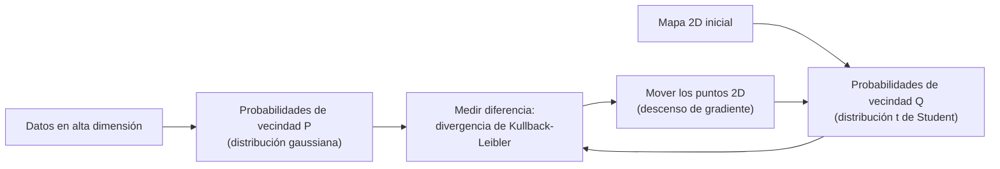

# EIN092B – Análisis de conceptos y prácticas del Lab C4

Este documento explica en detalle los dos notebooks del laboratorio:

- **Parte I:** `C4 - Visualización 2D/3D conceptos básicos` (Pandas, Matplotlib, Seaborn, Plotly; dataset *Salary Data* e *Iris*).
- **Parte II:** `C4_PCA_tSNE` (reducción de dimensionalidad; datasets *Breast Cancer Wisconsin* y *Olivetti Faces*).

---

# PARTE I: Visualización 2D y 3D

## 1. Punto de partida: el DataFrame y la exploración inicial

El análisis exploratorio de datos (EDA) comienza **mirando la tabla antes de graficar**. El notebook carga el archivo con `pd.read_csv('Salary Data.csv')` y describe cada columna: edad, años de experiencia, sexo, cargo, nivel de estudios y salario (la variable objetivo).

| Instrucción | Qué devuelve |
|---|---|
| `df.shape` | Tupla `(filas, columnas)` |
| `df.size` | Número total de elementos (filas × columnas) |
| `df.columns` | Nombres de las columnas |
| `df.index` | Etiquetas de las filas |
| `df.dtypes` | Tipo de dato de cada columna |
| `df.info()` | Resumen: filas, columnas, tipos, no-nulos y memoria |
| `df.head(n)` / `df.tail(n)` | Primeras / últimas `n` filas |

**Por qué importa:** el tipo de dato decide qué gráfico tiene sentido. Una columna numérica continua (salario) admite histograma o dispersión; una categórica (nivel de estudios) admite barras o torta. `df.info()` también revela **valores nulos**, que más adelante afectan a varios gráficos.

### Tipos de variable y su gráfico natural

```
Numérica continua   (Salary, Age, Years of Experience)  → histograma, dispersión, boxplot, línea
Categórica          (Gender, Education Level, Job Title) → barras, torta, boxplot por grupo
Tiempo / secuencia  (meses, segundos)                    → línea, área
```

---

## 2. Agrupar y agregar: `groupby` + `agg`

Casi todos los gráficos de barras del notebook parten de un resumen por categoría. La lógica de Pandas se llama **dividir – aplicar – combinar** (*split-apply-combine*):

```
DataFrame completo
   │  1. DIVIDIR: separa las filas por Education Level
   ▼
 [Bachelor's]   [Master's]   [PhD]
   │  2. APLICAR: calcula mean() de Salary en cada grupo
   ▼
 [media_B]      [media_M]    [media_P]
   │  3. COMBINAR: junta todo en una tabla nueva
   ▼
 Education Level | Salary
```

```python
educationSalary = df.groupby('Education Level').agg({'Salary': lambda x: x.mean()}).reset_index()
```

- **`groupby('Education Level')`:** crea los grupos.
- **`.agg({...})`:** indica qué función aplicar a qué columna.
- **`.reset_index()`:** el nombre del grupo queda como índice; este método lo convierte en una columna normal para poder usarla en el gráfico.

### Varias estadísticas a la vez

```python
resumen = df.groupby('Education Level').agg({'Salary': ['mean', 'std']}).reset_index()
resumen.columns = ['Education Level', 'Salary mean', 'Salary std']
```

Al pedir **más de una función** sobre una columna, Pandas crea columnas con **dos niveles de nombre** (`('Salary','mean')`). Por eso el notebook las renombra con una lista plana. Una forma equivalente y más corta es `df.groupby('Education Level')['Salary'].agg(['mean','std'])`.

El notebook también muestra la forma "larga": calcular media y desviación por separado y unirlas con `pd.concat(axis=1)`. Funciona, pero es redundante frente a una sola llamada a `agg`.

---

## 3. Gráfico de dispersión (scatter plot)

**Qué muestra:** la relación entre **dos variables numéricas**. Cada punto es una observación.

**Qué se lee en él:**
- **Tendencia:** si al subir X sube Y (positiva), baja (negativa) o no hay patrón.
- **Forma:** lineal, curva, en grupos.
- **Dispersión:** cuán pegados están los puntos a la tendencia.
- **Atípicos:** puntos solitarios lejos de la nube.

```python
plt.scatter(df['Age'], df['Years of Experience'], marker='+', s=15, color='red')
```

| Parámetro | Efecto |
|---|---|
| `marker` | Forma del punto (`'>'`, `'+'`, `'o'`...) |
| `s` | Tamaño del punto |
| `color` / `c` | Color fijo, o una variable para colorear |
| `alpha` | Transparencia (útil cuando hay solapamiento) |

### Cómo se arma una figura con varios paneles

```python
plt.figure(figsize=(10, 10))
plt.subplot(221)   # 2 filas, 2 columnas, posición 1
plt.subplot(222)   # posición 2
plt.subplot(223)   # posición 3
plt.subplot(224)   # posición 4
plt.tight_layout() # evita que se encimen títulos y ejes
```

```
┌──────────┬──────────┐
│ 221 (1)  │ 222 (2)  │
├──────────┼──────────┤
│ 223 (3)  │ 224 (4)  │
└──────────┴──────────┘
```

**Observación de la práctica:** en el notebook los paneles 1 y 3 repiten el mismo gráfico (solo cambia el color), igual que 2 y 4. El objetivo es practicar la sintaxis de `subplot` y de estilo, no aportar información nueva. Además, el texto dice que el salario va en el eje Y, pero el código lo pone en el eje X; conviene fijarse siempre en qué variable va en cada eje, porque cambia la lectura.

### El problema del solapamiento (*overplotting*)

Con muchos datos, los puntos se encimen y la nube parece una mancha uniforme: no se distingue dónde hay 5 puntos y dónde 500. Para eso existen `alpha` (transparencia), `hist2d` y `hexbin`, que se explican más abajo.

---

## 4. Gráfico de barras

**Qué muestra:** un valor (conteo, promedio, suma) para cada **categoría discreta**.

```python
plt.bar(educationSalary['Education Level'], educationSalary['Salary'], color='darkblue')
```

**Buenas prácticas:**
- **El eje Y debe partir en cero.** La altura de la barra representa el valor; si se recorta el eje, se exageran las diferencias.
- **Ordenar las barras** por valor cuando no hay un orden natural (el orden alfabético rara vez es informativo).
- **Barras horizontales** (`plt.barh`) si los nombres de las categorías son largos.
- Una barra con un promedio **oculta la dispersión**. Dos grupos con la misma media pueden tener variabilidades muy distintas.

### Anotar media ± desviación estándar

El notebook escribe sobre cada barra el texto `media ± std` con `plt.text(...)`:

```python
bars = plt.bar(x, means, color=['skyblue','blue','darkblue'])
for bar, mean, std in zip(bars, means, stds):
    plt.text(bar.get_x() + bar.get_width()/2,   # centro de la barra
             bar.get_height()/2,                 # a media altura
             f'{int(mean)} ± {int(std)}', ha='center')
```

- `bar.get_x()` y `bar.get_width()` permiten ubicar el centro de la barra.
- `ha='center'` centra el texto horizontalmente.
- Una alternativa más estándar para mostrar variabilidad es la **barra de error**: `plt.bar(x, means, yerr=stds, capsize=5)`.

**Observación de la práctica:** la desviación estándar describe la dispersión de los datos dentro de cada grupo. Si se grafica sobre barras de **promedios**, hay que dejar claro que `±std` mide la variabilidad entre personas, no la incertidumbre del promedio (eso sería el error estándar).

### Ejercicios propuestos (con solución)

**a) Salario promedio por género:**

```python
gender_salary = df.groupby('Gender')['Salary'].mean().reset_index()

plt.bar(gender_salary['Gender'], gender_salary['Salary'], color=['orange', 'tomato'])
plt.title('Salario promedio por género')
plt.xlabel('Género')
plt.ylabel('Salario promedio [USD]')
plt.show()
```

**b) Los cinco cargos con mayor salario promedio:**

```python
top5 = (df.groupby('Job Title')['Salary']
          .mean()
          .sort_values(ascending=False)
          .head(5)
          .reset_index())

plt.barh(top5['Job Title'], top5['Salary'], color='teal')
plt.gca().invert_yaxis()       # el mayor arriba
plt.xlabel('Salario promedio [USD]')
plt.title('Top 5 cargos por salario promedio')
plt.show()
```

Un detalle metodológico: un cargo con **muy pocos empleados** puede aparecer arriba solo por azar. Conviene mirar también cuántas personas hay en cada grupo (`.agg(['mean','count'])`).

---

## 5. Histograma

**Qué muestra:** la **distribución de una sola variable continua**. Divide el rango en intervalos (*bins*) y cuenta cuántas observaciones caen en cada uno.

```python
plt.hist(df['Years of Experience'], bins=20, edgecolor='black', color='teal')
```

**Qué se lee:**
- **Forma:** simétrica, sesgada a la derecha o izquierda.
- **Modas:** uno o varios picos (varios picos sugieren subgrupos mezclados).
- **Rango y atípicos:** valores extremos aislados.

**Cuidado con el número de bins:**

```
Muy pocos bins   →  oculta la forma real (todo parece una sola barra)
Muy muchos bins  →  ruido: cada barra tiene 0 o 1 dato
```

**Observación de la práctica:** el histograma del notebook grafica *Years of Experience*, pero el eje X dice "Salary". Siempre hay que verificar que la etiqueta describa la variable realmente graficada.

### Histograma 2D (`hist2d`)

Extiende la idea a **dos variables**: divide el plano en celdas y colorea cada una según cuántos puntos contiene.

```python
plt.hist2d(DFN['Age'], DFN['Salary'], bins=15, cmap='viridis')
plt.colorbar().set_label('Frequency')
```

Resuelve el solapamiento: donde el scatter muestra una mancha, el hist2d muestra **dónde se concentra la densidad**.

**Sobre `df.fillna(0)`:** el notebook rellena los nulos con 0 antes de graficar. Esto **introduce datos falsos** (personas de edad 0 o salario 0) que aparecen como una esquina de alta densidad artificial. Para gráficos es más correcto **eliminar** esas filas (`dropna()`), salvo que el 0 tenga sentido real para esa variable.

---

## 6. Gráfico de líneas

**Qué muestra:** cómo cambia una variable a lo largo de un eje **continuo y ordenado**, típicamente el tiempo.

La línea que une los puntos afirma algo: *"entre un punto y el siguiente, el valor evoluciona de forma continua"*. Por eso se usa para series temporales, señales o curvas de entrenamiento.

**Observación de la práctica:** el notebook grafica el salario promedio por nivel educativo con una línea. Es útil para practicar la sintaxis, pero conceptualmente **una línea entre categorías es discutible**. Si las categorías no tienen un orden natural, la línea sugiere una tendencia que no existe; en ese caso lo correcto es un gráfico de barras. Solo se justifica si las categorías son ordinales y se ordenan explícitamente (Bachelor → Master → PhD).

### El ejemplo de la señal con ruido

```python
np.random.seed(0)
time = np.linspace(0, 220, 100)
signal = np.sin(2 * np.pi * 50 * time)
noise = np.random.normal(0, 0.2, time.shape)
signal_with_noise = signal + noise
```

Muestra dos curvas superpuestas: la señal limpia (línea punteada roja) y la señal con ruido gaussiano (azul). Sirve para ver cómo el **ruido** perturba una señal. Elementos usados: `label` + `plt.legend()` para identificar curvas, `linestyle='--'` para distinguirlas y `plt.grid(True)` para facilitar la lectura.

**Observación de fondo (muestreo):** el código genera 100 puntos en 220 segundos, es decir, uno cada ~2,2 s, pero la señal es una senoide de 50 Hz (un ciclo cada 0,02 s). Para ver una senoide hay que muestrear a más del **doble de la frecuencia** (criterio de Nyquist, más de 100 muestras por segundo en este caso). Con tan pocas muestras ocurre *aliasing*: el gráfico no se parece a una onda seno. Para verla bien habría que graficar, por ejemplo, 0,1 s con 1000 puntos. (Además, el comentario del código habla de 60 Hz pero la fórmula usa 50.)

---

## 7. Boxplot (diagrama de caja)

**Qué muestra:** un resumen de la distribución con **cinco números** y los atípicos, ideal para **comparar grupos**.

```
              Q1      mediana     Q3
 ○           ├────────┬─────────┤                 ○  ○
outlier  ├────[   caja  (IQR)   ]────┤        outliers
       bigote                      bigote
```

| Elemento | Significado |
|---|---|
| **Mediana** (línea dentro de la caja) | Valor central: 50 % de los datos por debajo y 50 % por encima |
| **Q1** (borde inferior de la caja) | Percentil 25 |
| **Q3** (borde superior de la caja) | Percentil 75 |
| **IQR** (alto de la caja) | `Q3 − Q1`: contiene el 50 % central de los datos; mide dispersión |
| **Bigotes** | Se extienden hasta el dato más extremo que no supere los límites |
| **Puntos sueltos** | Valores atípicos (*outliers*) |

**Regla de Tukey para los límites:**

```
límite inferior = Q1 − 1,5 · IQR
límite superior = Q3 + 1,5 · IQR
```

Precisión: el bigote llega hasta **el último dato observado dentro de esos límites**, no necesariamente hasta el valor `Q1 − 1,5·IQR` mismo. Todo lo que cae fuera se dibuja como punto individual.

**Por qué es robusto:** usa mediana y cuartiles, que casi no se mueven por valores extremos. La media, en cambio, sí se desplaza mucho con un solo outlier.

**En la práctica del notebook:**

```python
gender_data = [df[df['Gender'] == g]['Salary'] for g in df['Gender'].unique()]
gender_data[0][0] = 5e5          # se inserta a propósito un salario atípico de 500 000
plt.boxplot(gender_data, labels=df_gender, patch_artist=True)
```

- Se arma **una lista con la serie de salarios de cada grupo**; `plt.boxplot` dibuja una caja por elemento.
- `gender_data[0][0] = 5e5` **modifica un dato a propósito** para crear un outlier visible y que se aprecie cómo se dibuja.
- `patch_artist=True` permite colorear las cajas (`patch.set_facecolor`).
- El segundo gráfico compara distribuciones por cargo y rota las etiquetas con `plt.xticks(rotation=35)` para que no se encimen.

> **Conexión con el laboratorio de mapas:** la actividad 4.4 usaba exactamente esta misma regla (IQR) para detectar distritos con densidad atípica, y la clasificación `BoxPlot` de `mapclassify` es la versión cartográfica del mismo concepto.

---

## 8. Gráfico de área

**Qué muestra:** cómo evoluciona una cantidad a lo largo de un eje continuo (normalmente tiempo), **rellenando** el espacio bajo la línea. Enfatiza el **volumen** o la contribución al total.

El notebook muestra dos formas distintas de hacerlo:

### a) Áreas superpuestas con `fill_between`

```python
plt.fill_between(df2.index, df2['Product_1'], color='darkblue', alpha=0.6, label='Product 1')
plt.fill_between(df2.index, df2['Product_2'], color='gray',     alpha=0.85, label='Product 2')
```

Cada serie se dibuja **desde cero** y se superpone a las otras; por eso se necesita `alpha` (transparencia). Sirve para **comparar series entre sí**, pero una serie grande puede tapar a otra.

### b) Áreas apiladas con Pandas

```python
df2.plot(kind='area', stacked=True, alpha=0.5)
```

Cada serie se dibuja **encima de la anterior**, de modo que el borde superior es el **total**.

```
Superpuesto                    Apilado
  ▁▂▃▅▆                          ▁▂▃▅▇  ← borde superior = suma total
  ▁▂▃▄▅   (cada serie desde 0)   ▁▂▃▄▅   ← capa 3
  ▁▁▂▃▃                          ▁▁▂▃▃   ← capa 2 / capa 1 (base)
```

| | Superpuesto | Apilado |
|---|---|---|
| Responde | ¿Cómo se compara cada serie con las demás? | ¿Cómo se compone el total? |
| Ventaja | Cada serie se lee desde la línea base | Se ve la contribución de cada parte |
| Desventaja | Una serie tapa a otra | Solo la capa inferior tiene base común, las demás son difíciles de leer |

**Ejercicio propuesto** (graficar sin apilar):

```python
df2.plot(kind='area', stacked=False, alpha=0.5, figsize=(6, 4))
plt.title('Ventas por producto (sin apilar)')
plt.show()
```

---

## 9. Gráfico circular (torta)

**Qué muestra:** la **proporción** de cada categoría respecto de un total (suma 100 %).

```python
gender_counts = df['Gender'].value_counts()
plt.pie(gender_counts, labels=gender_counts.index, autopct='%1.1f%%', startangle=90)
```

| Parámetro | Efecto |
|---|---|
| `labels` | Etiqueta de cada porción |
| `autopct='%1.1f%%'` | Muestra el porcentaje con un decimal |
| `startangle` | Ángulo donde parte la primera porción (0 = las 3 en punto, 90 = las 12 en punto) |
| `colors` | Lista de colores |

**Cuándo sirve y cuándo no:** los humanos comparamos **longitudes** (barras) mucho mejor que **ángulos y áreas** (tortas). La torta funciona con **2 a 5 categorías** cuando una de ellas es claramente distinta. Con muchas categorías, o con porciones de tamaños parecidos, no se pueden comparar.

El notebook lo demuestra con tres versiones del cargo (*Job Title*):

1. **Todas las categorías:** ilegible.
2. **Primeras 8:** sigue siendo difícil comparar porciones.
3. **Las 5 más frecuentes** (`value_counts().nlargest(5)`): más legible, pero ojo, **los porcentajes se recalculan solo sobre esas 5 categorías**, no sobre el total del dataset. Si se muestran solo las más frecuentes, hay que aclarar que no suman el 100 % real.

**Ejercicio propuesto** (distribución del nivel de estudios):

```python
df['Education Level'].value_counts().plot(kind='pie', autopct='%1.1f%%', startangle=90, figsize=(5, 5))
plt.ylabel('')
plt.title('Distribución del nivel de estudios')
plt.show()
```

---

## 10. Hexbin

**Qué muestra:** la densidad de puntos en un scatter dividiendo el plano en **hexágonos** y coloreando cada uno según cuántos puntos contiene.

```python
hb = plt.hexbin(df['Years of Experience'], df['Salary'], gridsize=10, cmap='jet', mincnt=1)
plt.colorbar(hb, label='Cuenta de Densidad')
```

| Parámetro | Efecto |
|---|---|
| `gridsize` | Número de hexágonos a lo ancho: **mayor valor = hexágonos más pequeños = más detalle** |
| `cmap` | Mapa de color (oscuro/intenso = más densidad, según la paleta) |
| `mincnt=1` | No dibuja hexágonos vacíos |

**Por qué hexágonos y no cuadrados (`hist2d`):** un hexágono tiene todos sus vecinos a una distancia parecida, así que el patrón de la grilla distorsiona menos la percepción de la densidad que una grilla cuadrada, donde los ejes horizontal y vertical "pesan" más.

**Cuándo usarlo:** conjuntos grandes donde el scatter se vuelve una mancha. En el notebook se compara con el scatter simple para ver el contraste. Con pocos datos el hexbin aporta poco.

---

## 11. Covarianza, correlación y mapa de calor

### Conceptos

```
Covarianza:  cov(X,Y) = promedio de (X − media_X)·(Y − media_Y)
Correlación: r(X,Y)   = cov(X,Y) / (σ_X · σ_Y)         →  siempre entre −1 y +1
```

| | **Covarianza** | **Correlación (Pearson)** |
|---|---|---|
| Rango | Cualquiera | −1 a +1 |
| Unidades | Producto de las unidades (USD·años) | Sin unidades |
| Comparable entre pares de variables | No | Sí |
| Mide | Dirección conjunta | Dirección **y fuerza** de la relación **lineal** |

**Interpretación de r:** +1 relación lineal positiva perfecta; 0 ausencia de relación lineal; −1 negativa perfecta.

**Cuidados:**
- Correlación **no implica causalidad**.
- Pearson solo detecta relaciones **lineales**: una relación en U puede tener r ≈ 0.
- Es sensible a valores atípicos.

### El mapa de calor (`sns.heatmap`)

```python
matrix = df[['Years of Experience', 'Age', 'Salary']].dropna()
sns.heatmap(matrix.corr(), annot=True, cmap='jet', vmin=0.0, vmax=1.0)
```

Dibuja la matriz como una grilla coloreada; `annot=True` escribe el número en cada celda. La matriz es **simétrica** y tiene unos en la diagonal (cada variable consigo misma).

**Observación de la práctica:** el notebook dibuja también la covarianza con la misma escala `vmin=0, vmax=1`. La covarianza **no está acotada** (con salarios en miles de USD sus valores son enormes), así que esa escala satura el color y deja de ser informativa. Además `vmin=0` oculta cualquier correlación negativa. Para correlaciones lo recomendable es una escala **divergente centrada en 0** (`vmin=-1, vmax=1, cmap='coolwarm'`).

**Relación con la Parte II:** la matriz de covarianza es justamente el objeto sobre el que trabaja PCA.

---

## 12. Pairplot (matriz de dispersión)

`sns.pairplot(df)` genera una **cuadrícula de gráficos** con todas las combinaciones de variables numéricas:

```
        Age            Experience         Salary
Age     histograma     scatter            scatter
Exper.  scatter        histograma         scatter
Salary  scatter        scatter            histograma
```

- **Diagonal:** distribución de cada variable individual.
- **Fuera de la diagonal:** relación entre cada par.
- **`hue='Education Level'`:** colorea por una variable categórica, lo que permite ver si los grupos se separan.
- **`diag_kind="hist"`:** fuerza histogramas en la diagonal (por defecto puede usar densidad).
- **`height`:** tamaño de cada subgráfico.

**Lo que enseña la práctica:**
- Con `hue='Education Level'` (pocas categorías) el gráfico es legible.
- Con `hue='Job Title'` (muchísimas categorías) la leyenda y los colores se vuelven inmanejables: **el color solo es útil con pocas categorías**.
- Con **Iris** (4 medidas numéricas, 3 especies) se ve el caso ideal: se aprecia que una especie (*setosa*) se separa claramente de las otras dos en las variables de pétalo.

**Límite del pairplot:** crece de forma cuadrática. Con 4 variables hay 16 paneles; con 30 variables serían 900. Es una de las razones por las que existe la reducción de dimensionalidad (Parte II).

---

## 13. Visualización 3D

Un scatter 3D añade un tercer eje (`x`, `y`, `z`) y permite colorear por categoría.

### Con Plotly (interactivo)

```python
import plotly.express as px
fig = px.scatter_3d(iris, x='sepal_length', y='sepal_width', z='petal_length', color='species')
fig.show()
```

Se puede **rotar, hacer zoom y pasar el cursor** para ver los valores. Es la opción más cómoda para explorar.

### Con Matplotlib (estático)

```python
ax = fig.add_subplot(111, projection='3d')
ax.scatter(x, y, z, label=species)
ax.set_xlabel(...); ax.set_ylabel(...); ax.set_zlabel(...)
```

Se dibuja una especie a la vez en un bucle para que cada una tenga color y leyenda. Es una imagen fija: solo ves el ángulo elegido.

**Observación de la práctica:** en una de las versiones del notebook el eje X se amplía con `set_xlim(min − 10, max + 10)`, lo que **aplasta los datos** en una franja pequeña. En la versión siguiente se usa un margen de ±1, que es razonable. Los límites de eje deben acercarse al rango real de los datos.

### Limitaciones del 3D

- **Oclusión:** unos puntos tapan a otros.
- **Perspectiva:** es difícil estimar distancias y valores exactos.
- **Dependencia del ángulo:** un patrón puede ser invisible desde un punto de vista y evidente desde otro.
- **Mal soporte en papel:** una imagen fija pierde la interactividad que lo hace útil.

Por eso, salvo que haya interacción, a menudo es mejor una matriz de scatter 2D (pairplot) o codificar la tercera variable con color o tamaño.

---

## 14. Resumen: qué gráfico elegir

| Pregunta | Gráfico |
|---|---|
| ¿Cómo se distribuye **una** variable numérica? | Histograma, boxplot |
| ¿Cómo se relacionan **dos** variables numéricas? | Scatter (hist2d / hexbin si hay muchos puntos) |
| ¿Cómo se comparan **categorías**? | Barras |
| ¿Cómo se comparan las **distribuciones de varios grupos**? | Boxplot por grupo |
| ¿Cómo evoluciona algo en el **tiempo**? | Línea |
| ¿Cómo se **compone un total** en el tiempo? | Área apilada |
| ¿Qué **proporción** tiene cada parte (pocas categorías)? | Torta (si no, barras) |
| ¿Cómo se relacionan **muchas** variables numéricas? | Matriz de correlación, pairplot |
| ¿Tres variables numéricas? | Scatter 3D interactivo o 2D con color/tamaño |

---

# PARTE II: Datos de alta dimensionalidad: PCA y t-SNE

## 1. ¿Qué es la dimensionalidad?

La **dimensionalidad** de un dataset es el **número de variables (columnas)** que describe cada observación. Si cada paciente se describe con 30 mediciones, sus datos viven en un espacio de **30 dimensiones**: cada paciente es un punto en ese espacio.

**El problema de visualización:** solo podemos dibujar hasta 3 dimensiones.

```
1 variable   →  una línea
2 variables  →  un plano (scatter)
3 variables  →  un espacio (scatter 3D)
4 o más      →  no hay forma directa de dibujarlo
```

Y aunque usemos pairplots, con 30 variables habría 435 pares distintos (30·29/2) y nadie los puede mirar todos.

## 2. La maldición de la dimensionalidad

Añadir dimensiones no solo agrega información: **cambia la geometría del espacio** y vuelve más difícil analizarlo.

| Efecto | Explicación |
|---|---|
| **Dispersión** | El volumen crece exponencialmente. Si divides cada variable en 10 intervalos, con 30 variables hay `10³⁰` celdas, y con 569 pacientes casi todas están vacías. Los puntos quedan aislados. |
| **Distancias pierden significado** | En alta dimensión, la distancia al vecino más cercano y al más lejano se parecen: todo "está igual de lejos". Las medidas de similitud pierden poder discriminante. |
| **Necesidad de más datos** | Para cubrir el espacio de forma representativa se necesitan cantidades de datos que crecen muy rápido. |
| **Sobreajuste** | Con muchas variables y pocas observaciones, un modelo memoriza ruido en vez de aprender patrones generales. |
| **Costo computacional** | Más variables implican más memoria y tiempo. |

## 3. Reducción de dimensionalidad

Es transformar los datos originales (muchas variables) en una representación de **pocas dimensiones (típicamente 2 o 3)** que conserve la **mayor cantidad posible de estructura relevante**.

```
30 variables  ──(PCA / t-SNE)──►  2 coordenadas  ──►  scatter 2D
```

Beneficios: permite **visualizar**, reduce ruido y redundancia, y mitiga los problemas anteriores.

Hay dos grandes familias, y el notebook trabaja una de cada una:

| | **PCA** | **t-SNE** |
|---|---|---|
| Tipo | Lineal | No lineal |
| Qué preserva | Dirección de **máxima varianza** (estructura global) | **Vecindades locales** |
| Determinista | Sí | No (estocástico) |
| Velocidad | Rápida | Más lenta |
| Interpretable en términos de variables originales | Sí (loadings) | No |

## 4. Estandarización previa (`StandardScaler`)

```python
X_scaled = StandardScaler().fit_transform(X)
```

Transforma cada variable para que tenga **media 0 y desviación 1**:

```
z = (x − media) / desviación estándar
```

**Por qué es indispensable en PCA:** PCA busca direcciones de máxima **varianza**, y la varianza depende de las **unidades**. Una variable medida en cientos o miles (como el área) tendría muchísima más varianza que una medida en centésimas (como la dimensión fractal), y dominaría el resultado solo por su escala, no por ser más informativa.

**Qué pasa si no se estandariza (pregunta de la actividad):** con el dataset de cáncer de mama, la desviación estándar de *worst area* es ≈ 569, mientras que la de variables como *fractal dimension error* es ≈ 0,003: **cinco órdenes de magnitud** de diferencia. Al ejecutar PCA directamente sobre los datos originales:

- **PC1 explica ≈ 98,2 %** de la varianza (versus ≈ 44,3 % con datos estandarizados).
- Los loadings de PC1 quedan dominados por las variables de área: *worst area* ≈ 0,85 y *mean area* ≈ 0,52, y casi todas las demás variables tienen loadings cercanos a cero.
- El resultado deja de describir "estructura de los datos" y pasa a describir "qué variable tiene las unidades más grandes".

Estandarizar da a todas las variables el mismo peso inicial.

---

## 5. PCA (Análisis de Componentes Principales)

### 5.1 La idea geométrica

PCA **rota el sistema de ejes** para encontrar nuevas direcciones, llamadas **componentes principales**, ordenadas por cuánta variabilidad capturan.

```
        y                         Los datos forman una nube alargada.
        │      · ·  ·             PC1 apunta a lo largo de la dirección
        │    ·  · ·  · ·          donde la nube más se estira (mayor varianza).
        │  ·  ·  ·  ·             PC2 es perpendicular (ortogonal) a PC1
        │ · ·  ·  ·               y captura la varianza restante.
        └──────────────── x
        (PC1 ↗ , PC2 ↖)
```

- **PC1:** dirección de máxima varianza.
- **PC2:** perpendicular a PC1, con la mayor varianza restante.
- Y así sucesivamente: **todos los componentes son ortogonales entre sí**.

Cada componente es una **combinación lineal** de las variables originales:

```
PC1 = w₁·x₁ + w₂·x₂ + ... + w₃₀·x₃₀
```

### 5.2 La matemática: eigenvalues y eigenvectors

PCA parte de la **matriz de covarianza** Σ (30×30 en este dataset) y resuelve:

```
Σ v = λ v
```

| Objeto | Significado |
|---|---|
| **Eigenvector `v`** | Una dirección del espacio: cómo se combinan las variables para formar un componente |
| **Eigenvalue `λ`** | Cuánta varianza tienen los datos **en esa dirección** |

Los eigenvectors se ordenan por eigenvalue de mayor a menor. Conservar los primeros `k` produce la reducción.

**Algoritmo en pasos:**

```
1. Estandarizar los datos
2. Calcular la matriz de covarianza
3. Calcular eigenvalues y eigenvectors
4. Ordenarlos de mayor a menor λ
5. Elegir los k primeros componentes
6. Proyectar los datos: Z = X · W_k
```

En `scikit-learn`:

| Atributo | Contenido |
|---|---|
| `pca.components_` | Direcciones de los componentes (una fila por componente) |
| `pca.explained_variance_` | Varianza (eigenvalue) de cada componente |
| `pca.explained_variance_ratio_` | **Proporción** de la varianza total que explica cada componente |

La proporción es `λᵢ / Σλ`. Con 30 variables estandarizadas la varianza total es ≈ 30, así que si PC1 explica 44,3 %, su eigenvalue es ≈ 13,3.

### 5.3 ¿Por qué `scikit-learn` usa SVD en vez de la matriz de covarianza? (pregunta de la actividad)

La **Descomposición en Valores Singulares (SVD)** factoriza una matriz de datos centrada `X` (n×p) como:

```
X = U · S · Vᵀ
```

- Las columnas de `V` (filas de `Vᵀ`) son las **direcciones principales**, es decir, los mismos eigenvectors de la covarianza.
- Los **valores singulares** de `S` se relacionan con los eigenvalues por `λᵢ = sᵢ² / (n − 1)`.
- Las coordenadas proyectadas (*scores*) son `U·S`.

Es decir, **SVD entrega lo mismo que la covarianza sin necesidad de calcularla**. Ventajas:

| Ventaja | Explicación |
|---|---|
| **Estabilidad numérica** | Calcular `XᵀX` eleva al cuadrado el número de condición de la matriz y amplifica errores de redondeo. SVD trabaja directamente sobre `X`. |
| **Eficiencia de memoria** | Evita construir la matriz p×p. Con las imágenes de rostros sería de 4096×4096 ≈ 16,8 millones de entradas. |
| **Cálculo parcial** | Existen variantes (*truncated*, *randomized*) que calculan **solo los primeros k** componentes, mucho más rápido cuando k es pequeño. |
| **Generalidad** | Funciona bien incluso cuando hay más variables que observaciones. |

(`scikit-learn` elige el solver automáticamente según el tamaño de los datos; en versiones recientes puede usar la descomposición de la covarianza en ciertos casos con muchas filas y pocas columnas, pero el enfoque base es SVD.)

### 5.4 ¿Cuántos componentes conservar?

Se mira la **varianza explicada** por componente y la **acumulada**, buscando un **codo**: el punto desde donde agregar más componentes aporta cada vez menos.

```python
pca = PCA(n_components=5)
X_pca = pca.fit_transform(X_scaled)
explained_var = pca.explained_variance_ratio_
plt.bar(range(1, 6), explained_var)
```

Resultados con el dataset de cáncer de mama estandarizado:

| Componente | Varianza explicada | Acumulada |
|---|---|---|
| PC1 | 44,3 % | 44,3 % |
| PC2 | 19,0 % | 63,2 % |
| PC3 | 9,4 % | 72,6 % |
| PC4 | 6,6 % | 79,2 % |
| PC5 | 5,5 % | 84,7 % |

**Lectura importante:** el scatter 2D con PC1 y PC2 conserva **≈ 63 % de la información (varianza)**, no el 100 %. Aun así, 5 componentes explican cerca del 85 % de la información de 30 variables: hay mucha **redundancia** (por ejemplo, radio, perímetro y área están fuertemente correlacionados entre sí).

Criterios habituales: elegir `k` para alcanzar un umbral de varianza acumulada (80–95 %), o usar el codo del gráfico.

### 5.5 Visualización en 2D

Tras `fit_transform`, cada paciente tiene nuevas coordenadas `(PC1, PC2)` y se grafica como un scatter. Se hace en dos pasos:

1. **Sin etiquetas:** se mira la estructura general (concentraciones, grupos, dispersión).
2. **Con etiquetas** (`y`): se colorea por clase para ver si la estructura **no supervisada** que encontró PCA coincide con las clases reales.

Punto clave: **PCA nunca usa las etiquetas**. Se usan solo después, para colorear.

> **Corrección importante sobre el código:** en `load_breast_cancer`, la etiqueta **`0` es *maligno*** (212 casos) y la **`1` es *benigno*** (357 casos). El notebook asigna `y==0` → "Benigno" y `y==1` → "Maligno", es decir, **las leyendas están invertidas**. La forma segura es usar `data.target_names` (`['malignant', 'benign']`) para etiquetar:
> ```python
> for clase, nombre in enumerate(data.target_names):
>     plt.scatter(X_pca[y==clase,0], X_pca[y==clase,1], label=nombre, alpha=0.7, edgecolor='k')
> ```
> Así los colores se mantienen y la leyenda es correcta.

### 5.6 Loadings: interpretar los componentes

Los **loadings** son los coeficientes `wᵢ` de cada variable en un componente (las entradas del eigenvector).

- **Valor absoluto grande:** la variable contribuye mucho a ese componente.
- **Valor cercano a 0:** contribuye poco.
- **Signo:** si es positivo, la variable y el componente crecen juntos; si es negativo, en sentido contrario.

```python
loadings = pd.DataFrame(pca.components_.T, columns=['PC1','PC2'], index=data.feature_names)
ordered_pc1 = loadings.reindex(loadings['PC1'].abs().sort_values(ascending=False).index)
```

**Resultado real en este dataset (estandarizado):**

| Ranking PC1 (|loading|) | Loading | Ranking PC2 (|loading|) | Loading |
|---|---|---|---|
| mean concave points | 0,261 | mean fractal dimension | 0,367 |
| mean concavity | 0,258 | fractal dimension error | 0,280 |
| worst concave points | 0,251 | worst fractal dimension | 0,275 |
| mean compactness | 0,239 | mean radius | −0,234 |
| worst perimeter | 0,237 | compactness error | 0,233 |

**Cómo leerlo:** PC1 está dominado por variables de **concavidad y compacidad del contorno** (irregularidad de la forma), con radio y perímetro también aportando (≈ 0,22–0,24). Es un eje que mezcla **tamaño y forma irregular del núcleo celular**. PC2 está dominado por la **dimensión fractal** (complejidad del borde).

> El notebook sugiere como ejemplo que, si predominan radio, perímetro y área, PC1 podría interpretarse como "tamaño". En los datos reales el top-3 son variables de concavidad; **hay que mirar los números, no asumir la interpretación**. Además, el signo de un componente es arbitrario (el algoritmo puede devolver `v` o `−v` según la versión), así que lo que importa son los signos **relativos** entre variables, no el signo absoluto.

### El gráfico de flechas (biplot simplificado)

El notebook dibuja flechas desde el origen con coordenadas `(loading_PC1, loading_PC2) × scaling_factor` para las 3 variables de mayor peso en PC1.

- El `scaling_factor` (35) solo **agranda** las flechas para que se vean; su **longitud no es una medida cuantitativa**.
- Lo informativo es la **dirección**: flechas que apuntan hacia lo mismo indican variables con contribuciones parecidas; direcciones opuestas indican contribuciones de signo contrario.
- La importancia exacta se lee en la tabla numérica de loadings.

### 5.7 Limitaciones de PCA: ¿varianza = información? (pregunta de la actividad)

PCA **asume** que las direcciones de mayor varianza son las más informativas. Esto puede fallar, sobre todo cuando el objetivo es **separar clases**, porque PCA **no usa las etiquetas**.

**Ejemplo construido:** dos clases que se separan en una variable de varianza pequeña, mientras otra variable, irrelevante, tiene varianza enorme.

```python
rng = np.random.default_rng(0)
n = 300
x_ruido = rng.normal(0, 10, 2*n)              # mucha varianza, sin relación con la clase
y_clase = np.r_[np.full(n, -1.0), np.full(n, 1.0)] + rng.normal(0, 0.3, 2*n)  # poca varianza, separa las clases
X_ej = np.c_[x_ruido, y_clase]
labels = np.r_[np.zeros(n), np.ones(n)]
# PC1 apunta casi exactamente hacia x_ruido: al proyectar sobre PC1 las dos clases se superponen.
```

```
Datos originales                 Proyección sobre PC1
  y │ ● ● ● ● ● ● ● (clase 1)       ●○●○○●●○●○●○○●○●   ← clases mezcladas
    │ ○ ○ ○ ○ ○ ○ ○ (clase 0)
    └───────────────── x
```

**Por qué ocurre:** PCA es **no supervisado**: maximiza varianza, no separabilidad. La varianza puede venir de ruido, de una variable irrelevante o de un factor que no distingue las clases. Alternativas cuando hay etiquetas: **LDA** (Análisis Discriminante Lineal), que busca direcciones que separen clases.

Otras limitaciones de PCA: solo captura estructura **lineal** (una espiral o una curva no se "desenrolla"), es sensible a la escala y a los outliers, y sus componentes son combinaciones de todas las variables, lo que complica la interpretación.

---

## 6. t-SNE

### 6.1 La idea

**t-SNE** (*t-distributed Stochastic Neighbor Embedding*) es una técnica **no lineal** diseñada para **visualización exploratoria** en 2D o 3D. Su objetivo **no** es maximizar varianza, sino **preservar las relaciones de vecindad**:

> *Si dos observaciones son similares (cercanas) en el espacio original, deben quedar cerca en el mapa 2D.*

### 6.2 Cómo funciona (paso a paso)



1. **En el espacio original:** para cada punto, se convierte la distancia a los demás en una **probabilidad de ser su vecino** usando una gaussiana. Puntos cercanos = alta probabilidad; lejanos = probabilidad casi nula. El ancho de la gaussiana de cada punto se ajusta según la **perplexity**.
2. **En el espacio 2D:** se hace lo mismo, pero con una distribución **t de Student** (1 grado de libertad).
3. **Comparar:** se mide qué tan distintas son ambas distribuciones con la **divergencia de Kullback-Leibler**.
4. **Optimizar:** se mueven iterativamente los puntos del mapa para reducir esa diferencia.

### 6.3 Gaussiana vs. t de Student

```python
gaussian  = np.exp(-(d**2) / 2)
student_t = 1 / (1 + d**2)
```

Valores del notebook (similitud relativa, sin normalizar):

| Distancia | Gaussiana | t de Student |
|---|---|---|
| 0,5 | 0,8825 | 0,8000 |
| 1 | 0,6065 | 0,5000 |
| 2 | 0,1353 | 0,2000 |
| 3 | 0,0111 | 0,1000 |

A distancias grandes la t de Student asigna **mucha más probabilidad** (a distancia 3, nueve veces más): tiene **colas pesadas**. Esto sirve para el **problema de aglomeración (*crowding problem*)**: en 2D hay mucho menos espacio que en 30 dimensiones; si todos los puntos moderadamente lejanos tuvieran que quedar cerca, el mapa se colapsaría. Con colas pesadas, los puntos **no vecinos pueden alejarse más** en el mapa sin penalización excesiva, y los grupos se separan visiblemente.

### 6.4 Divergencia de Kullback-Leibler y su asimetría (pregunta de la actividad)

La **divergencia KL** mide cuánto difiere una distribución `Q` de una distribución de referencia `P`:

```
KL(P ‖ Q) = Σ p_ij · log( p_ij / q_ij )
```

En t-SNE, `P` son las vecindades del espacio original y `Q` las del mapa 2D. Se minimiza `KL(P ‖ Q)`.

**Es asimétrica:** `KL(P ‖ Q) ≠ KL(Q ‖ P)`. La consecuencia práctica se ve con los términos de la suma:

| Situación | p (original) | q (mapa) | Contribución al costo | Significado |
|---|---|---|---|---|
| **Vecinos reales separados en el mapa** | 0,5 | 0,01 | 0,5·ln(50) ≈ **+1,96** | Penalización **alta** |
| **No vecinos juntados en el mapa** | 0,01 | 0,5 | 0,01·ln(0,02) ≈ **−0,04** | Penalización **casi nula** |

Es decir, el algoritmo castiga mucho **separar puntos que sí eran vecinos** y castiga poco **juntar puntos que no lo eran**. Consecuencias:

- t-SNE preserva muy bien la **estructura local**.
- Puede **crear vecindades falsas** o colocar grupos alejados en posiciones arbitrarias.
- Por eso **las distancias globales entre clusters no son confiables**.

### 6.5 Hiperparámetros

| Parámetro | Qué controla | Notas |
|---|---|---|
| `n_components` | Dimensión de salida | Normalmente 2 (a veces 3) |
| **`perplexity`** | Escala de vecindad: número "efectivo" de vecinos | Rango típico 5–50; debe ser **menor que el número de muestras**. Baja → estructuras muy locales, puede fragmentar grupos. Alta → vecindad amplia, estructura más global, menos detalle local |
| `learning_rate` | Tamaño de los pasos de optimización | Muy bajo → avance lento o nube comprimida. Muy alto → resultado inestable o artificialmente disperso. `'auto'` en versiones recientes |
| `max_iter` | Pasos de optimización | Muy pocos → el algoritmo se detiene antes de estabilizarse |
| `random_state` | Semilla | t-SNE es **estocástico**; fijar la semilla hace el resultado reproducible |

### 6.6 Experimento con distintos valores de `perplexity` (pregunta de la actividad)

```python
fig, axes = plt.subplots(1, 4, figsize=(20, 4))
for ax, perp in zip(axes, [2, 5, 30, 100]):
    emb = TSNE(n_components=2, perplexity=perp, random_state=42).fit_transform(X_scaled)
    ax.scatter(emb[y==0,0], emb[y==0,1], c='r', alpha=0.6, s=10, label='maligno')
    ax.scatter(emb[y==1,0], emb[y==1,1], c='b', alpha=0.6, s=10, label='benigno')
    ax.set_title(f'perplexity = {perp}')
plt.show()
```

**Qué suele observarse (conviene comprobarlo con la ejecución propia):**

| Perplexity | Aspecto típico | Riesgo |
|---|---|---|
| **Muy baja (2–5)** | Muchos grupitos pequeños, dispersos y fragmentados, a veces como "cadenas" | Parecen clusters que **no existen**: se interpreta ruido local como estructura |
| **Media (15–50)** | Grupos más estables y claros | Generalmente la zona más razonable |
| **Muy alta (≥ 100)** | Estructura más difusa, grupos que se pegan | Se pierde detalle local |

La lección: **un solo mapa t-SNE no prueba nada**. Una estructura es creíble si **se mantiene a través de varios valores de perplexity y semillas**. Un resultado puede ser engañoso cuando la perplexity es muy baja (clusters falsos) o cuando se interpreta el tamaño o la distancia entre grupos como si fueran reales.

### 6.7 Cómo (no) interpretar un mapa t-SNE

| Sí es informativo | No es informativo |
|---|---|
| Puntos cercanos entre sí dentro de una región suelen ser similares | **Distancia entre clusters** (que uno esté al doble de lejos de otro no significa nada) |
| Existencia de agrupamientos locales (si es robusta) | **Tamaño** de los clusters |
| Mezcla o separación parcial entre clases | **Espacios vacíos** entre grupos |
| | Ejes: no tienen significado propio (ni "dimensión 1" ni "dimensión 2") |

Además, t-SNE **no es un clasificador**: una separación visual no equivale a una frontera de decisión. Las etiquetas solo se usan después, para colorear.

### 6.8 Aplicación al dataset de cáncer de mama

```python
X_scaled = StandardScaler().fit_transform(X)
tsne = TSNE(n_components=2, random_state=42, perplexity=15, learning_rate=300)
X_tsne = tsne.fit_transform(X_scaled)
```

Se **estandariza otra vez** porque t-SNE se apoya en distancias entre observaciones: una variable con escala enorme dominaría la distancia. (Aplica la misma corrección de etiquetas de la sección 5.5: usar `data.target_names`.)

Una separación parcial entre clases en el mapa sugiere que las características contienen información relacionada con el diagnóstico.

---

## 7. t-SNE sobre PCA (dataset Olivetti Faces)

### El dataset

- **400 imágenes** en escala de grises de rostros, de **40 personas** (10 fotos por persona).
- Cada imagen es de **64×64 píxeles** = **4096 variables** (cada píxel es una dimensión).
- Cambian la expresión, la iluminación y la orientación, lo que modifica muchos píxeles a la vez.

```python
faces = fetch_olivetti_faces()
X, y = faces.data, faces.target        # X: (400, 4096)
plt.imshow(X.reshape(-1, 64, 64)[i], cmap='gray')   # volver a forma de imagen
```

`reshape(-1, 64, 64)` convierte cada vector de 4096 valores de vuelta en una imagen 64×64 para poder verla.

### Por qué combinar PCA + t-SNE

```python
X_pca30 = PCA(n_components=30, random_state=42).fit_transform(X_scaled)
X_tsne  = TSNE(n_components=2, perplexity=30, learning_rate=200, random_state=42).fit_transform(X_pca30)
```

```
4096 dimensiones ──PCA──► 30 dimensiones ──t-SNE──► 2 dimensiones
```

| Motivo | Explicación |
|---|---|
| **Costo** | Calcular distancias en 4096 dimensiones es caro; en 30 es mucho más rápido |
| **Ruido** | Los últimos componentes de PCA capturan sobre todo ruido (variaciones mínimas de píxeles); descartarlos limpia la señal |
| **Maldición de la dimensionalidad** | Las distancias son más fiables en 30 dimensiones que en 4096 |
| **Complementariedad** | PCA hace la reducción gruesa y lineal; t-SNE el refinamiento no lineal para visualizar |

Un práctica recomendada es comprobar cuánta varianza se conserva con esos 30 componentes (`pca.explained_variance_ratio_.sum()`), para saber cuánto se descartó.

El mapa se colorea por identidad de la persona (`c=y`). Si t-SNE funciona bien, las fotos de la **misma persona** quedan agrupadas, porque las vecindades locales reflejan que son la misma cara. Como son 40 identidades sin orden natural, una escala continua como `jet` sugiere un orden que no existe; una paleta cualitativa sería más apropiada.

---

## 8. PCA vs. t-SNE: comparación

| Aspecto | PCA | t-SNE |
|---|---|---|
| Naturaleza | Lineal | No lineal |
| Objetivo | Maximizar varianza | Preservar vecindades locales |
| Estructura global | Se preserva (razonablemente) | No es confiable |
| Estructura local | Puede perderse | Muy bien preservada |
| Determinismo | Sí | No (depende de semilla) |
| Hiperparámetros | Prácticamente solo `n_components` | `perplexity`, `learning_rate`, `max_iter`... y muy sensible |
| Velocidad | Rápido | Lento en datasets grandes |
| Interpretabilidad | Alta (loadings) | Ninguna sobre variables |
| Nuevos datos | Sí (`transform`) | No: en `scikit-learn` solo existe `fit_transform` |
| Invertible | Aproximadamente (`inverse_transform`) | No |
| Uso típico | Preprocesar, comprimir, entender qué variables pesan | Visualizar y explorar agrupaciones |

**Flujo de trabajo habitual:** estandarizar → PCA (para entender, comprimir o preprocesar) → t-SNE (para visualizar la estructura local) → validar con varias perplexities y semillas.

---

## 9. UMAP (pregunta de la actividad)

**UMAP** (*Uniform Manifold Approximation and Projection*) es otra técnica no lineal de reducción de dimensionalidad, muy usada hoy.

### Similitudes con t-SNE

- Ambas son **no lineales** y buscan preservar **vecindades locales**.
- Ambas construyen una **representación de vecindad en alta dimensión** y optimizan un layout en baja dimensión para que se parezca.
- Ambas se usan principalmente para **visualización 2D/3D**.
- Ambas dependen de hiperparámetros y requieren interpretación cuidadosa.

### Diferencias conceptuales

| Aspecto | t-SNE | UMAP |
|---|---|---|
| Fundamento | Probabilidades de vecindad (gaussiana/t) y divergencia KL | Teoría de variedades y topología: construye un **grafo de vecinos más cercanos "difuso"** y optimiza una entropía cruzada |
| Parámetro principal | `perplexity` | `n_neighbors` (tamaño de vecindad) y `min_dist` (qué tan apretados quedan los puntos) |
| Velocidad y escalabilidad | Más lento | Normalmente mucho más rápido y escalable |
| Estructura global | Poco confiable | Suele conservarla mejor (sin garantía estricta) |
| Nuevos datos | No admite `transform` en `scikit-learn` | Sí, puede proyectar puntos nuevos con un modelo ya ajustado |
| Uso más allá de visualizar | Casi solo visualización | Puede usarse también como paso previo para otros algoritmos |

**Advertencia común a ambos:** aunque UMAP suele conservar mejor la geometría global, **la distancia entre clusters en un mapa UMAP tampoco debe interpretarse de forma cuantitativa**, y sus resultados también cambian con sus hiperparámetros y semillas.

---

## 10. Conexión entre las dos partes del laboratorio

- Los gráficos de la Parte I (scatter, pairplot, 3D) llegan a un límite cuando hay **muchas variables**: no hay forma de verlas todas a la vez.
- La Parte II resuelve ese límite proyectando muchas variables a **2 coordenadas** que sí se pueden graficar con un scatter simple.
- Conceptos de la Parte I que reaparecen en la Parte II: **covarianza y correlación** (base matemática de PCA), **estandarización** (necesaria por las escalas distintas de las variables), **scatter coloreado por categoría** (para evaluar si la estructura encontrada coincide con las clases) y **outliers** (que afectan tanto a PCA como a la correlación).
