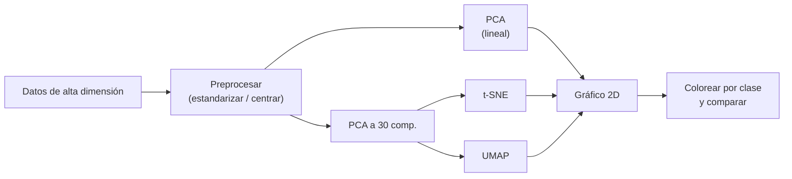

# EIN092B – Lab S6: conceptos y gráficos

Esta guía explica, en orden, los **conceptos** y los **gráficos** del laboratorio *Técnicas de visualización y reducción de dimensionalidad* (PCA, t-SNE y UMAP). Las descripciones de cada gráfico están hechas a partir de las figuras que produce tu notebook `Lab_S6.ipynb`. Los números leídos desde una figura son aproximados y se marcan con "≈".

---

## 0. Mapa general del laboratorio



| Parte | Dataset | Dimensión original | Técnica | Gráficos |
|---|---|---|---|---|
| 1 | USArrests (50 estados) | 4 variables | PCA | Biplot |
| 2 | Olivetti faces (400 caras) | 4096 píxeles | PCA → t-SNE | Varianza, scatter t-SNE, fotos de una clase, widget perplexity, PCA vs t-SNE |
| 3 | Fashion-MNIST (70 000 prendas) | 784 píxeles | PCA → UMAP | Scatter UMAP, grilla de hiperparámetros, métricas, widget, t-SNE vs UMAP, semisupervisado |

**Idea central de todo el lab:** estos datos tienen demasiadas variables para dibujarlos. Las técnicas de reducción de dimensionalidad los proyectan a **2 coordenadas** para poder hacer un scatter plot y ver si hay estructura (grupos, parecidos, atípicos).

---

## 1. Conceptos base

### 1.1 Aprendizaje no supervisado

En un problema supervisado hay una respuesta conocida (etiqueta o variable objetivo). En uno **no supervisado** solo hay variables medidas, y se busca descubrir **estructura**: grupos, tendencias, redundancias.

En este lab **ninguna técnica usa las etiquetas para calcular la proyección** (salvo el último gráfico, el de UMAP semisupervisado). Las etiquetas se usan después, solo para **colorear** los puntos y comprobar si lo que encontró el algoritmo coincide con las clases reales.

### 1.2 Dimensionalidad y reducción de dimensionalidad

- **Dimensionalidad** = número de variables por observación. Una cara de 64×64 píxeles tiene 4096 dimensiones: cada píxel es una variable.
- **Reducción de dimensionalidad** = transformar esos datos a pocas dimensiones (aquí 2) conservando la mayor estructura posible.
- **Embedding** = la representación de baja dimensión resultante: en el lab, la matriz de forma `(n_muestras, 2)` que se dibuja.

### 1.3 Preprocesamiento: centrar vs. estandarizar

| Operación | Fórmula | Efecto |
|---|---|---|
| **Centrar** | `x − media` | Media 0; la escala no cambia |
| **Estandarizar** | `(x − media) / desviación` | Media 0 y desviación 1 |

- En **USArrests** se estandariza porque las variables tienen unidades y escalas muy distintas (Assault en cientos, UrbanPop en porcentaje, Murder en unidades). Sin esto, la de mayor escala dominaría PCA solo por su magnitud.
- En **Olivetti** todas las variables son píxeles con la misma escala, así que basta con centrar. El notebook aplica dos centrados:
  - **Global:** a cada píxel se le resta su promedio sobre las 400 caras (se quita la "cara promedio").
  - **Local:** a cada imagen se le resta su propio brillo promedio (se quita el efecto de que una foto sea globalmente más clara u oscura).

### 1.4 Clúster y colores de clase

Un **clúster** es un grupo de puntos cercanos entre sí. Que los puntos de un mismo color (misma clase) formen un clúster significa que las observaciones de esa clase son parecidas según el espacio original, y que la técnica supo mostrarlo.

### 1.5 Mapas de color usados

| Mapa | Dónde | Observación |
|---|---|---|
| `nipy_spectral` | Olivetti (40 clases) | Escala **continua**: colores cercanos en la barra se parecen, por lo que identidades distintas pueden verse del mismo color |
| `tab10` | Fashion-MNIST (10 clases) | Paleta **cualitativa**: 10 colores bien distinguibles; es la adecuada para categorías |

---

## 2. PCA en USArrests

### 2.1 Qué es el dataset

50 filas (estados de EE. UU.) y 4 variables:

| Variable | Significado |
|---|---|
| **Murder** | Arrestos por asesinato por cada 100 000 habitantes |
| **Assault** | Arrestos por agresión por cada 100 000 habitantes |
| **Rape** | Arrestos por violación por cada 100 000 habitantes |
| **UrbanPop** | Porcentaje de la población que vive en zonas urbanas |

### 2.2 Conceptos de PCA

| Concepto | Explicación |
|---|---|
| **Componente principal (PC)** | Un nuevo eje, combinación lineal de las variables originales |
| **PC1** | La dirección donde los datos tienen **mayor varianza** |
| **PC2** | La dirección **perpendicular** a PC1 con la mayor varianza restante |
| **Eigenvector** | La dirección de un componente: `pca.components_` (una fila por componente) |
| **Eigenvalue** | La varianza de los datos en esa dirección: `pca.explained_variance_` |
| **Varianza explicada** | Proporción de la varianza total que captura cada componente: `explained_variance_ratio_` |
| **Scores** | Las nuevas coordenadas de cada observación (`x_train_pca`): los **puntos** del gráfico |
| **Loadings** | Los coeficientes de cada variable en cada componente: las **flechas** del gráfico |

Resultado del notebook:

```
Varianza explicada por componente: [0.620, 0.247]
Varianza total explicada (2 componentes): 0.8675  → 86,75 %
```

Las dos primeras componentes retienen casi el 87 % de la información de las 4 variables, así que el gráfico 2D es una representación bastante fiel.

### 2.3 Gráfico 1: Biplot (dispersión + eigenvectores)

**Qué es:** un **biplot** dibuja en un mismo plano dos cosas:

1. Las **observaciones** (50 puntos azules con el nombre del estado), en coordenadas (PC1, PC2).
2. Las **variables** (4 flechas rojas desde el origen), con sus loadings.

**Anatomía del gráfico**

| Elemento | Qué representa |
|---|---|
| Punto | Un estado, en las nuevas coordenadas |
| Origen (0, 0) | El estado "promedio" (los datos estaban estandarizados) |
| Eje X: PC1 (62,0 %) | Primer componente |
| Eje Y: PC2 (24,7 %) | Segundo componente |
| Flecha | Una variable original: apunta hacia donde esa variable **aumenta** |

**Valores aproximados de las flechas** (coordenada en PC1, coordenada en PC2):

| Variable | PC1 | PC2 |
|---|---|---|
| Murder | ≈ 0,54 | ≈ −0,42 |
| Assault | ≈ 0,58 | ≈ −0,19 |
| Rape | ≈ 0,54 | ≈ +0,17 |
| UrbanPop | ≈ 0,28 | ≈ +0,87 |

(El signo de PC2 depende de la implementación; si saliera invertido, el gráfico se vería reflejado y la interpretación sería la misma.)

#### Cómo leer el eje horizontal (PC1)

Las tres flechas de delitos apuntan a la **derecha** con pesos parecidos (≈ 0,54–0,58). UrbanPop también apunta a la derecha, pero con un peso bajo (≈ 0,28). Por eso **PC1 es un índice general de criminalidad violenta**:

- **Derecha:** Florida, Nevada, California, Michigan, New Mexico, Maryland, Alaska → tasas altas en los tres delitos.
- **Izquierda:** North Dakota, Vermont, Maine, New Hampshire, Iowa, Wisconsin → tasas bajas.

PC1 explica el 62 % porque los tres delitos están **correlacionados**: PCA los condensa en un solo eje.

#### Cómo leer el eje vertical (PC2)

Aquí domina **UrbanPop** (≈ +0,87), con Murder y Assault apuntando hacia abajo. PC2 contrasta **urbanización** con **homicidios y asaltos**:

- **Arriba:** estados muy urbanizados (California, Hawaii, Rhode Island, Massachusetts, New Jersey, Connecticut).
- **Abajo:** estados poco urbanizados, y más abajo aún si tienen mucho homicidio (Mississippi, North Carolina, South Carolina, Georgia, Alabama).

#### Lectura de las flechas

| Qué miras | Qué significa |
|---|---|
| **Ángulo pequeño** entre dos flechas | Las variables están **correlacionadas positivamente** |
| **Ángulo ≈ 90°** | Prácticamente **sin relación lineal** |
| **Ángulo ≈ 180°** (opuestas) | Correlación **negativa** |
| Un estado "en la dirección" de una flecha | Tiene valor **alto** de esa variable |
| Un estado en la dirección **opuesta** | Tiene valor **bajo** de esa variable |

Aplicado al gráfico:

- Murder, Assault y Rape forman un abanico estrecho a la derecha → están **fuertemente correlacionadas**. En los datos reales, Murder–Assault ≈ 0,80, Assault–Rape ≈ 0,67 y Murder–Rape ≈ 0,56.
- UrbanPop apunta casi perpendicular a Assault y forma un ángulo mayor con Murder → **poca relación** con ellos (en los datos, correlación con Murder ≈ 0,07 y con Assault ≈ 0,26).
- UrbanPop forma un ángulo más cerrado con Rape (≈ 55°), coherente con una relación **moderada** (≈ 0,41).

**Cuidados de lectura**

1. **Las flechas y los puntos están en escalas distintas.** Las flechas son eigenvectores de norma 1 (valores entre −1 y 1), mientras que los puntos llegan a ±3. Por eso las flechas se ven "chicas". El notebook no las agranda; el largo no debe leerse como importancia cuantitativa. Lo informativo es la **dirección** y los **valores numéricos** de los loadings.
2. **Los ángulos son una aproximación.** El plano 2D conserva ≈ 87 % de la información; el 13 % restante (PC3 y PC4) no se ve. Para afirmar una correlación hay que verificarla con `df.corr()`.
3. **PCA describe asociación, no causa.** Que dos variables suban juntas no explica por qué.

Para respaldar lo que dices con números:

```python
print(pd.DataFrame(pca.components_.T,
                   index=['Murder','Assault','UrbanPop','Rape'],
                   columns=['PC1','PC2']).round(3))
print(pd.DataFrame(x_train, columns=['Murder','Assault','UrbanPop','Rape']).corr().round(2))
```

#### Estados interesantes en el gráfico

| Estado(s) | Posición | Lectura |
|---|---|---|
| Nevada, California | Derecha y arriba | Muy urbanos y con alta criminalidad violenta |
| Hawaii, Massachusetts, Rhode Island, New Jersey | Izquierda y arriba | Muy urbanos pero con criminalidad baja |
| Mississippi, North Carolina, South Carolina | Derecha y muy abajo | Poco urbanos y con criminalidad alta |
| North Dakota, Vermont, West Virginia | Izquierda y abajo | Poco urbanos y con criminalidad baja |
| Virginia, Indiana, Oregon, Delaware | Cerca del origen | Estados "promedio" en las 4 variables |

El gráfico muestra que **urbanización y criminalidad violenta no van de la mano** en este dataset: hay estados urbanos con poco crimen y estados rurales con mucho. Eso es lo que significa que PC1 y PC2 sean casi independientes.

---

## 3. t-SNE sobre Olivetti faces

### 3.1 El dataset

- **400 fotos** de **40 personas** (10 por persona). Varían la expresión, el punto de vista y el uso ocasional de gafas.
- La guía menciona imágenes de 92×112 = 10 304 píxeles (el tamaño original). La versión de `scikit-learn` que usas está **reducida a 64×64 = 4096 píxeles**, y eso es lo que imprime el notebook: `(400, 4096)`. (El comentario `# (400, 10304)` del código quedó desactualizado.)

### 3.2 Conceptos de t-SNE

| Concepto | Explicación |
|---|---|
| **t-SNE** | Técnica no lineal para visualización: busca que puntos **vecinos** en alta dimensión queden **vecinos** en el mapa 2D |
| **Probabilidades de vecindad (P)** | En alta dimensión, se convierte la distancia entre puntos en la probabilidad de ser vecinos usando una **gaussiana** |
| **Probabilidades en 2D (Q)** | En el mapa se usa una **t de Student** (colas pesadas), que deja separar más los puntos no vecinos |
| **Divergencia KL** | Mide cuánto difieren P y Q; el algoritmo mueve los puntos para **minimizarla** |
| **Perplexity** | Número "efectivo" de vecinos que considera cada punto; controla la escala (local vs. más amplia) |
| **`random_state`** | Semilla: t-SNE es estocástico, con otra semilla el mapa cambia |

**Por qué PCA antes de t-SNE:** con 4096 dimensiones el cálculo es lento y hay ruido (variaciones mínimas de píxeles). PCA a 30 componentes reduce costo y filtra ruido, y t-SNE trabaja sobre esas 30 coordenadas, no sobre los píxeles crudos.

### 3.3 Gráfico 2: Varianza explicada por componente y acumulada

Es una figura con dos paneles, sobre las 30 componentes de PCA.

**Panel izquierdo (barras):** cuánto aporta **cada** componente por separado.

| Componente | Varianza individual (≈) |
|---|---|
| PC1 | 18 % |
| PC2 | 10 % |
| PC3 | 7 % |
| PC4 | 5,5 % |
| PC5 | 4 % |
| PC20–30 | ≈ 0,5–1 % cada una |

La caída es rápida al inicio y luego se aplana: las primeras componentes capturan los rasgos globales (iluminación, forma general de la cara), y las últimas, detalles finos.

**Panel derecho (línea con puntos):** la varianza **acumulada**.

| Nº de componentes | Varianza acumulada (≈) |
|---|---|
| 1 | 18 % |
| 5 | 45 % |
| 10 | 58 % |
| 20 | 70 % |
| 30 | **77,2 %** (línea roja punteada) |

**Cómo leerlo:**

- Con 30 componentes se retiene el **77,2 %** de la varianza; se descarta ≈ 23 % (ruido y detalle fino).
- **No hay un "codo" claro:** la curva sigue subiendo lentamente. Las caras son datos cuya variabilidad está **repartida** en muchas direcciones, a diferencia de USArrests, donde 2 componentes bastaban.
- Con solo **2 componentes se llega a ≈ 28 %**: un dato clave para entender el gráfico de PCA vs. t-SNE más abajo.

### 3.4 Gráfico 3: Scatter de t-SNE (perplexity = 40)

**Qué muestra:** 400 puntos (una foto por punto) en el mapa 2D. El color indica la identidad (0 a 39) según la barra lateral.

**Qué buscar:** si t-SNE funcionó bien, las 10 fotos de cada persona (mismo color) deberían quedar juntas.

**Qué se observa:**

- Aparecen **muchos grupos compactos** de puntos del mismo color en la periferia (por ejemplo, rojos arriba a la izquierda, naranjas a la izquierda, amarillos a la derecha, violetas oscuros arriba). Cada grupo corresponde a una persona.
- En el **centro** el mapa es más mezclado: hay puntos de colores muy distintos entremezclados. Allí t-SNE no logró separar bien a las personas.
- Algunos colores aparecen en **dos o más grupos separados**: una misma persona puede ocupar varias "islas".

**Cuidados:**

- Con 40 identidades y un mapa de colores continuo (`nipy_spectral`), muchos colores se parecen. Un grupo "mezclado" a veces es solo una paleta poco discriminable. Para distinguir mejor se pueden usar marcadores distintos, o graficar solo algunas clases.
- Los **ejes no tienen significado**: ni "dimensión 1" ni "dimensión 2" corresponden a una variable. Tampoco son interpretables las distancias entre islas ni su tamaño.

**Los mensajes de la consola** (`verbose=1`):

| Mensaje | Qué significa |
|---|---|
| `Computing 121 nearest neighbors` | t-SNE solo considera los `3·perplexity + 1` vecinos más cercanos de cada punto (3·40+1 = 121) |
| `Mean sigma: 3.345` | Ancho promedio de las gaussianas, ajustado para cumplir la perplexity |
| `KL divergence after 250 iterations with early exaggeration: 55.67` | En las primeras 250 iteraciones se **exageran** artificialmente las probabilidades para formar grupos; este valor está inflado a propósito |
| `KL divergence after 1000 iterations: 0.595` | Valor final de la divergencia KL: **menor = mejor ajuste** de las vecindades |

El valor de KL **no sirve para comparar** entre datasets ni entre perplexities distintas; solo indica que el algoritmo convergió.

### 3.5 Gráfico 4: Fotos originales de la clase 5

Es una fila con las 10 fotos de la persona 5, con su índice (idx) en el dataset. El notebook la acompaña de las coordenadas t-SNE de esas 10 fotos para **comprobar visualmente** si t-SNE las agrupó bien.

**Qué muestran las fotos:** un hombre con gafas, de frente; cambian la expresión (en idx 190 sonríe mostrando los dientes), la iluminación (algunas, como idx 92 y 283, tienen sombra en el lado izquierdo) y pequeños giros de la cabeza.

**Cruce con las coordenadas t-SNE impresas:** las 10 fotos se reparten así en el mapa.

| Grupo en el mapa | Coordenadas ≈ | Fotos (idx) |
|---|---|---|
| A | (−3,7 ; −9,6), (−2,2 ; −8,7), (−3,7 ; −8,8) | 15, 82, 345 |
| B | (0,0 ; −14,8), (1,3 ; −15,5), (2,0 ; −15,5) | 45, 92, 283 |
| C | (−8,8 ; −0,5), (−8,1 ; −0,8), (−8,4 ; −0,4) | 56, 190, 286 |
| Aislada | (−1,3 ; −4,6) | 335 |

**Lectura:**

- La persona 5 no queda en un solo grupo, sino en **tres tríos y una foto aislada**. Dentro de cada trío los puntos están muy juntos: t-SNE reconoce las **vecindades locales** (fotos casi idénticas).
- Los tres tríos están lejos entre sí (decenas de unidades). Esto muestra que t-SNE **no garantiza que toda la clase quede unida**: las variaciones de iluminación, pose o expresión dentro de una misma persona pueden ser mayores que la diferencia con otras personas.
- Una hipótesis (a verificar mirando las fotos de cada grupo) es que los grupos reflejan **condiciones de captura similares**; por ejemplo, el grupo B reúne a 92 y 283, que comparten sombra lateral.

**Conclusión sobre la pregunta de la guía** ("¿hay relación entre la similitud de las imágenes y la transformación de t-SNE?"): **sí, localmente**. Fotos casi iguales quedan pegadas en el mapa; pero la identidad completa no siempre se conserva en un solo grupo.

### 3.6 Gráfico 5: Widget interactivo de `perplexity`

**Qué es un widget:** `ipywidgets.interactive` crea un **control (slider)** conectado a una función. Cada vez que lo mueves, se vuelve a ejecutar t-SNE con el nuevo valor y se redibuja el scatter. Aquí el slider va de 5 a 100 en pasos de 5.

**Qué esperar al mover el parámetro** (comportamiento típico de t-SNE; conviene confirmarlo con tu propia ejecución):

| Perplexity | Aspecto típico | Riesgo |
|---|---|---|
| **Baja (5–10)** | Muchos grupos pequeños y fragmentados; una misma persona suele partirse en pares o tríos | Se interpreta ruido local como estructura |
| **Media (20–40)** | Islas compactas, una por persona en general | Es la zona más razonable |
| **Alta (70–100)** | Los grupos se acercan y se mezclan; se pierde detalle local | Con solo 400 puntos, 100 vecinos es una porción enorme del dataset |

**Cómo razonar el valor a elegir:** la perplexity equivale al número de vecinos "efectivos". Cada persona tiene **solo 10 fotos** (9 vecinos "verdaderos"). Una perplexity muy superior a 10 obliga a mirar fotos de otras personas, que ya no son "vecinas verdaderas". Por eso un valor **moderado (alrededor de 10 a 30)** suele ser más coherente con esta estructura que 40 o más. La elección final debe apoyarse en lo que veas en el slider: pruébalo y justifica con tus observaciones.

### 3.7 Gráfico 6: PCA (2 componentes) vs. t-SNE, lado a lado

Dos scatters con los mismos datos y los mismos colores:

| | **PCA (n=2)** | **t-SNE (perplexity=40, sobre PCA-30)** |
|---|---|---|
| Aspecto | Una **nube única y densa** donde casi todos los colores se superponen | Muchas **islas compactas** de un solo color |
| Rango de ejes | ≈ −12 a 11 (PC1) y −6 a 6 (PC2) | ≈ −20 a 20 en ambos |
| Separación entre clases | Casi nula; solo algunos puntos periféricos se despegan | Clara en la periferia; mezclada en el centro |

**Por qué PCA se ve "mezclado":**

1. **Retiene poca información:** 2 componentes ≈ 28 % de la varianza (según el gráfico de varianza), frente a 77 % con 30.
2. **Es lineal:** busca las direcciones de mayor varianza (por ejemplo, iluminación global), que **no coinciden con lo que distingue a una persona de otra**. Esto ilustra que **mayor varianza ≠ más información para separar clases**.

**Por qué t-SNE se ve mejor:** está diseñado para preservar vecindades locales, y la identidad de una persona es justamente una propiedad "local" (sus fotos se parecen entre sí).

**Advertencia:** que t-SNE se vea más separado **no lo hace "más correcto"**. Son técnicas con objetivos distintos. PCA es determinista, rápido e interpretable; t-SNE solo sirve para ver agrupaciones y sus distancias globales no son confiables. Además, las escalas de los ejes de los dos paneles **no son comparables**.

---

## 4. UMAP sobre Fashion-MNIST

### 4.1 El dataset

- Imágenes en escala de grises de **prendas de vestir**, de 28×28 = **784 píxeles**.
- **10 clases:** 0 T-shirt/top, 1 Trouser, 2 Pullover, 3 Dress, 4 Coat, 5 Sandal, 6 Shirt, 7 Sneaker, 8 Bag, 9 Ankle boot.
- La guía habla de 60 000 imágenes; `fetch_openml` devuelve las **70 000** (entrenamiento + prueba), y eso imprime el notebook: `(70000, 784)`.
- Se normaliza dividiendo por 255 (los píxeles quedan entre 0 y 1).
- **PCA a 30 componentes** retiene ≈ **82,1 %** de la varianza (según el notebook).

### 4.2 Conceptos de UMAP

| Concepto | Explicación |
|---|---|
| **UMAP** | Técnica no lineal basada en *manifold learning* y topología: construye un **grafo de vecinos** en alta dimensión y busca un mapa 2D con un grafo lo más parecido posible |
| **Manifold (variedad)** | Idea de que los datos de alta dimensión se apoyan en una superficie de menor dimensión (como una hoja de papel doblada dentro de un cuarto 3D) |
| **`n_neighbors`** | Tamaño de la vecindad local: **bajo** = foco en estructura local; **alto** = visión más global |
| **`min_dist`** | Distancia mínima entre puntos en el mapa: **bajo** = grupos muy compactos; **alto** = puntos más esparcidos |
| **`metric`** | Cómo se mide la distancia entre observaciones en alta dimensión |
| **Semisupervisado** | Usar también las etiquetas durante el ajuste (`fit(..., y=y_train)`) |

**Comparación conceptual con t-SNE**

| | t-SNE | UMAP |
|---|---|---|
| Base | Probabilidades y divergencia KL | Grafo de vecinos y topología |
| Parámetro principal | `perplexity` | `n_neighbors` y `min_dist` |
| Estructura global | Poco confiable | Suele conservarse mejor (sin garantía estricta) |
| Velocidad | Más lento | Normalmente más rápido |
| Proyectar datos nuevos | No (`scikit-learn`) | Sí (`transform`) |

### 4.3 Gráfico 7: UMAP base (n_neighbors=15, min_dist=0.1)

**Qué muestra:** 70 000 puntos (una prenda cada uno) coloreados con la paleta `tab10`. La barra lateral usa los nombres de las clases (T-shirt/top abajo, Ankle boot arriba).

**Equivalencia de colores**

| Color | Clase | Color | Clase |
|---|---|---|---|
| Azul | T-shirt/top | Marrón | Sandal |
| Naranja | Trouser | Rosa | Shirt |
| Verde | Pullover | Gris | Sneaker |
| Rojo | Dress | Verde oliva | Bag |
| Morado | Coat | Celeste | Ankle boot |

**Qué se observa:**

| Región del mapa | Qué contiene | Lectura |
|---|---|---|
| **Abajo, aislado** | Naranja (Trouser) | Los pantalones son muy distintos de todo lo demás |
| **Izquierda, un arco grande** | Celeste (Ankle boot), marrón (Sandal), gris (Sneaker) | Todo el **calzado** queda junto, con transición gradual entre sus tres tipos |
| **Arriba al centro, banda curva** | Verde oliva (Bag) | Las bolsas forman su propia región, conectada por un "puente" fino a la zona de arriba a la derecha |
| **Arriba a la derecha** | Verde (Pullover), morado (Coat), rosa (Shirt), muy mezclados | Estas tres prendas son **muy parecidas** en píxeles y no se separan |
| **Abajo a la derecha** | Rojo (Dress) y azul (T-shirt/top), con un lóbulo azul hacia la derecha | Dress y T-shirt se encuentran en una zona común |

**Mensaje clave:** UMAP reproduce una **jerarquía con sentido**: calzado, por un lado; prendas de torso, por otro; pantalones y bolsas, aparte. Eso es **estructura global**. Y revela también las confusiones reales del dataset (pullover, coat y shirt).

### 4.4 Gráfico 8: Grilla de `n_neighbors` × `min_dist` (9 paneles)

Cada panel es una corrida distinta de UMAP. Las **filas** varían `n_neighbors` (5, 15, 50) y las **columnas** varían `min_dist` (0.0, 0.1, 0.5). Los ejes se ocultan porque sus valores no tienen significado.

```
              min_dist = 0.0      0.1        0.5
n_neighbors=5     ▪compacto▪   ▪▪▪        ▪ disperso ▪
n_neighbors=15    ...
n_neighbors=50    ...
```

**Efecto de `min_dist` (a lo largo de las columnas)**

| Valor | Aspecto |
|---|---|
| **0.0** | Grupos **muy compactos y densos**, con espacios en blanco entre ellos y "huecos" internos; se ven filamentos finos |
| **0.1** | Intermedio |
| **0.5** | Los puntos **se esparcen** y llenan el espacio; los grupos se tocan y parecen fundirse |

`min_dist` cambia el aspecto (compacidad), pero **no** altera qué es vecino de qué: los mismos grupos están en todas las columnas.

**Efecto de `n_neighbors` (a lo largo de las filas)**

| Valor | Aspecto |
|---|---|
| **5** | Más **fragmentado**: pequeñas islas y estructuras alargadas tipo hebra; prioriza detalle local |
| **15** | Equilibrio |
| **50** | Más **suave y unificado**: bloques más grandes y regulares; prioriza el panorama global |

**Lo más importante:** en los nueve paneles la **disposición general es la misma** (calzado a la izquierda, pantalones abajo, bolsas arriba al centro, prendas de torso a la derecha). Eso muestra que la estructura que ve UMAP **es estable** y no un capricho de un hiperparámetro. Lo que cambia es el nivel de detalle y la compacidad.

**Qué configuración elegir:** una opción razonable y fácil de justificar es **`n_neighbors` ≈ 15 y `min_dist` ≈ 0.1**: ni fragmenta en exceso (como 5) ni mezcla los grupos (como `min_dist` = 0.5), y conserva la separación entre familias de prendas.

### 4.5 Gráfico 9: Comparación de métricas (4 paneles)

Mismos datos y mismos hiperparámetros (`n_neighbors=15`, `min_dist=0.1`); solo cambia la **métrica de distancia**. Para dos vectores `x` e `y`:

| Métrica | Fórmula | Qué mide |
|---|---|---|
| **Euclidean** | `√Σ(xᵢ − yᵢ)²` | Distancia "en línea recta"; sensible a diferencias grandes |
| **Manhattan** | `Σ|xᵢ − yᵢ|` | Suma de diferencias absolutas ("distancia por cuadras"); menos sensible a diferencias extremas en una sola coordenada |
| **Cosine** | `1 − (x·y) / (‖x‖‖y‖)` | Diferencia de **ángulo** entre vectores; ignora la magnitud |
| **Correlation** | `1 − r(x, y)` | Como el coseno, pero **centrando** cada vector antes (compara el patrón de variación) |

**Qué se observa**

- **Euclidean y Manhattan:** mapas muy parecidos, con una forma similar y el lóbulo azul (T-shirt) extendido hacia la derecha.
- **Cosine y Correlation:** son casi **idénticos entre sí** (ambas ignoran la magnitud), y se diferencian de las otras dos: el grupo azul queda más redondeado dentro de la zona roja y rosa, y aparecen más huecos y filamentos en la región de arriba a la derecha.
- En los cuatro, la estructura general es la misma: calzado a la izquierda, pantalones abajo, bolsas arriba.

**Dos observaciones importantes**

1. Las distancias se calculan sobre las **30 componentes de PCA**, no sobre los píxeles originales. Para Euclidean, esto es casi equivalente a trabajar con píxeles; para Cosine o Correlation no es exactamente lo mismo.
2. Las diferencias son **moderadas**: la métrica cambia el detalle, no la estructura de fondo.

**Cuál conviene:** para imágenes como estas, **Euclidean** suele ser una elección natural y suficiente: los píxeles tienen la misma escala y la magnitud (brillo, tamaño de la prenda) es informativa. **Cosine y Correlation** son más apropiadas cuando importa **el patrón y no la magnitud**, por ejemplo textos (conteos de palabras que dependen de la longitud del documento) o perfiles de expresión génica. **Manhattan** es útil cuando hay muchas dimensiones o valores extremos.

### 4.6 Gráfico 10: Widget interactivo de UMAP

Igual que el de t-SNE, pero con **dos sliders**: `n_neighbors` (2 a 200) y `min_dist` (0.0 a 1.0). Cada movimiento recalcula UMAP y redibuja.

**Por qué el notebook crea una muestra de 5000 puntos:** recalcular UMAP con 70 000 puntos en cada movimiento es muy lento. Con `idx_sample` se toma una muestra aleatoria de 5000 imágenes para que el widget responda mejor. Para que el widget use esa muestra, la función debe recibir `x_pca_30_sample` e `y_train_sample`; con `x_pca_30` completo seguirá siendo lento.

**Qué observar:** `n_neighbors` muy bajo (2–5) fragmenta en micro-islas; muy alto (≥ 100) unifica en bloques grandes. `min_dist` cerca de 0 compacta, cerca de 1 esparce.

### 4.7 Gráfico 11: t-SNE vs. UMAP

Mismo dato (PCA-30 de Fashion-MNIST), mismos colores, con el tiempo de cómputo en el título.

| | t-SNE (perplexity=30) | UMAP (n_neighbors=15, min_dist=0.1) |
|---|---|---|
| Tiempo | **556,8 s** | **481,8 s** |
| Escala de ejes | ≈ ±100 | ≈ ±15 (no comparable) |
| Aspecto | Nube más extendida; las clases se **fragmentan en varias islas** | Regiones más **compactas**, con **espacios vacíos** entre ellas |
| Estructura global | Calzado arriba a la izquierda, pantalones abajo | Calzado, bolsas y pantalones claramente separados como "continentes" |
| Prendas de torso | Pullover, Coat y Shirt dispersos en muchos fragmentos mezclados | Los mismos tres en un bloque mezclado |

**Observaciones**

- Ambas técnicas separan los **mismos grandes grupos** y **fallan en lo mismo**: no distinguen bien Shirt, Pullover y Coat (y en parte T-shirt), porque esas prendas son realmente muy parecidas en píxeles.
- UMAP muestra la relación entre familias de prendas con más claridad; t-SNE entrega más "textura" interna, pero parte las clases en trozos.
- **Sobre el tiempo:** UMAP fue ≈ 13 % más rápido (482 s frente a 557 s). La ventaja es menor de lo habitual, y se explica por la advertencia que muestra el notebook: *"n_jobs value 1 overridden to 1 by setting random_state"*. Al fijar `random_state`, UMAP se ejecuta en **un solo hilo** para ser reproducible, y pierde su paralelismo. Sin semilla fija suele ser bastante más rápido. Hay un compromiso entre **reproducibilidad** y **velocidad**.

**Cuándo elegir cada una**

| Prefiero **UMAP** si... | Prefiero **t-SNE** si... |
|---|---|
| El dataset es grande | El dataset es pequeño o mediano |
| Importa la relación **entre** grupos (estructura global) | Interesa solo el detalle de vecindades locales |
| Quiero **proyectar datos nuevos** (`transform`) | Basta con una visualización exploratoria única |
| Quiero ajustar compacidad con `min_dist` | Quiero una técnica muy establecida y conocida |

### 4.8 Gráfico 12: UMAP no supervisado vs. semisupervisado

Izquierda: el UMAP del gráfico 7. Derecha: UMAP que recibe las etiquetas durante el ajuste (`fit_transform(x_pca_30, y=y_train)`).

**Qué se observa en el panel derecho**

- **Diez grupos muy compactos y claramente separados**, con grandes espacios en blanco entre ellos.
- Las clases que en el panel izquierdo estaban mezcladas (Pullover, Coat, Shirt, T-shirt) ahora aparecen en **islas distintas**.
- **No es perfecto:** hay algunos **puntos sueltos** dispersos en el centro, que corresponden a prendas ambiguas que ni con las etiquetas se pudieron ubicar limpiamente. Además, **T-shirt/top (azul) y Shirt (rosa) aparecen cada una en dos islas separadas**, no en una sola.

**Cómo funciona:** al pasarle `y`, UMAP incorpora la información de las etiquetas en el grafo de vecindades: tiende a **acercar** puntos de la misma clase y a **alejar** los de clases distintas.

**Advertencia clave (la del propio notebook):** esto **no es una forma válida de evaluar** qué tan bien separa UMAP. Se le está entregando **la respuesta de antemano**: la separación que ves ya no es descubierta por el algoritmo, sino inducida por las etiquetas. Es una especie de **fuga de información** si se interpreta como "las clases son separables".

**Cuándo tiene sentido y cuándo no**

| Tiene sentido | No tiene sentido |
|---|---|
| Hay etiquetas para **una parte** de los datos y quieres aprovecharlas (los datos sin etiqueta se marcan con −1) | Quieres **explorar** qué estructura natural tienen los datos |
| Quieres un espacio de baja dimensión útil para un **clasificador** posterior | Quieres **demostrar** que las clases se separan por sí solas |
| Quieres visualizar cómo se organizan las clases conocidas | No dispones de etiquetas fiables |

---

## 5. Cómo leer cualquier gráfico de reducción de dimensionalidad

| Pregunta | PCA | t-SNE | UMAP |
|---|---|---|---|
| ¿Tienen significado los ejes? | **Sí** (combinaciones de variables, con loadings) | No | No |
| ¿Importa la distancia entre puntos cercanos? | Sí | **Sí** (vecindad local) | Sí |
| ¿Importa la distancia entre grupos lejanos? | Sí, razonablemente | **No** (no confiable) | Algo más que en t-SNE, pero sin garantía |
| ¿Importa el tamaño de un grupo? | Sí | **No** | Con cautela |
| ¿Es reproducible? | Siempre | Solo con `random_state` | Solo con `random_state` |
| ¿Se pueden proyectar datos nuevos? | Sí | No (en `scikit-learn`) | Sí |
| ¿Se puede medir qué parte de la información conserva? | Sí (varianza explicada) | No directamente | No directamente |

**Reglas generales**

1. **Un solo mapa no prueba nada** (t-SNE y UMAP). Una estructura es creíble si se mantiene al cambiar hiperparámetros y semillas.
2. **Las etiquetas solo colorean**; que los colores se separen sugiere que los datos contienen información sobre la clase, pero no equivale a un clasificador.
3. **Verifica los ejes y las escalas** antes de comparar dos paneles: no siempre son comparables.
4. **PCA es la única de las tres con significado directo** para las variables originales (loadings) y con una medida de información retenida (varianza explicada).
5. **Cuidado con la paleta:** con muchas clases, usa colores o marcadores que se distingan.

**Resumen de la progresión del lab**

```
USArrests (4 variables)   → PCA basta: 2 componentes retienen 87 % y se interpretan.
Olivetti (4096 variables) → PCA a 2D mezcla todo (28 %), t-SNE revela islas locales.
Fashion-MNIST (784 vars., 70 000 puntos) → UMAP conserva mejor la estructura global
                                           y escala mejor; con etiquetas, separa aún más.
```
