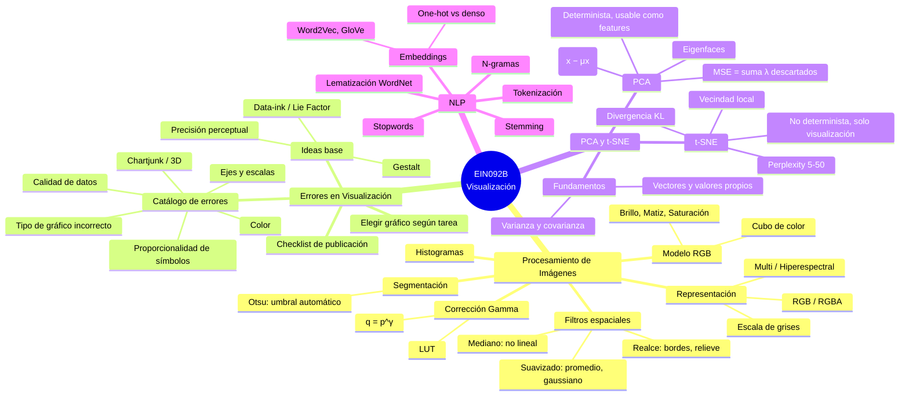

# Resumen General — EIN092B: Visualización

**Curso:** EIN092B - Visualización
**Documentos cubiertos:**
1. Introducción al Procesamiento de Imágenes
2. Errores Comunes y Distracciones en Visualizaciones de Datos
3. Análisis de Componentes Principales (PCA) y t-SNE
4. Introducción al Procesamiento del Lenguaje Natural (NLP)

---

## 1. Procesamiento de Imágenes

- **Representación de imágenes:** escala de grises (1 canal, 8 bpp) → RGB (3 canales, 24 bpp) → RGBA (4 canales, 32 bpp) → multiespectral (>10 bandas) → hiperespectral (>100 bandas).
- **Modelo RGB:** basado en los tres tipos de conos del ojo humano (sensibles a azul ~445 nm, verde ~535 nm, rojo ~575 nm). Se representa como un cubo unitario; la diagonal negro-blanco contiene los grises. Es un modelo **aditivo**.
- **Atributos perceptuales del color:** brillo, matiz (hue) y saturación — base de modelos alternativos como HSV/HSL.
- **Corrección gamma:** transformación no lineal `q = p^γ`. γ<1 aclara (resalta sombras), γ>1 oscurece (resalta altas luces). En la práctica se usa una LUT precalculada por eficiencia.
- **Histogramas:** cuentan píxeles por nivel de intensidad; su versión normalizada estima una probabilidad. Base de la segmentación en tiempo real.
- **Filtros espaciales (convolución):** costo M×N×u×v.
  - Suavizado: promedio, gaussiano (isotrópico, forma de campana).
  - No lineal: filtro **mediano** (robusto a ruido "sal y pimienta", no promedia sino que toma el valor central ordenado).
  - Realce: paso alto, detección de bordes (Laplaciano), relieve (emboss).
- **Segmentación — Umbralización de Otsu:** elige automáticamente el umbral que **maximiza la varianza entre clases** `σ²_B = w0·w1·(μ1−μ0)²`, ideal para histogramas bimodales. Ventaja clave sobre el umbral fijo: se adapta a cambios de iluminación. Limitación: falla con distribuciones unimodales o múltiples clases.

---

## 2. Errores Comunes en Visualización de Datos

- **Ideas base:** un gráfico responde una pregunta; jerarquía de precisión perceptual de Cleveland & McGill (posición > longitud > ángulo > área > volumen/color); data-ink ratio y Lie Factor (Tufte); atributos preatentivos; principios de Gestalt (proximidad, similitud, continuidad).
- **Percepción no neutral:** contraste simultáneo (tablero de Adelson), insensibilidad a la textura, efecto Bezold (asimilación cromática) — todos justifican usar fondos neutros, alto contraste y etiquetas numéricas.
- **Elegir el gráfico según la tarea** (Stephen Few): ranking → barras ordenadas; correlación → scatter; desviación → barras desde cero con línea base; distribución → histograma/boxplot; parte-todo → barras apiladas 100% o pie (≤5 partes); serie de tiempo → líneas.
- **Catálogo de errores**, agrupados en 6 familias:
  - **A. Ejes y escalas:** eje truncado (infla el Lie Factor), eje invertido, doble eje Y, escalas distintas entre gráficos comparados.
  - **B. Tipo de gráfico incorrecto:** pie que no suma 100%, pie con demasiadas categorías, pie para un proceso temporal, líneas uniendo categorías nominales, donas duplicadas redundantes.
  - **C. Color:** demasiados colores (>6-8), color que contradice el nombre de la categoría, paleta sin orden perceptual para datos ordenados, intervalos desiguales en mapas.
  - **D. Decoración/chartjunk:** barras 3D (perspectiva + oclusión), sobrecarga de codificaciones en un símbolo, exceso de números sobre un heatmap, pictogramas de llenado no proporcionales.
  - **E. Proporcionalidad de símbolos:** círculos dimensionados por radio en vez de por área (distorsiona la percepción cuadráticamente).
  - **F. Calidad de datos:** categorías de texto libre sin normalizar, barras que no calzan con sus etiquetas.
- **Checklist final** antes de publicar: propósito, tipo de gráfico, ejes, color, datos — y la prueba de los "10 segundos" con alguien ajeno al tema.

---

## 3. PCA y t-SNE

### PCA (Análisis de Componentes Principales)
- Motivado por la **maldición de la dimensionalidad**: dispersión de datos, dificultad de visualización e interpretación, mayor costo computacional.
- Fundamentos: varianza, covarianza, matriz de covarianza (simétrica, diagonal = varianzas), vectores y valores propios (`Ax = λx`).
- **Definición de PCA:** transformación lineal ortogonal `y = A(x − μx)`, donde A contiene los vectores propios de Cx ordenados de mayor a menor valor propio. Reconstrucción exacta con todos los componentes (`x = Aᵀy + μx`) o aproximada con k componentes.
- **Error de reconstrucción (MSE):** igual a la suma de los valores propios descartados — cuantifica cuánta información se pierde al reducir dimensiones.
- **Ejemplo paso a paso:** centrar datos → covarianza → valores/vectores propios → ordenar y seleccionar k componentes según varianza explicada → transformar → reconstruir.
- **Aplicación — Eigenfaces:** vectores propios de un set de rostros (dataset ATT, 400 imágenes 128×128) reinterpretados como imágenes; los de mayor valor propio muestran patrones faciales, los de menor valor propio son ruido. Pocas componentes bastan para buena reconstrucción/clasificación.
- PCA es **determinista**, sus componentes sirven como *features* para otros modelos (regresión, clasificación).

### t-SNE (t-distributed Stochastic Neighbor Embedding)
- Desarrollado por van der Maaten y Hinton (2008), orientado **solo a visualización**.
- A diferencia de PCA: preserva **vecindad local** (no varianza global), es **no lineal**, y **no es determinista**.
- Basado en SNE: calcula probabilidades de vecindad en alta dimensión, las replica en baja dimensión, y minimiza la **divergencia KL** entre ambas distribuciones.
- **Hiperparámetro Perplexity** (recomendado 5-50): equilibrio entre estructura local y global; debe ser menor que el número de puntos.
- **Comparación MNIST:** t-SNE separa dígitos en clusters mucho más nítidos que PCA, a costa de mayor costo computacional y sensibilidad a hiperparámetros.
- Limitaciones: no apto para alimentar modelos de ML, no escala bien a dimensiones objetivo >3D, también sufre la maldición de la dimensionalidad.

---

## 4. Procesamiento del Lenguaje Natural (NLP)

Pipeline típico de preprocesamiento de texto, de principio a fin:

1. **Tokenización:** dividir el texto en tokens (palabras, signos de puntuación, frases u oraciones). Primer paso casi universal en NLP.
2. **Stopwords:** eliminar palabras muy frecuentes y poco informativas (el, la, de, en...) para concentrar el análisis en las palabras clave.
3. **Lematización (NLTK + WordNet):** reduce cada palabra a su forma canónica (lema) considerando el contexto gramatical; siempre produce una palabra válida (ej. "estudiantes" → "estudiante", "están" → "estar").
4. **Stemming:** alternativa más simple y rápida; recorta sufijos mecánicamente, sin garantizar que el resultado sea una palabra real (ej. "laboratorio" → "laborator").
5. **Embeddings:** representación numérica densa y de baja dimensión de las palabras, que captura relaciones semánticas (palabras similares quedan cerca en el espacio vectorial). Contrastan con el **one-hot encoding** (disperso, de alta dimensión, sin noción de semántica). Se aprenden con técnicas como **Word2Vec** y **GloVe**.
6. **N-gramas:** secuencias de n elementos consecutivos (ej. bigramas) usadas para modelar la probabilidad de que aparezca una palabra dado su contexto previo.

---

## Mapa mental

---

## Hilo conductor entre los documentos

Los cuatro documentos cubren, en conjunto, el flujo típico de un proyecto de análisis de datos visuales: **representar la información cruda** (imágenes, texto) de forma numérica, **reducir su dimensionalidad** cuando es muy alta (PCA/t-SNE) para poder explorarla o modelarla, y finalmente **comunicar los resultados** evitando los errores de diseño más comunes en visualización.
