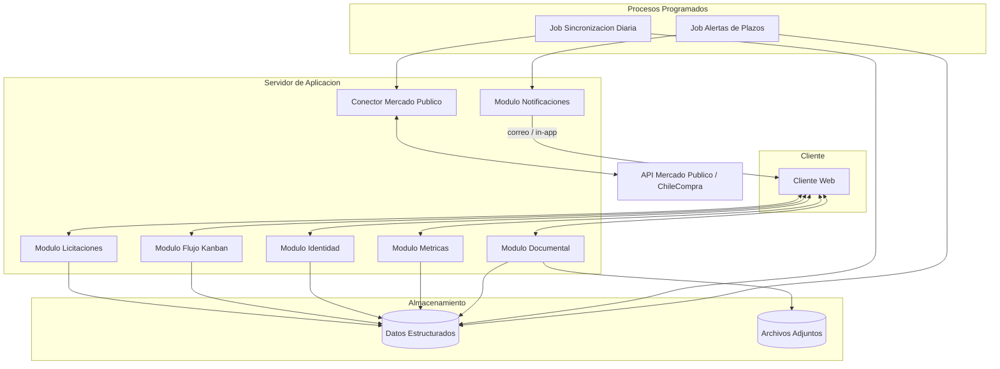

# LiciFlow — Documentación consolidada del proyecto

> Plataforma web SaaS que funciona como un CRM especializado en licitaciones, conectada a la API de Mercado Público (ChileCompra).

| Ítem | Detalle |
|---|---|
| **Equipo** | Lukas Garrido (líder), Octavio Valencia |
| **Inicio estimado** | 10-09-2026 |
| **Duración estimada** | 8 meses |
| **Estado** | Etapa de planificación |

---

## Índice

1. [Acta de Constitución del Proyecto (Entregable 1)](#1-acta-de-constitución-del-proyecto-entregable-1)
   - [1.1 Identificación del proyecto](#11-identificación-del-proyecto)
   - [1.2 Problema o necesidad](#12-problema-o-necesidad)
   - [1.3 Justificación](#13-justificación)
   - [1.4 Objetivo general](#14-objetivo-general)
   - [1.5 Descripción inicial de la solución](#15-descripción-inicial-de-la-solución)
   - [1.6 Beneficios esperados](#16-beneficios-esperados)
   - [1.7 Alcance inicial](#17-alcance-inicial)
   - [1.8 Restricciones iniciales](#18-restricciones-iniciales)
   - [1.9 Criterios iniciales de éxito](#19-criterios-iniciales-de-éxito)
   - [1.10 Autorización inicial](#110-autorización-inicial)
2. [Definición del Proyecto](#2-definición-del-proyecto)
   - [2.1 Problema o necesidad](#21-problema-o-necesidad)
   - [2.2 Objetivo del proyecto](#22-objetivo-del-proyecto)
   - [2.3 Personas o grupos afectados](#23-personas-o-grupos-afectados)
   - [2.4 Usuarios o beneficiarios](#24-usuarios-o-beneficiarios)
   - [2.5 Solución propuesta](#25-solución-propuesta)
   - [2.6 Interesados](#26-interesados)
   - [2.7 Alcance (MVP)](#27-alcance-mvp)
   - [2.8 Supuestos](#28-supuestos)
   - [2.9 Riesgos identificados](#29-riesgos-identificados)
   - [2.10 Métricas de éxito (KPIs)](#210-métricas-de-éxito-kpis)
3. [Registro de Interesados (Entregable 2)](#3-registro-de-interesados-entregable-2)
   - [3.1 Preguntas de identificación](#31-preguntas-de-identificación)
   - [3.2 Registro inicial](#32-registro-inicial)
   - [3.3 Matriz Poder/Interés](#33-matriz-poderinterés)
   - [3.4 Interesado crítico](#34-interesado-crítico)
4. [Requerimientos](#4-requerimientos)
   - [4.1 Requerimientos funcionales (RF)](#41-requerimientos-funcionales-rf)
   - [4.2 Requerimientos no funcionales (RNF)](#42-requerimientos-no-funcionales-rnf)
   - [4.3 Trazabilidad](#43-trazabilidad)
5. [Arquitectura del Sistema](#5-arquitectura-del-sistema)
   - [5.1 Estilo de arquitectura](#51-estilo-de-arquitectura)
   - [5.2 Componentes lógicos](#52-componentes-lógicos)
   - [5.3 Diagrama de componentes](#53-diagrama-de-componentes)
   - [5.4 Flujos principales](#54-flujos-principales)
   - [5.5 Elección de stack (pendiente)](#55-elección-de-stack-pendiente)
   - [5.6 Decisiones aún no tomadas](#56-decisiones-aún-no-tomadas)
6. [Integración con la API de Mercado Público](#6-integración-con-la-api-de-mercado-público)
   - [6.1 Propósito](#61-propósito)
   - [6.2 Datos generales](#62-datos-generales)
   - [6.3 Información por levantar](#63-información-por-levantar)
   - [6.4 Consideraciones de diseño del conector](#64-consideraciones-de-diseño-del-conector)
   - [6.5 Riesgos específicos de la integración](#65-riesgos-específicos-de-la-integración)
   - [6.6 Referencias](#66-referencias)
   - [6.7 Próximos pasos](#67-próximos-pasos)
7. [Gestión de Riesgos](#7-gestión-de-riesgos)
   - [7.1 Ruta de trabajo](#71-ruta-de-trabajo)
   - [7.2 Categorías de riesgo](#72-categorías-de-riesgo)
   - [7.3 Riesgos ya identificados en la documentación](#73-riesgos-ya-identificados-en-la-documentación)
   - [7.4 Los 5 pasos para evaluar riesgos](#74-los-5-pasos-para-evaluar-riesgos)
   - [7.5 Registro inicial de riesgos](#75-registro-inicial-de-riesgos)
   - [7.6 Evaluación de riesgos (Proceso 3)](#76-evaluación-de-riesgos-proceso-3)
   - [7.7 Matriz de evaluación de riesgos (RAM)](#77-matriz-de-evaluación-de-riesgos-ram)
   - [7.8 Matriz de riesgos priorizada](#78-matriz-de-riesgos-priorizada)
8. [Observaciones sobre la documentación](#8-observaciones-sobre-la-documentación)

---

## 1. Acta de Constitución del Proyecto (Entregable 1)

### 1.1 Identificación del proyecto

| Ítem | Información |
|---|---|
| **Nombre del proyecto** | LiciFlow |
| **Equipo de proyecto** | Octavio Valencia - Lukas Garrido |
| **Líder / responsable del proyecto** | Lukas Garrido |
| **Sponsor / Patrocinador** | Empresas |
| **Fecha de inicio estimada** | 10-09-2026 |
| **Duración estimada** | 8 meses |
| **Presupuesto inicial estimado** | 1.000.000 aprox |

### 1.2 Problema o necesidad

**¿Qué situación, problema o necesidad da origen al proyecto?**

Pérdida de tiempo de trabajo productivo por búsqueda y seguimiento de licitaciones.

Problemas: desorganización documental, olvido de fechas críticas de cierre o rondas de preguntas.

### 1.3 Justificación

**¿Por qué es necesario desarrollar este proyecto? ¿Qué ocurriría o qué oportunidad se perdería si no se realiza?**

El proyecto es necesario ya que ayuda a centralizar y automatizar el proceso de descubrimiento, evaluación y seguimiento de licitaciones públicas y privadas entre empresas.

Si el proyecto no llega a ver la luz, las empresas seguirán perdiendo tiempo valioso de trabajo y haciendo el proceso de licitaciones engorroso y descentralizado.

### 1.4 Objetivo general

**¿Qué resultado concreto se espera alcanzar mediante el proyecto?**

Centralizar y automatizar el proceso de descubrimiento, evaluación y seguimiento de licitaciones públicas y privadas.

- Disminuir la carga operativa del equipo comercial.
- Mitigar los errores administrativos que causan descalificación.
- Aumentar las probabilidades de adjudicación de las empresas usuarias.

### 1.5 Descripción inicial de la solución

**¿Qué se propone desarrollar o implementar para responder al problema identificado?**

Plataforma web tipo SaaS que funciona como un CRM especializado en licitaciones. El sistema se conectará a la API de Mercado Público para buscar y filtrar licitaciones según el perfil comercial de cada empresa usuaria.

### 1.6 Beneficios esperados

| N.º | Beneficio esperado |
|---|---|
| 1 | Reducción del tiempo dedicado a la búsqueda manual de licitaciones |
| 2 | Mayor visibilidad y control sobre el estado de todas las postulaciones en curso |
| 3 | Mayor claridad de requisitos de licitaciones para postulaciones |

### 1.7 Alcance inicial

**Incluye inicialmente:**

Sincronización automática con la API de Mercado Público, filtros de búsqueda por palabras clave, rubro, región y monto, tablero Kanban para gestionar el estado de cada postulación, etc.

**No incluye inicialmente:**

- Licitaciones privadas o de portales distintos a Mercado Público.
- Gestión de contratos posteriores a la adjudicación.
- Procesos de facturación o cobros dentro de la plataforma.
- Integración con otros portales de compras públicas regionales o internacionales.

> [!note]
> En esta etapa el alcance es preliminar. Será definido y desarrollado con mayor profundidad durante la Planificación.

### 1.8 Restricciones iniciales

| Tipo | Restricción |
|---|---|
| **Tiempo** | 8 meses |
| **Presupuesto** | 12.000.000 |
| **Recursos** | Personas (2 desarrolladores) |
| **Tecnología / infraestructura** | La obtención de datos depende de la disponibilidad y condiciones de uso de la API pública de Mercado Público (ChileCompra) |
| **Otra** | — |

### 1.9 Criterios iniciales de éxito

**¿Cómo podremos reconocer al finalizar el proyecto que este fue exitoso?**

| N.º | Criterio de éxito |
|---|---|
| 1 | El sistema logra sincronizar diariamente licitaciones desde la API de Mercado Público y filtrarlas según los criterios configurados por el usuario. |
| 2 | Los usuarios pueden gestionar de principio a fin una postulación dentro del tablero Kanban. |
| 3 | El sistema envía correctamente las alertas de plazos críticos. |

### 1.10 Autorización inicial

- **Sponsor / Patrocinador:** Empresas
- **Responsable del proyecto:** Lukas Garrido
- **Fecha:** 10-09-2026

---

## 2. Definición del Proyecto

### 2.1 Problema o necesidad

Las empresas proveedoras pierden valiosas horas de trabajo productivo buscando manualmente oportunidades diarias en portales como Mercado Público. Además, existe una alta tasa de descalificación («fuera de bases») y oportunidades perdidas debido a:

- Desorganización documental.
- Seguimiento ineficiente de las postulaciones en curso.
- Olvido de fechas críticas de cierre o rondas de preguntas.

### 2.2 Objetivo del proyecto

Centralizar y automatizar el proceso de descubrimiento, evaluación y seguimiento de licitaciones públicas y privadas, con el fin de:

- Disminuir la carga operativa del equipo comercial.
- Mitigar los errores administrativos que causan descalificación.
- Aumentar las probabilidades de adjudicación de las empresas usuarias.

### 2.3 Personas o grupos afectados

Equipos de ventas, gerentes comerciales y personal administrativo de pequeñas, medianas y grandes empresas (B2B) que venden productos o servicios al Estado o a grandes corporaciones.

### 2.4 Usuarios o beneficiarios

- Encargados de licitaciones (Bid Managers).
- Ejecutivos comerciales.
- Asistentes administrativos.
- Gerentes comerciales o dueños de empresa (como tomadores de decisión, no necesariamente como operadores diarios).

### 2.5 Solución propuesta

Plataforma web tipo SaaS (Software as a Service) que funciona como un CRM especializado en licitaciones. Se conecta a la API de Mercado Público para buscar y filtrar oportunidades automáticamente según el perfil comercial del usuario, e integra:

- Tablero visual (Kanban) para gestionar el flujo de cada postulación.
- Alertas automatizadas de fechas límite.
- Repositorio centralizado para estandarizar los documentos clave requeridos en las propuestas.

### 2.6 Interesados

**Internos**

| Interesado | Rol en el proyecto |
|---|---|
| Equipo de desarrollo | Construye la plataforma técnica (programación, diseño de interfaz, arquitectura) |
| Jefe de proyecto / Product Owner | Prioriza tareas, asegura cumplimiento de objetivos, mantiene la visión comercial |
| Patrocinadores / inversionistas | Avalan, financian o evalúan el proyecto |
| Equipo de soporte y mantenimiento | Resuelve problemas técnicos y da asistencia en producción |

**Externos**

| Interesado | Rol en el proyecto |
|---|---|
| Usuarios finales (operativos) | Encargados de licitaciones, ejecutivos comerciales, asistentes que usan el sistema a diario |
| Clientes (tomadores de decisión) | Gerentes comerciales o dueños de empresa que adquieren la suscripción |
| Proveedor de datos (ChileCompra / Mercado Público) | Entidad estatal que suministra la API abierta; cambios en su disponibilidad o estructura afectan directamente al proyecto |

### 2.7 Alcance (MVP)

**Incluido:**

- Búsqueda y filtrado automático de licitaciones publicadas en Mercado Público.
- Gestión del flujo de postulación mediante tablero Kanban.
- Repositorio documental por licitación.
- Alertas de plazos críticos.
- Panel de métricas básico.

**Fuera de alcance por ahora:**

- Licitaciones privadas fuera de Mercado Público.
- Gestión de contratos posteriores a la adjudicación.
- Facturación o cobros dentro de la plataforma.
- Integraciones con otros portales de compras (regionales, internacionales).

### 2.8 Supuestos

- La API de Mercado Público se mantiene pública, gratuita y con una estructura de datos razonablemente estable.
- Las empresas usuarias cuentan con conexión a internet estable durante su jornada laboral.
- Los usuarios finales tienen conocimientos básicos de navegación web (no se requiere capacitación técnica avanzada).

### 2.9 Riesgos identificados

| Riesgo | Impacto | Mitigación propuesta |
|---|---|---|
| Cambios en la estructura o disponibilidad de la API de ChileCompra | Alto — puede interrumpir el motor de descubrimiento | Aislar la integración en un módulo propio; monitoreo de la API; plan de contingencia manual |
| Baja adopción por parte de usuarios acostumbrados al proceso manual | Medio | Diseño simple, onboarding guiado, foco en RNF01 (usabilidad) |
| Fuga o pérdida de documentos sensibles de licitación | Alto | Cifrado en tránsito y reposo, control de acceso por organización, respaldos periódicos |
| Cumplimiento de la Ley 19.628 (Protección de Datos Personales) | Medio | Revisión legal de política de privacidad antes del lanzamiento |

> Ver también el análisis completo en [7. Gestión de Riesgos](#7-gestión-de-riesgos).

### 2.10 Métricas de éxito (KPIs)

- Reducción del tiempo promedio dedicado a la búsqueda manual de licitaciones (objetivo referencial: -50%).
- Reducción de postulaciones descalificadas por errores administrativos o de plazo.
- Porcentaje de licitaciones guardadas que efectivamente llegan a la etapa «Postulada».
- Tasa de adopción: usuarios activos semanales sobre usuarios registrados por organización.

---

## 3. Registro de Interesados (Entregable 2)

### 3.1 Preguntas de identificación

Antes de completar el registro, el equipo debe preguntarse:

**¿Quién autoriza? · ¿Quién decide? · ¿Quién participa? · ¿Quién utiliza el resultado? · ¿Quién se beneficia? · ¿Quién puede verse afectado? · ¿Quién puede influir en el proyecto?**

### 3.2 Registro inicial

| N.º | Interesado | Rol / relación con el proyecto | Necesidad o expectativa principal | Interés | Poder / Influencia |
|---|---|---|---|---|---|
| 1 | Patrocinadores / inversionistas | Financian o evalúan el proyecto | Cumplimiento de los objetivos definidos y viabilidad del proyecto | Alto | Alto |
| 2 | Jefe de proyecto / Product Owner | Prioriza tareas, dirige al equipo y mantiene la visión comercial del producto | Cumplimiento de alcance, plazos y calidad del producto | Alto | Alto |
| 3 | Clientes / gerentes comerciales (tomadores de decisión) | Adquieren la licencia o suscripción del software para su empresa | Reducción real del tiempo operativo y de los errores de postulación (retorno de la inversión) | Alto | Alto |
| 4 | Equipo de desarrollo | Construye la plataforma considerando interfaz e infraestructura | Requerimientos claros y alcance realista para poder ejecutar el proyecto | Alto | Bajo |
| 5 | Encargados de licitaciones / Bid Managers | Usuario final que opera el sistema a diario para buscar y postular | Facilidad de uso y ahorro real de tiempo en la búsqueda de oportunidades | Alto | Bajo |
| 6 | Ejecutivos comerciales | Usuario final que gestiona el avance de cada postulación en el tablero (revisan postulaciones) | Alertas confiables y visibilidad clara del estado de cada licitación | Alto | Bajo |
| 7 |  |  |  |  |  |
| 8 |  |  |  |  |  |
| 9 |  |  |  |  |  |

### 3.3 Matriz Poder/Interés

Los interesados identificados se ubican en el cuadrante correspondiente:

| | **Interés bajo** | **Interés alto** |
|---|---|---|
| **Poder / influencia alta** | **Mantener satisfecho** Proveedor de datos (ChileCompra / Mercado Público) | **Gestionar de cerca** Patrocinadores/inversionistas; Jefe de proyecto/PO; Clientes/gerentes comerciales |
| **Poder / influencia baja** | **Monitorear** Equipo de soporte y mantenimiento | **Mantener informado** Equipo de desarrollo; Bid Managers; Ejecutivos comerciales; Asistentes administrativos |

### 3.4 Interesado crítico

**¿Cuál consideran que es el interesado más crítico para el éxito del proyecto?**

El proveedor de datos, ChileCompra / Mercado Público.

**¿Por qué?**

Aunque tiene bajo interés directo en el éxito de LiciFlow, es el interesado del cual depende técnicamente todo el valor central del sistema: sin acceso estable a su API pública, el motor de descubrimiento automatizado —el pilar más diferenciador del proyecto— simplemente no puede funcionar. A diferencia de los demás interesados, su influencia no se gestiona con comunicación o negociación, sino con monitoreo técnico constante, ya que un cambio en la estructura de su API o en sus condiciones de acceso puede afectar el proyecto sin previo aviso, tal como se identificó en los riesgos del proyecto.

---

## 4. Requerimientos

Este apartado detalla los requerimientos funcionales (RF) y no funcionales (RNF) del sistema. Ver [2. Definición del Proyecto](#2-definición-del-proyecto) para el contexto y objetivos.

### 4.1 Requerimientos funcionales (RF)

#### Gestión de usuarios y organizaciones

- **RF01**: El sistema debe permitir a los usuarios registrarse, iniciar sesión y recuperar su contraseña mediante correo electrónico.
- **RF02**: El sistema debe permitir crear perfiles corporativos para agrupar a múltiples usuarios bajo una misma organización.
- **RF02.1**: El sistema debe permitir definir roles por usuario dentro de una organización (ej: administrador, operativo), restringiendo acciones según el rol.
- **RF02.2**: El sistema debe garantizar el aislamiento de datos entre organizaciones distintas (una empresa no puede ver información de otra).

#### Descubrimiento de licitaciones

- **RF03**: El sistema debe sincronizarse diariamente con la API de Mercado Público para extraer las nuevas licitaciones publicadas. Si la sincronización falla, debe reintentarse y notificar al equipo de soporte.
- **RF04**: El sistema debe permitir a los usuarios configurar filtros de búsqueda automática basados en palabras clave, región, rubro y montos.
- **RF05**: El sistema debe generar un listado dinámico de las licitaciones que coincidan con los filtros configurados por el usuario.
- **RF06**: El sistema debe mostrar el detalle completo de cada licitación, incluyendo fechas clave, institución compradora y enlace directo a las bases.

#### Gestión del flujo de postulación

- **RF07**: El sistema debe incorporar un tablero visual (tipo Kanban) donde los usuarios puedan guardar las licitaciones de su interés.
- **RF08**: El sistema debe permitir trasladar las licitaciones guardadas entre diferentes columnas de estado (ej: Por evaluar, Armando propuesta, Enviada, Adjudicada).
- **RF09**: El sistema debe permitir la asignación de un usuario específico del equipo como responsable de una licitación dentro del tablero.
- **RF10**: El sistema debe permitir ingresar y almacenar comentarios o notas de texto dentro de la ficha de cada licitación gestionada.

#### Gestión documental

- **RF11**: El sistema debe habilitar la creación de listas de verificación (checklists) de tareas o documentos requeridos para cada postulación.
- **RF12**: El sistema debe permitir subir, descargar y eliminar archivos adjuntos (certificados, documentos PDF, planillas) asociados a una licitación.

#### Alertas y visualización

- **RF13**: El sistema debe enviar una notificación cuando falten 48 horas para el cierre del periodo de preguntas de una licitación guardada.
- **RF14**: El sistema debe enviar una notificación cuando falten 48 horas para el cierre de postulación de una licitación activa.
- **RF13.1 / RF14.1**: Las notificaciones deben poder enviarse al menos por correo electrónico, y de forma visible dentro de la plataforma (in-app).
- **RF15**: El sistema debe incluir un calendario interactivo que consolide y visualice las fechas críticas de todas las licitaciones gestionadas por el equipo.
- **RF16**: El sistema debe generar un panel de control con métricas sobre el estado de las postulaciones (ganadas, perdidas, en proceso) del mes en curso.

### 4.2 Requerimientos no funcionales (RNF)

| Código | Categoría | Descripción |
|---|---|---|
| RNF01 | Usabilidad | La interfaz debe tener diseño responsivo, asegurando correcta visualización y operatividad en computadores de escritorio y dispositivos móviles. |
| RNF02 | Rendimiento | El tiempo de respuesta frente a una búsqueda o carga del tablero no debe superar los 3 segundos en condiciones normales de red. |
| RNF03 | Seguridad | Las contraseñas deben almacenarse mediante algoritmos de encriptación unidireccional (ej. bcrypt). |
| RNF04 | Seguridad | Todo el tráfico entre cliente y servidor debe estar cifrado mediante HTTPS. |
| RNF05 | Disponibilidad | La infraestructura debe garantizar un uptime objetivo de 99.5% anual. |
| RNF06 | Interoperabilidad | La extracción de datos desde Mercado Público debe realizarse exclusivamente mediante sus servicios web RESTful en formato JSON. |
| RNF07 | Capacidad | El sistema debe proveer almacenamiento inicial de al menos 2 GB por empresa registrada; al superar el límite, el usuario debe ser notificado antes de que se bloquee la carga de nuevos archivos. |
| RNF08 | Mantenibilidad | El código fuente debe gestionarse mediante un sistema de control de versiones basado en Git. |
| RNF09 | Continuidad | El sistema debe contar con respaldos periódicos de la base de datos y documentos, con un objetivo de punto de recuperación (RPO) no mayor a 24 horas. |
| RNF10 | Cumplimiento normativo | El tratamiento de datos personales almacenados debe ajustarse a la Ley 19.628 sobre Protección de la Vida Privada. |
| RNF11 | Escalabilidad | La arquitectura debe permitir el crecimiento en número de organizaciones y usuarios sin requerir rediseño estructural. |

### 4.3 Trazabilidad

| Objetivo | Requerimientos asociados |
|---|---|
| Reducir tiempo de búsqueda manual | RF03, RF04, RF05, RF06 |
| Mitigar descalificación por errores administrativos | RF11, RF12, RF13, RF14, RF15 |
| Aumentar control sobre el proceso comercial | RF07, RF08, RF09, RF10, RF16 |
| Proteger la operación y los datos del cliente | RNF03, RNF04, RNF09, RNF10 |

---

## 5. Arquitectura del Sistema

> Descripción a nivel lógico y de componentes (nivel conceptual). No define tecnologías, lenguajes ni proveedores específicos: esa decisión se documentará por separado una vez cerrada la etapa de planificación.

### 5.1 Estilo de arquitectura

- **Aplicación web multi-tenant**: una sola instancia del sistema sirve a múltiples organizaciones (empresas clientes), con aislamiento lógico de datos entre ellas (ver RF02.2).
- **Cliente-servidor**: separación entre una capa de interfaz (cliente web) y una capa de lógica de negocio (servidor/API).
- **Integración por servicios web**: la obtención de licitaciones se realiza consumiendo una API externa (Mercado Público), no mediante scraping.
- **Procesos programados (jobs) independientes de las solicitudes del usuario**: la sincronización diaria y el envío de alertas no dependen de que un usuario esté navegando la plataforma en ese momento.

### 5.2 Componentes lógicos

#### Cliente web (Frontend)

Responsable de la interacción con el usuario. Consume la API del backend y no se comunica directamente con la API de Mercado Público.

Módulos principales:

- Autenticación y gestión de sesión.
- Panel de configuración de filtros de búsqueda.
- Tablero Kanban.
- Ficha de licitación (detalle, comentarios, checklist, documentos).
- Calendario de fechas críticas.
- Panel de métricas.

#### Servidor de aplicación (Backend / API)

Contiene la lógica de negocio y expone endpoints consumidos por el frontend. Se organiza en módulos según dominio funcional:

- **Módulo de identidad**: registro, login, recuperación de contraseña, organizaciones, roles.
- **Módulo de licitaciones**: almacenamiento y consulta de licitaciones extraídas, filtros configurados por usuario.
- **Módulo de flujo (Kanban)**: estados, transiciones, asignación de responsables.
- **Módulo documental**: carga, almacenamiento y control de acceso a archivos adjuntos.
- **Módulo de notificaciones**: generación y envío de alertas (48h antes de cierres).
- **Módulo de métricas**: agregación de datos para el panel de control.

#### Integración externa — Conector Mercado Público

Componente aislado responsable exclusivamente de comunicarse con la API de ChileCompra. Ver detalle en [6. Integración con la API de Mercado Público](#6-integración-con-la-api-de-mercado-público).

Se aísla deliberadamente del resto del backend para que, si la API externa cambia su estructura o disponibilidad (riesgo identificado en la definición del proyecto), el impacto quede contenido en este componente.

#### Procesos programados (Jobs)

- **Job de sincronización diaria**: ejecuta la extracción de licitaciones nuevas desde el conector externo y las incorpora al sistema.
- **Job de alertas**: revisa periódicamente las fechas críticas de las licitaciones activas y dispara notificaciones cuando corresponde (RF13, RF14).

#### Almacenamiento

Se distinguen dos tipos de datos con necesidades distintas:

- **Datos estructurados**: usuarios, organizaciones, licitaciones, estados del Kanban, comentarios, checklists, métricas.
- **Datos no estructurados**: archivos adjuntos (documentos, certificados, planillas).

Esta distinción es relevante para RNF07 (capacidad) y RNF09 (respaldo), aunque la tecnología concreta de almacenamiento aún no está definida.

### 5.3 Diagrama de componentes

### 5.4 Flujos principales

#### Descubrimiento de licitaciones

1. El job de sincronización diaria se activa según lo programado.
2. El conector de Mercado Público solicita las licitaciones nuevas o actualizadas a la API externa.
3. Los datos se normalizan y almacenan en el módulo de licitaciones.
4. Cada usuario visualiza únicamente las licitaciones que coinciden con los filtros configurados para su organización.

#### Gestión de una postulación

1. El usuario guarda una licitación de interés desde el listado filtrado.
2. La licitación aparece en el tablero Kanban en la columna inicial.
3. El usuario asigna un responsable, agrega checklist y sube documentos.
4. El usuario mueve la licitación entre columnas a medida que avanza el proceso.

#### Alertas de plazos

1. El job de alertas revisa periódicamente las licitaciones guardadas por todas las organizaciones.
2. Si una licitación está a 48 horas del cierre de preguntas o de postulación, se genera una notificación.
3. El módulo de notificaciones entrega la alerta por el canal configurado (correo, in-app).

### 5.5 Elección de stack (pendiente)

Preguntas que deberán resolverse al definir la tecnología, en base a esta arquitectura:

- ¿El frontend será una SPA o requiere renderizado en servidor?
- ¿El backend se implementará como monolito modular o como servicios separados desde el inicio?
- ¿Qué motor de base de datos se ajusta mejor a los datos estructurados (relacional vs. documental)?
- ¿Dónde se almacenarán los archivos adjuntos (almacenamiento de objetos vs. sistema de archivos del servidor)?
- ¿Qué mecanismo se usará para los jobs programados (cron del sistema, servicio de colas, scheduler del proveedor cloud)?
- ¿Qué proveedor de envío de correo se usará para las notificaciones?

### 5.6 Decisiones aún no tomadas

- Lenguajes y frameworks de frontend y backend.
- Motor de base de datos.
- Proveedor de hosting / nube.
- Estrategia de despliegue y CI/CD.

Estas decisiones se documentarán en un archivo separado (`05-decision-stack.md`, a crear) una vez cerrada la etapa de planificación.

---

## 6. Integración con la API de Mercado Público

> Documento vivo de investigación. Se irá completando a medida que se revise la documentación oficial de ChileCompra y se hagan pruebas de consumo de la API. Las secciones marcadas como «por confirmar» requieren revisión directa de la documentación oficial antes de iniciar el desarrollo.

### 6.1 Propósito

Registrar todo lo que el equipo necesita saber sobre la API de Mercado Público antes de construir el conector descrito en [5. Arquitectura del Sistema](#5-arquitectura-del-sistema), de modo que la integración se diseñe con información verificada y no con supuestos.

### 6.2 Datos generales

*(Por confirmar contra la documentación oficial.)*

- **Proveedor**: ChileCompra (Dirección de Compras y Contratación Pública).
- **Tipo de acceso**: API pública, requiere ticket/clave de acceso gratuita.
- **Formato de datos**: JSON (según RNF06).
- **Protocolo**: HTTP/HTTPS, servicios RESTful.

### 6.3 Información por levantar

- [ ] Proceso exacto para solicitar el ticket/API key de acceso.
- [ ] Endpoints disponibles (búsqueda de licitaciones, detalle por código, listado por fecha/estado).
- [ ] Límites de uso (rate limiting): cantidad de solicitudes permitidas por minuto/día.
- [ ] Estructura completa de la respuesta JSON (campos disponibles por licitación).
- [ ] Campos que identifican de forma única una licitación (código o ID).
- [ ] Campos de fecha relevantes: publicación, cierre de preguntas, cierre de postulación, fecha de adjudicación.
- [ ] Estados posibles de una licitación según la API (publicada, cerrada, adjudicada, desierta, revocada, etc.).
- [ ] Disponibilidad de un enlace directo a las bases o documentos de la licitación.
- [ ] Política de actualización de datos (¿cada cuánto se actualizan los registros en el origen?).
- [ ] Existencia de un ambiente de pruebas (sandbox) separado del ambiente productivo.
- [ ] Condiciones de uso y términos legales para consumo automatizado de la API.

### 6.4 Consideraciones de diseño del conector

- El conector debe ser el único punto del sistema que conoce la estructura específica de la API externa. El resto del backend debe trabajar con un modelo de datos propio y normalizado.
- Debe contemplar manejo de errores y reintentos ante caídas o respuestas inesperadas de la API externa (relacionado con RF03).
- Debe registrar (log) cada sincronización: cantidad de licitaciones nuevas, actualizadas, y errores, para poder auditar fallos.
- Debe evitar duplicar licitaciones ya existentes en el sistema al volver a sincronizar (idempotencia).

### 6.5 Riesgos específicos de la integración

| Riesgo | Descripción | Mitigación propuesta |
|---|---|---|
| Cambio de estructura de la API | ChileCompra podría modificar campos o endpoints sin aviso previo | Validación de esquema antes de guardar datos; alertas internas si la validación falla |
| Límite de solicitudes (rate limit) | Podría restringir la frecuencia de sincronización | Diseñar la sincronización para operar dentro de los límites informados; usar backoff progresivo |
| Caída temporal del servicio externo | Afecta el RF03 y la actualidad de los datos mostrados | El sistema debe seguir funcionando con la última data sincronizada exitosamente, mostrando fecha de última actualización al usuario |
| Cambios en política de acceso (tickets, costos) | Podría requerir renovación o generar costos no previstos | Revisar periódicamente los términos de uso publicados por ChileCompra |

### 6.6 Referencias

- [Documentación oficial de la API de Mercado Público](https://www.chilecompra.cl/api/)

### 6.7 Próximos pasos

1. Solicitar el ticket de acceso a la API.
2. Realizar una prueba de consumo manual (ej. con Postman o curl) para validar la estructura real de la respuesta.
3. Documentar en este apartado los hallazgos reales, reemplazando los supuestos.
4. Actualizar el modelo de datos normalizado en función de los campos confirmados.

---

## 7. Gestión de Riesgos

> Contenido de la plantilla Excel *«Plantilla de actividades — Gestión de riesgos»* (`6__Matriz_de_Riesgos.xlsx`) y del archivo `Riesgos.md`. Las tablas de las secciones 7.5 a 7.8 corresponden a las hojas del Excel, que **estaban vacías** (solo estructura, sin riesgos cargados ni valoraciones).

### 7.1 Ruta de trabajo

**Proceso 2 → Registro inicial → Proceso 3 → Matriz de riesgos priorizada → Proceso 4**

| N.º | Etapa | Qué incluye | Estado |
|---|---|---|---|
| 1 | **Identificar** | Brainstorming + Delphi + Entrevistas + Causa raíz + DAFO | Hoy |
| 2 | **Registrar** | Riesgo + Causa + Consecuencia + Categoría | Hoy |
| 3 | **Analizar** | Probabilidad + Impacto → RAM | Hoy |
| 4 | **Priorizar** | Nivel de riesgo y orden de atención | Hoy |
| 5 | **Responder** | Planificar respuestas a los riesgos | Siguiente etapa (clase) |

**Cómo usar la plantilla:**

1. Completar el Registro inicial con los riesgos del propio proyecto.
2. Evaluar probabilidad e impacto en la hoja del Proceso 3.
3. Usar la RAM para obtener el nivel.
4. Revisar la matriz priorizada antes de planificar las respuestas.

### 7.2 Categorías de riesgo

- Técnicos
- Gestión
- Externos

### 7.3 Riesgos ya identificados en la documentación

Riesgos que ya aparecen mencionados en las secciones [2.9](#29-riesgos-identificados) y [6.5](#65-riesgos-específicos-de-la-integración), consolidados como insumo para el registro inicial. La **categoría es una sugerencia** y la probabilidad aún no está evaluada.

| Ref. | Riesgo | Fuente | Categoría (sugerida) | Impacto indicado en origen | Mitigación propuesta |
|---|---|---|---|---|---|
| R-a | Cambios en la estructura de la API de ChileCompra | 2.9 y 6.5 | Externo | Alto | Aislar integración en módulo propio; validación de esquema; alertas internas; plan de contingencia manual |
| R-b | Caída temporal o indisponibilidad de la API | 2.9 y 6.5 | Externo | Alto | Operar con la última data sincronizada; mostrar fecha de última actualización |
| R-c | Límite de solicitudes (rate limit) | 6.5 | Externo | — | Sincronización dentro de los límites; backoff progresivo |
| R-d | Cambios en política de acceso (tickets, costos) | 6.5 | Externo | — | Revisión periódica de los términos de uso |
| R-e | Baja adopción por usuarios acostumbrados al proceso manual | 2.9 | Gestión | Medio | Diseño simple, onboarding guiado, foco en RNF01 |
| R-f | Fuga o pérdida de documentos sensibles de licitación | 2.9 | Técnico | Alto | Cifrado en tránsito y reposo, control de acceso por organización, respaldos periódicos |
| R-g | Incumplimiento de la Ley 19.628 (datos personales) | 2.9 | Externo | Medio | Revisión legal de la política de privacidad antes del lanzamiento |

### 7.4 Los 5 pasos para evaluar riesgos

| Paso | Acción | Descripción |
|---|---|---|
| 1 | Seleccionar el riesgo | Tomar un riesgo del registro inicial |
| 2 | Asignar probabilidad | Estimar qué tan probable es que ocurra |
| 3 | Asignar impacto | Determinar qué tan grave sería su efecto |
| 4 | Ubicarlo en la RAM | Cruzar probabilidad e impacto en la matriz |
| 5 | Determinar nivel | Obtener el nivel de riesgo y priorizar |

**Resultado:** matriz de riesgos priorizada → insumo para el Proceso 4: Planificar las respuestas a los riesgos.

### 7.5 Registro inicial de riesgos

*(Hoja «1 Registro inicial» del Excel.)*

| ID | Riesgo | Causa | Consecuencia | Categoría | Fuente / técnica | Responsable | Observaciones |
|---|---|---|---|---|---|---|---|
| 1 |  |  |  |  |  |  |  |
| 2 |  |  |  |  |  |  |  |
| 3 |  |  |  |  |  |  |  |
| 4 |  |  |  |  |  |  |  |
| 5 |  |  |  |  |  |  |  |
| 6 |  |  |  |  |  |  |  |
| 7 |  |  |  |  |  |  |  |
| 8 |  |  |  |  |  |  |  |
| 9 |  |  |  |  |  |  |  |
| 10 |  |  |  |  |  |  |  |
| 11 |  |  |  |  |  |  |  |
| 12 |  |  |  |  |  |  |  |
| 13 |  |  |  |  |  |  |  |
| 14 |  |  |  |  |  |  |  |
| 15 |  |  |  |  |  |  |  |

### 7.6 Evaluación de riesgos (Proceso 3)

*(Hoja «2 Proceso 3» del Excel.)* Nivel = Probabilidad × Impacto, con escalas de 1 a 5.

| ID | Riesgo | Probabilidad (1–5) | Impacto (1–5) | Nivel = P × I | Clasificación | Ubicación RAM | Notas |
|---|---|---|---|---|---|---|---|
| 1 |  |  |  |  |  |  |  |
| 2 |  |  |  |  |  |  |  |
| 3 |  |  |  |  |  |  |  |
| 4 |  |  |  |  |  |  |  |
| 5 |  |  |  |  |  |  |  |
| 6 |  |  |  |  |  |  |  |
| 7 |  |  |  |  |  |  |  |
| 8 |  |  |  |  |  |  |  |
| 9 |  |  |  |  |  |  |  |
| 10 |  |  |  |  |  |  |  |
| 11 |  |  |  |  |  |  |  |
| 12 |  |  |  |  |  |  |  |
| 13 |  |  |  |  |  |  |  |
| 14 |  |  |  |  |  |  |  |
| 15 |  |  |  |  |  |  |  |

### 7.7 Matriz de evaluación de riesgos (RAM)

*(Hoja «3 RAM» del Excel.)* Cada celda es el producto Probabilidad × Impacto.

| Probabilidad ↓ / Impacto → | 1 | 2 | 3 | 4 | 5 |
|---|---|---|---|---|---|
| **5** | 5 | 10 | 15 | 20 | 25 |
| **4** | 4 | 8 | 12 | 16 | 20 |
| **3** | 3 | 6 | 9 | 12 | 15 |
| **2** | 2 | 4 | 6 | 8 | 10 |
| **1** | 1 | 2 | 3 | 4 | 5 |

**Referencia de clasificación:**

| Nivel | Clasificación |
|---|---|
| 1–4 | Bajo |
| 5–9 | Medio |
| 10–25 | Alto |

### 7.8 Matriz de riesgos priorizada

*(Hoja «4 Matriz priorizada» del Excel.)* Se completa a partir de las secciones 7.5 y 7.6, ordenando por nivel de mayor a menor.

| ID | Riesgo | Causa | Consecuencia | Probabilidad | Impacto | Nivel | Prioridad / acción |
|---|---|---|---|---|---|---|---|
| 1 |  |  |  |  |  |  |  |
| 2 |  |  |  |  |  |  |  |
| 3 |  |  |  |  |  |  |  |
| 4 |  |  |  |  |  |  |  |
| 5 |  |  |  |  |  |  |  |
| 6 |  |  |  |  |  |  |  |
| 7 |  |  |  |  |  |  |  |
| 8 |  |  |  |  |  |  |  |
| 9 |  |  |  |  |  |  |  |
| 10 |  |  |  |  |  |  |  |
| 11 |  |  |  |  |  |  |  |
| 12 |  |  |  |  |  |  |  |
| 13 |  |  |  |  |  |  |  |
| 14 |  |  |  |  |  |  |  |
| 15 |  |  |  |  |  |  |  |

---

## 8. Observaciones sobre la documentación

Puntos detectados al consolidar los archivos, para revisar antes de cerrar la planificación:

- **Presupuesto inconsistente**: el Acta indica «1.000.000 aprox» en la identificación (1.1) y «12.000.000» en las restricciones (1.8).
- **Alcance público vs. privado**: el objetivo y la justificación hablan de licitaciones «públicas y privadas» (1.3, 1.4, 2.2), pero el alcance excluye las privadas fuera de Mercado Público (1.7, 2.7).
- **Registro de interesados incompleto**: las filas 7 a 9 de la tabla 3.2 están vacías, y la matriz 3.3 menciona interesados que no figuran en la tabla (Proveedor de datos, Equipo de soporte, Asistentes administrativos).
- **Interesado crítico**: se describe al proveedor de datos con «bajo interés», pero está ubicado en «Poder alto / Interés bajo»; conviene reflejarlo también en la tabla 3.2.
- **Riesgos sin evaluar**: el Excel de riesgos no tiene riesgos cargados ni probabilidades/impactos asignados (secciones 7.5 a 7.8).
- **Patrocinador genérico**: el sponsor figura como «Empresas», sin una entidad o persona concreta.
- **Dependencia externa pendiente**: toda la sección 6 está por confirmar contra la documentación oficial de la API.
